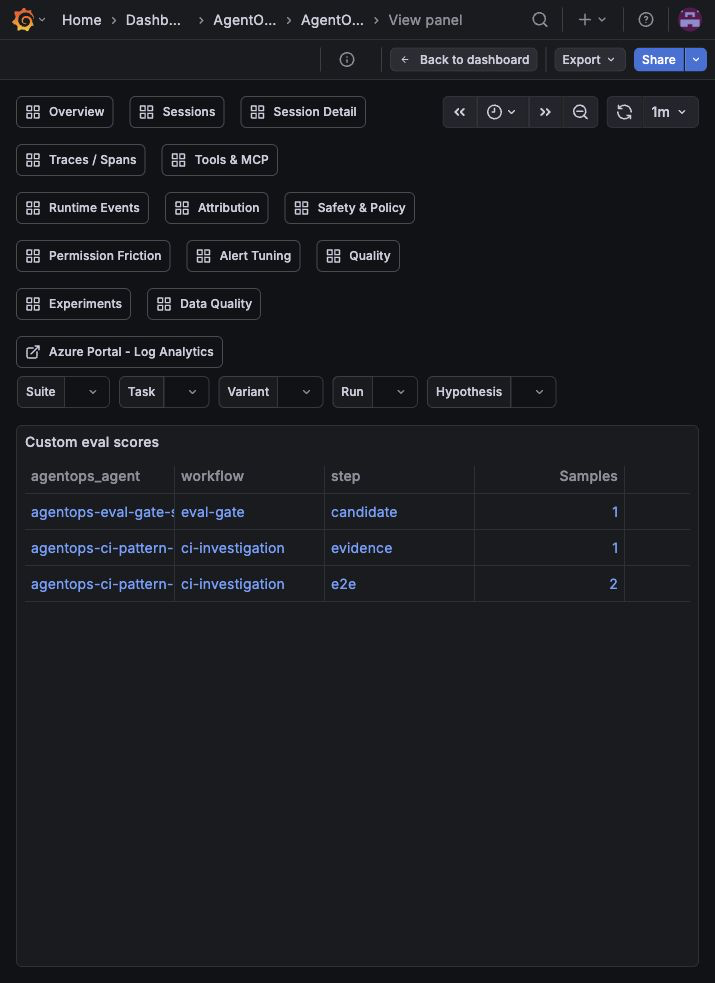

# Copilot CLI AgentOps for Azure

> Independent personal open-source project. Not an official Microsoft, GitHub, OpenAI, Azure, or Grafana product, and not endorsed by those organizations. See [DISCLAIMER.md](DISCLAIMER.md) and [SECURITY.md](SECURITY.md) before using with real telemetry.

<p align="center">
  
</p>

AgentOps gives GitHub Copilot CLI runs an Azure/Grafana observability loop: sessions, tool calls, failures, tokens, cost, policy signals, and benchmark results without recording prompts, code, tool arguments, or file contents by default.


## What It Answers

- Did my latest Copilot run work?
- Which tool failed?
- Did a run get slow, expensive, or context-heavy?
- Did a safety or permission policy block something?
- Which agent, skill, MCP server, hook, or benchmark produced the signal?
- Did a prompt/agent/tooling change make things better or worse?

You do not need to know OpenTelemetry, KQL, MCP, or Grafana to start. Those are the plumbing underneath the quick path.

## Quick Start

### Prerequisites

- Azure CLI logged into a subscription where you can create resources.
- Azure Developer CLI (`azd`) for the Bicep deployment path.
- GitHub Copilot CLI installed and authenticated.
- Docker Desktop, OrbStack, or another way to run the OpenTelemetry Collector locally.

### Fastest Path

```bash
az login
azd provision
./setup-agentops.sh
export PATH="$HOME/.local/bin:$PATH"
agentops validate-azure --last 24h
copilot plugin install c-mongan/copilot-cli-agentops-azure:plugin
agentops copilot --agent agentops-orchestrator \
  --allow-tool=bash --add-dir . --no-ask-user --no-remote \
  -p "Do not edit files. Use read-only shell commands: pwd and ls docs | head. Summarize what you saw."
agentops open
```

You are done when:

- `agentops status` shows the shim and collector setup as OK.
- `agentops validate-azure --last 24h` can query the deployed workspace and find imported dashboards.
- `copilot plugin install c-mongan/copilot-cli-agentops-azure:plugin` installs the Copilot hooks and MCP config used by policy/runtime dashboards.
- The real `agentops copilot --agent agentops-orchestrator ...` run finishes normally.
- The Overview dashboard shows runs, tool calls, tokens, or cost.

If something fails:

```bash
agentops status
agentops validate-azure --last 24h
agentops latest --last 2h
```

## What Gets Deployed

```text
Developer machine                            Azure resource group
-----------------                            --------------------

Copilot CLI / VS Code / Codex / SDK
        |
        | OTLP on localhost
        v
OpenTelemetry Collector
        |
        | scrub prompt/content/tool payload fields
        v
Application Insights + Log Analytics  --->  Azure Managed Grafana
```

The Azure path uses the repo's Bicep through `azure.yaml`:

- Log Analytics Workspace
- Application Insights
- Azure Monitor Workspace
- Azure Managed Grafana
- Key Vault
- Optional Function actioner, disabled by default
- Optional scheduled-query alerts, disabled by default

## Safe Defaults

Enterprise-safe, cost-bounded setup is the default posture: metadata-only telemetry, local collector binding, capped ingestion profiles, and opt-in automation.

Captured by default:

- run/session IDs
- operation names
- tool names
- model names
- duration and success/failure
- token, estimated cost, and AIU fields
- hashed repo metadata
- policy, safety, agent, skill, MCP, and benchmark labels

Not captured by default:

- prompts
- responses
- code contents
- file contents
- tool arguments
- tool results
- system instructions
- request/response bodies
- full URLs

For local debugging, content capture can be scoped to specific agents or annotated skills with `AGENTOPS_CAPTURE_CONTENT_AGENTS` or `AGENTOPS_CAPTURE_CONTENT_SKILLS`. The Azure collector still marks and scrubs raw prompt/tool content by default, so the dashboards can show a content-capture signal without storing the text.

Enterprise guardrails:

- Local collector binds to `127.0.0.1`.
- Content capture is off.
- Azure Managed Grafana API keys are disabled.
- Key Vault RBAC and purge protection are enabled.
- Log Analytics has profile-based retention and daily ingestion caps.
- Alert rules deploy disabled until thresholds are tuned.
- Automation/actioner resources are opt-in.

Run the static enterprise check before a pilot or release:

```bash
agentops validate-enterprise
```

## Cost Expectations

AgentOps is designed for a small Azure footprint, but it is not free:

- Log Analytics ingestion and retention are the main variable cost.
- Managed Grafana, Application Insights, and Azure Monitor resources may add service cost depending on your subscription and region.
- Defaults are intentionally conservative: metadata-only telemetry, content capture off, disabled actioner, disabled alerts, and capped ingestion profiles.

For a team pilot, start with the default `team` profile and review what-if:

```bash
AGENTOPS_DEPLOYMENT_PROFILE=team ./scripts/azure-what-if.sh
```

For budget/RBAC guardrails, see [Enterprise pilot guide](docs/enterprise-pilot.md).

## Dashboard Tour

Start with **Overview**, then open **Sessions** and **Session Detail** when you need to inspect a run. Use the rest as drilldowns.

```text
Overview
   |
   +--> Sessions ---------> Session Detail
   |        |                    |
   |        |                    +--> Live Replay
   |        |
   |        +--------------> Traces / Spans
   |
   +--> Tools & MCP -------> failed tools and MCP servers
   +--> Attribution -------> agents, skills, MCP, scripts/hooks
   +--> Safety & Policy ---> privacy and permission posture
   +--> Quality -----------> slow, expensive, failing, inefficient runs
   +--> Experiments -------> benchmark and variant comparisons
```

Full screenshot tour: [Dashboard tour](docs/dashboard-tour.md).

## What It Looks Like

The dashboards are meant to answer practical questions first, not make you learn KQL.

### Start Here

| Page | What it tells you |
| --- | --- |
|  | **Overview**: the health of recent agent runs, tokens, cost, latency, failures, and top activity. |
|  | **Sessions**: which runs happened, which failed, which were slow, and which used the most tokens or credits. |
|  | **Session Detail**: one selected run, broken into its important events and tool calls. |
|  | **Live Replay**: watch one run as a timeline, including orchestrator and sub-agent delegation when present. |

### Debug A Run

| Page | What it tells you |
| --- | --- |
|  | **Traces / Spans**: the raw execution path for agent operations, model calls, tools, MCP calls, and scripts. |
|  | **Tools & MCP**: which tools and MCP servers were called, how often they failed, and what errors appeared. |
|  | **Attribution**: which agent, skill, MCP server, script, hook, or repo produced the telemetry. |

### Safety, Quality, And Cost

| Page | What it tells you |
| --- | --- |
|  | **Quality**: slow, expensive, failing, or inefficient runs that are worth investigating. |
|  | **Data Quality**: whether the telemetry has the fields dashboards need. |

### Experiments And Custom Signals

| Page | What it tells you |
| --- | --- |
|  | **Experiments**: compare baseline and variant runs for prompts, tools, agents, or policies. |
|  | **Custom Eval Events**: metadata-only scores and measurements from your own eval gates. |

The full tour still covers Runtime Events, Safety & Policy, Permission Friction, and Alert Tuning. Those pages can be intentionally quiet in a healthy privacy-first setup, so they are better explained in [Dashboard tour](docs/dashboard-tour.md) than used as the README's first impression.

To populate those quieter pages with real events, install the Copilot plugin and run a small observed agent task:

```bash
copilot plugin install c-mongan/copilot-cli-agentops-azure:plugin
agentops copilot --agent agentops-orchestrator \
  --allow-tool=bash --add-dir . --no-ask-user --no-remote \
  -p "Do not edit files. Use read-only shell commands: pwd and ls docs | head. Summarize what you saw."
```

For a safe policy-block check, ask the agent to try a fake secret-read command. The hook should block it before it reaches Azure:

```bash
agentops copilot --agent agentops-orchestrator \
  --allow-tool=bash --add-dir . --no-ask-user --no-remote \
  -p "Use bash once to run: az keyvault secret show --vault-name agentops-nonexistent-vault --name agentops-nonexistent-secret. If AgentOps blocks it, do not retry."
```

## Common Workflows

Open dashboard links:

```bash
agentops open
```

Show the latest observed run:

```bash
agentops latest --last 2h
agentops explain latest --last 2h
agentops recommend latest --last 2h
```

Watch a compact live stream:

```bash
agentops live --last 2h --follow --interval 10
```

Replay one session:

```bash
agentops replay latest --last 2h
agentops replay <conversation-id> --last 24h
```

For a Grafana view of the same idea, open **Live Replay**. It shows a selected session as a timeline/tree: single-agent runs stay in one lane, while orchestrator runs split into parent/sub-agent lanes when the telemetry includes delegation fields.

If Live Replay is empty, widen the time picker or run:

```bash
agentops custom emit --event agent.delegation.started --agent investigator --parent-agent agentops-orchestrator --delegation-id demo-delegation --workflow investigation --step delegate --outcome started
agentops custom emit --event agent.delegation.completed --agent investigator --parent-agent agentops-orchestrator --delegation-id demo-delegation --workflow investigation --step delegate --outcome completed
```

Verify agent, skill, MCP, and hook attribution:

```bash
copilot plugin install c-mongan/copilot-cli-agentops-azure:plugin
agentops copilot --agent agentops-orchestrator --allow-tool=bash --add-dir . --no-ask-user --no-remote -p "Do not edit files. Use read-only shell commands: pwd and ls docs | head."
agentops custom emit --event agent.delegation.started --agent investigator --parent-agent agentops-orchestrator --delegation-id attribution-check --workflow investigation --step delegate --outcome started
agentops attribution --last 2h
agentops mcp --last 2h
agentops lineage --last 2h
```

Emit custom metadata-only lifecycle telemetry from an agent, hook, VS Code extension, SDK app, or script:

```bash
agentops custom emit --event agent.step.started --agent my-agent --workflow investigation --step collect --outcome started
agentops custom emit --event agent.eval.scored --agent my-agent --workflow eval-gate --step candidate --score 0.91 --outcome measured
agentops custom import ./agent-events.jsonl --agent my-agent --workflow investigation
```

Use `--custom key=value` for private dimensions. Use `--attribute key=value` only when a trusted agent or script intentionally needs to populate first-class dashboard fields such as `agentops.content_capture.signal=true` or `github.copilot.policy.decision=blocked`.

Run a benchmark:

```bash
agentops benchmark run starter --variant baseline --repeat 1 --hypothesis safer-tool-policy
agentops benchmark report <run-id> --azure --last 24h
```

## Manual Configuration

`./setup-agentops.sh` tries `agentops configure import-azd` when `azd` outputs are available.

If you are binding to an existing Azure environment instead of using `azd`, configure values manually:

```bash
agentops configure set \
  --resource-group rg-agentops-dev \
  --workspace-id "<workspace-id>" \
  --workspace-name "<workspace-name>" \
  --grafana-url "https://<your-grafana>.grafana.azure.com" \
  --grafana-name "<grafana-resource-name>" \
  --app-insights-name "<app-insights-name>"
```

PowerShell setup is also available:

```powershell
az login
./setup-agentops.ps1
$env:PATH = "$HOME/.local/bin;$env:PATH"
agentops status
agentops validate-azure --last 24h
```

## Native OTel And Other Clients

The shim is convenient, but not required. Any Copilot surface that emits compatible OTLP can send data to the local collector.

Supported paths include:

- GitHub Copilot CLI
- VS Code Copilot Chat
- Copilot SDK apps
- Codex CLI through `agentops codex`
- Offline JSONL replay for local debugging

See [Advanced usage](docs/advanced-usage.md) for VS Code settings, Copilot CLI OTel environment variables, SDK snippets, Codex setup, custom agent telemetry, science mode, and Azure MCP analyst mode.

## Troubleshooting

If dashboards are empty:

```bash
agentops status
agentops validate-azure --last 24h
agentops copilot --agent agentops-orchestrator --allow-tool=bash --add-dir . --no-ask-user --no-remote -p "Do not edit files. Use read-only shell commands: pwd and ls docs | head."
agentops latest --last 2h
```

Expected empty panels are normal when the matching event did not happen. For example, content-capture panels should be empty when privacy defaults are working, compaction/truncation only appears after a real context-pressure event, and alert tuning needs enough history before it becomes useful. Collector smoke commands still exist for low-level ingestion debugging, but the README path uses real observed Copilot/custom telemetry for dashboard population.

More help: [Troubleshooting](docs/troubleshooting.md), [Testing and next steps](docs/testing-and-next-steps.md), [Dashboard tour](docs/dashboard-tour.md).

## Known Limitations

- This is a preview OSS project, not a hosted service or official product.
- The managed path assumes Azure Monitor, Log Analytics, Application Insights, and Azure Managed Grafana.
- Dashboard panels can be empty until matching events exist inside the selected time range.
- Azure ingestion is eventually consistent; fresh data may take a few minutes to appear.
- Prompt, response, file-content, tool-argument, and tool-result capture is off by default and should stay opt-in per agent or skill.
- Alert rules deploy disabled until a team tunes thresholds against its own traffic.
- Screenshots in this repo use a development workspace with real observed runs. Regenerate them for your own environment if you publish a fork.

## Documentation Map

- [Dashboard tour](docs/dashboard-tour.md) - plain-English guide to every Grafana page.
- [Architecture](docs/architecture.md) - resource and data-flow overview.
- [Enterprise pilot guide](docs/enterprise-pilot.md) - safe internal rollout path.
- [Threat model](docs/threat-model.md) - privacy and abuse cases.
- [Secure by default](docs/secure-by-default.md) - security posture summary.
- [Telemetry schema](docs/telemetry-schema.md) - fields and KQL assumptions.
- [Advanced usage](docs/advanced-usage.md) - native OTel, Codex, benchmarks, MCP analyst mode.
- [Copilot MCP prompts](docs/copilot-mcp-agentops-prompts.md) - copyable investigation prompts.
- [Public release checklist](docs/public-release.md) - OSS release readiness.

## Remove It

Stop the collector:

```bash
agentops collector stop
```

Stop routing plain `copilot` through AgentOps:

```bash
agentops disable-shadow
```

Remove installed AgentOps shims and plugin files:

```bash
agentops plugin uninstall
agentops uninstall
```

## Plain English Glossary

- **context pressure** = Copilot had too much to remember
- **tool failure** = a tool Copilot tried did not work
- **policy block** = a safety rule stopped something risky
- **content capture** = recording prompts/code/tool arguments
- **benchmark** = a repeatable task
- **baseline** = before
- **variant** = after/version being tested
- **regression** = got worse
