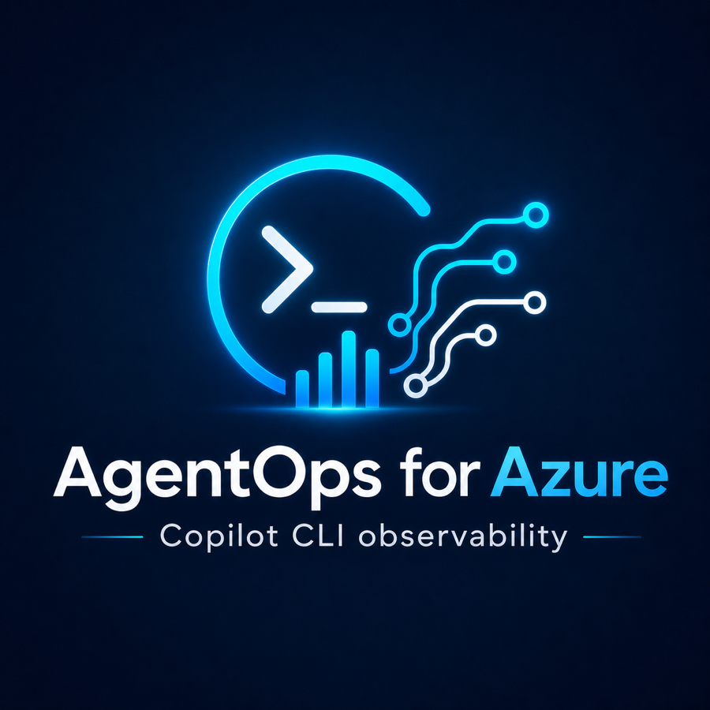

# Copilot CLI AgentOps for Azure



> Independent personal OSS project. Not an official Microsoft, GitHub, OpenAI, Azure, or Grafana product.

Privacy-first Datadog/Lapdog-style observability for GitHub Copilot CLI runs, Copilot SDK sessions, MCP tools, and code outcomes in Azure Monitor and Grafana. AgentOps records run/session metadata, tool names, failures, latency, token usage, estimated cost, privacy signals, evals, and GitHub outcomes without recording prompts, code, file contents, tool arguments, or tool results by default.

```text
GitHub Copilot CLI
  -> local OTLP endpoint on 127.0.0.1
  -> local OpenTelemetry Collector privacy boundary
  -> Azure Monitor / Application Insights / Log Analytics
  -> Azure Managed Grafana dashboards
```

## Quick Start

Prerequisites:

- Azure CLI logged in.
- Azure Developer CLI (`azd`) for the Bicep deployment.
- GitHub Copilot CLI installed and authenticated.
- No Docker required: `./setup-agentops.sh` installs the tested local OpenTelemetry Collector binary. Docker is only an optional fallback.

```bash
az login
azd provision
./setup-agentops.sh
export PATH="$HOME/.local/bin:$PATH"
agentops configure import-azd
agentops setup
agentops collector smoke --privacy strict --poison --json
agentops collector start --mode auto --privacy strict
agentops smoke --real-copilot --wait 2m --poll 10s
agentops latest --last 2h
agentops open latest --last 2h
```

`agentops setup` is read-only. It prints the one-minute first-run loop, the current Azure/Grafana binding state, and the exact next commands for privacy smoke testing, running a safe no-edit Copilot smoke, opening the newest run, and verifying dashboards. `agentops smoke --real-copilot` waits for the latest Copilot run to appear before printing the V2 Run Replay link.

If `collector start --mode auto` cannot find a collector binary and Docker is not running, it fails with setup instructions. It does not silently run Copilot without the local privacy boundary. Install the binary any time with:

```bash
agentops collector install-binary
```

## Core Commands

```text
agentops setup
agentops install
agentops uninstall
agentops status
agentops doctor
agentops configure show|set|import-azd
agentops collector start|stop|status|validate|smoke|install-binary|uninstall-binary
agentops copilot [...args]
agentops schema validate|print
agentops ask-context
agentops content status|opt-in
agentops dashboard validate|links-check|ux-check|kql-check|verify|import
agentops demo generate
agentops demo verify
agentops explain
agentops github-enrich
agentops insights generate|patterns
agentops init --dry-run
agentops init --provision-cloud
agentops mcp-proxy
agentops recommend
agentops triage
agentops run-summary generate
agentops latest
agentops replay
agentops open
agentops product audit
agentops product audit --live --require-rows
agentops product audit --live --require-rows --require-visual
agentops validate-azure
agentops validate-azure --import-dashboards
agentops validate-enterprise
agentops plugin install|uninstall
agentops e2e run
agentops e2e report
agentops e2e browser-check
agentops e2e auth-profile
```

Everything else is under `agentops experimental ...` or documented as experimental.

## What It Answers

- What did Copilot do?
- Which run, session, tool, model, or agent failed?
- What did it cost?
- Was anything risky blocked or dropped?
- Did it edit code, run tests, or produce a PR?
- Can I replay the run and drill into traces, tools, privacy signals, evals, or GitHub outcomes?

The V2 control-room spec and dashboard pack live in [docs/grafana-ux-spec.md](docs/grafana-ux-spec.md), [docs/agent-run-data-model.md](docs/agent-run-data-model.md), and `grafana/dashboards/v2/`.

To populate a local demo dataset without live Copilot traffic:

```bash
agentops demo generate --runs 50 --with-failures --with-privacy-drops --with-github-outcomes --json
agentops demo verify --runs 50 --json
```

This writes metadata-only `AgentOps*_CL.jsonl` files under `.agentops/demo/latest`.

To audit the local control-room contract:

```bash
agentops product audit
```

This checks the V2 schema, strict privacy gates, Copilot CLI/SDK surfaces, MCP proxy, GitHub outcomes, evals/insights, dashboard JSON, drilldown links, transcript opt-in, and first-run setup wiring.

To include live Azure and Grafana row checks:

```bash
agentops product audit --live --last 24h --require-rows --json
```

To require actual rendered Grafana dashboards from an authenticated browser profile:

```bash
agentops e2e auth-profile
agentops product audit --live --last 24h --require-rows --require-visual --json
```

The visual gate is strict: it only passes after Playwright opens the V2 Grafana dashboard pages and sees them rendered. If it reports Microsoft sign-in, run the `agentops e2e auth-profile` sign-in command once, then rerun the audit with the suggested browser profile flags.
If you generate dashboard screenshots with another authenticated browser harness, pass its validated evidence file with `--visual-evidence <json>`.

To roll up a raw local span export into the same V2 table shape:

```bash
agentops run-summary generate --file tests/sample-otel/tool-failure.jsonl --json
```

To check whether local V2 table files are ready for Azure Log Analytics custom-table ingestion:

```bash
agentops azure-ingest plan --dir .agentops/demo/latest --json
```

To preview the opt-in prompt/response viewer with safe synthetic content:

```bash
agentops demo generate --runs 10 --with-content --json
agentops content status --dir .agentops/demo/latest --allow-content
agentops azure-ingest plan --dir .agentops/demo/latest --allow-content --json
agentops open latest --runs .agentops/demo/latest/AgentOpsRunSummary_CL.jsonl
```

`agentops content status` shows whether transcript rows exist and whether ingestion is deliberately allowed. `agentops open` prints a Run Replay link plus a dedicated prompt/response viewer link. The viewer stays empty in strict mode and only shows `AgentOpsContent_CL` rows after explicit content-capture opt-in.

To observe a stdio MCP server without storing tool arguments/results:

```bash
agentops mcp-proxy --server-name playwright -- npx -y @microsoft/mcp-server-playwright
```

To create privacy-safe PR/CI outcome rows from local `gh` CLI metadata:

```bash
agentops github-enrich --limit 30 --runs .agentops/demo/latest/AgentOpsRunSummary_CL.jsonl --json
```

To instrument a Copilot SDK app with strict AgentOps defaults:

```js
const { CopilotClient } = require('@github/copilot-sdk');
const { createAgentOpsCopilotClient } = require('@agentops/copilot-sdk');

const client = createAgentOpsCopilotClient(CopilotClient, {
  otlpEndpoint: 'http://localhost:4318',
  privacyMode: 'strict',
  captureContent: false
});

const session = await client.createSession(client.createAgentOpsSessionConfig());
```

To generate deterministic eval and insight rows from V2 tables:

```bash
agentops insights generate --runs .agentops/demo/latest/AgentOpsRunSummary_CL.jsonl --json
agentops insights patterns --insights .agentops/insights/latest/AgentOpsInsights_CL.jsonl
```

To explain a V2 run using the same eval/insight rows shown in Grafana:

```bash
agentops explain latest --runs .agentops/demo/latest/AgentOpsRunSummary_CL.jsonl --evals .agentops/insights/latest/AgentOpsEval_CL.jsonl --insights .agentops/insights/latest/AgentOpsInsights_CL.jsonl
```

To open the V2 control room directly around the latest run:

```bash
agentops open latest --runs .agentops/demo/latest/AgentOpsRunSummary_CL.jsonl
```

To get one evidence-backed next action with dashboard drilldowns:

```bash
agentops recommend latest --runs .agentops/demo/latest/AgentOpsRunSummary_CL.jsonl --evals .agentops/insights/latest/AgentOpsEval_CL.jsonl --insights .agentops/insights/latest/AgentOpsInsights_CL.jsonl --benchmark-run pass-run --out .agentops/demo/latest
```

With `--out`, AgentOps appends a metadata-only `AgentOpsRecommendations_CL.jsonl` row so Home and Insights can show first-class next actions, benchmark-gate evidence, and change-target refs without storing prompts, responses, tool arguments, tool results, source code, or file contents.

To get the run links, recommendation, evidence counts, and Ask AgentOps prompt in one packet:

```bash
agentops triage latest --runs .agentops/demo/latest/AgentOpsRunSummary_CL.jsonl --events .agentops/demo/latest/AgentOpsEvents_CL.jsonl --tools .agentops/demo/latest/AgentOpsToolCalls_CL.jsonl --evals .agentops/insights/latest/AgentOpsEval_CL.jsonl --insights .agentops/insights/latest/AgentOpsInsights_CL.jsonl --out .agentops/demo/latest
```

To hand the latest V2 run to Copilot/Codex as a privacy-safe investigation bundle:

```bash
agentops ask-context latest \
  --runs .agentops/demo/latest/AgentOpsRunSummary_CL.jsonl \
  --events .agentops/demo/latest/AgentOpsEvents_CL.jsonl \
  --tools .agentops/demo/latest/AgentOpsToolCalls_CL.jsonl \
  --evals .agentops/insights/latest/AgentOpsEval_CL.jsonl \
  --insights .agentops/insights/latest/AgentOpsInsights_CL.jsonl
```

To preview the Azure Managed Grafana import command:

```bash
agentops dashboard import --json
```

## Safe Defaults

Captured by default:

- session/run identifiers
- operation and tool names
- model names
- duration and success/failure
- token, cost, and AIU metadata when Copilot emits it
- hashed repo metadata
- simple hook/policy signals

Not captured by default:

- prompts or responses
- code or file contents
- tool arguments or tool results
- system instructions
- request or response bodies
- full URLs
- secrets

The local Collector is the scrub-before-export boundary. Direct/no-collector mode is advanced and unsafe: it requires `AGENTOPS_ALLOW_NO_COLLECTOR=1` or `--unsafe-no-collector`.

Enterprise-safe, cost-bounded setup is the intended default: metadata-only telemetry, localhost collection, capped Azure ingestion profiles, and disabled automation until explicitly enabled.

## Collector Modes

`AGENTOPS_COLLECTOR_MODE=auto` is the default.

- `auto`: prefer a configured/found local Collector binary, then Docker Compose, then fail closed.
- `binary`: run `AGENTOPS_OTELCOL_BIN`, `otelcol-contrib`, or compatible `otelcol`.
- `docker`: run the bundled Compose file with localhost-only ports.
- `none`: do not start a collector; explicit unsafe opt-in required.

See [Collector modes](docs/collector-modes.md).

## Privacy Modes

`AGENTOPS_PRIVACY_MODE=strict` is the default.

- `strict`: allowlist safe metadata and drop/redact everything else before export.
- `compat`: current denylist scrubber for compatibility with older dashboards or collectors.

See [Privacy modes](docs/privacy-modes.md).

## Plugin And Hooks

`agentops install` installs local shims and the tested Collector binary. It also installs a plain `copilot` shim by default so normal Copilot CLI runs are observed when `~/.local/bin` is first on `PATH`. Plugin files are explicit and reversible:

```bash
agentops plugin install
agentops plugin uninstall
```

The bundled `preToolUse` hook is a transparent demo guardrail. It can block obvious risky patterns such as fake secret reads, but it is not a full security boundary.

## What This Is Not Yet

- Not an official Microsoft/GitHub/Azure/OpenAI/Grafana product.
- Not a hosted service.
- Not a complete agent governance platform.
- Not a full security boundary.
- Policy hooks, benchmarks, Codex support, MCP analyst workflows, custom events, actioners, and advanced dashboards are experimental.

## Validation

Offline checks:

```bash
npm --prefix agentops-cli test
agentops doctor --json
agentops validate-enterprise --json
agentops collector validate --mode auto --privacy strict --json
agentops collector smoke --privacy strict --poison --json
```

Live E2E:

```bash
agentops e2e run --live --browser-report --last 2h --json
agentops e2e report --last 2h --out .agentops/e2e/latest/report.html
agentops e2e browser-check --report .agentops/e2e/latest/report.html --json
```

`browser-check` validates the local static report and can capture screenshots when Playwright is available:

```bash
AGENTOPS_E2E_PLAYWRIGHT=1 AGENTOPS_BROWSER_EXECUTABLE="/Applications/Google Chrome.app/Contents/MacOS/Google Chrome" \
  agentops e2e browser-check --report .agentops/e2e/latest/report.html --playwright --grafana --json
```

For V2 dashboard-tour screenshots, add `--grafana-v2-only --v2-docs-screenshots`.

Azure Managed Grafana validation may still require the user’s normal signed-in browser.

See [E2E validation](docs/e2e-validation.md).

## Documentation

- [Architecture](docs/architecture.md)
- [Collector modes](docs/collector-modes.md)
- [Privacy modes](docs/privacy-modes.md)
- [Secure by default](docs/secure-by-default.md)
- [Threat model](docs/threat-model.md)
- [Azure V2 ingestion](docs/azure-v2-ingestion.md)
- [Grafana dashboard tour V2](docs/grafana-dashboard-tour-v2.md)
- [Copilot CLI instrumentation](docs/copilot-cli-instrumentation.md)
- [KQL query library](docs/kql-query-library.md)
- [E2E validation](docs/e2e-validation.md)
- [Experimental features](docs/experimental-features.md)
- [Advanced usage](docs/advanced-usage.md)
- [Dashboard tour](docs/dashboard-tour.md)

## Remove It

```bash
agentops collector stop
agentops plugin uninstall
agentops uninstall
```
