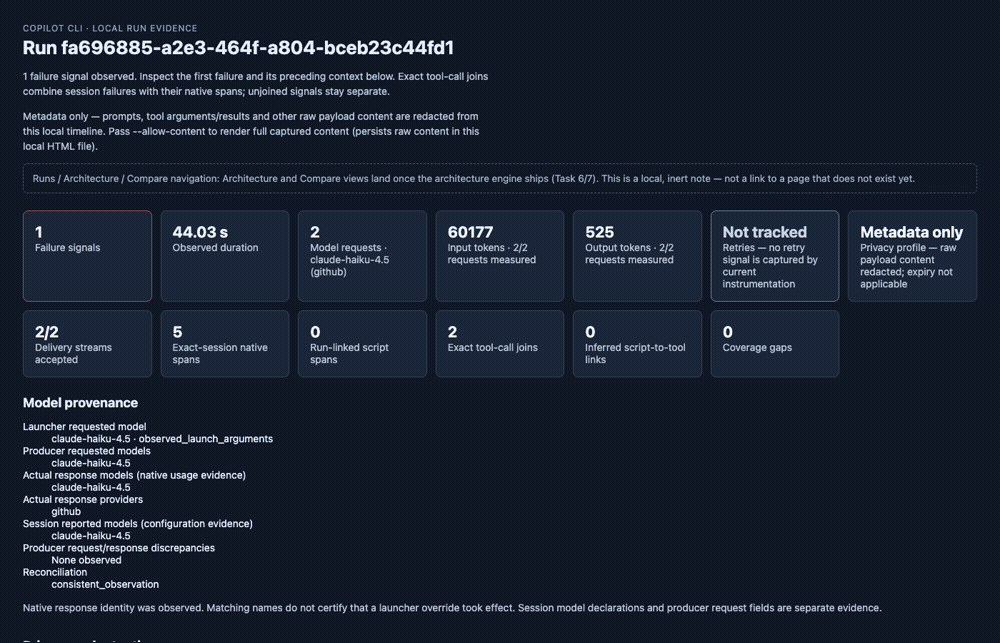
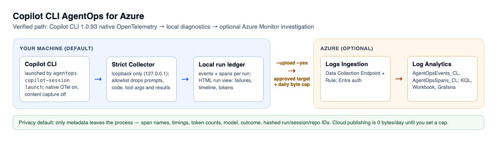

# Copilot CLI AgentOps for Azure

**Local diagnostics for GitHub Copilot CLI sessions, with optional investigation in Azure Monitor.** It shows failures, latency and token use per run. Prompts, code, tool arguments and tool results are not recorded by default.



> Independent personal open-source project. Not an official Microsoft, GitHub, OpenAI, Azure or Grafana product. Preview quality.

## What it does

| Question | Where you see it | Verified with real Copilot CLI runs |
|---|---|---|
| Which tool call failed or was denied, and what came before it? | Local run view, failure detail | Yes: a denied `curl` appears as a failure signal |
| Where did the time go? | End-to-end timeline, span durations | Yes: a 12 s shell step reads back as 12,109 ms |
| How many tokens did each model call use? | Run summary, `AgentOpsSpans_CL` | Yes: tokens match Copilot CLI's own summary |
| What did a run cost? | `EstimatedCostUsd` (nullable) | Only when the runtime emits cost metadata. Copilot CLI 1.0.93 did not, so cost stays empty instead of being guessed |
| Did Azure store exactly what was sent? | KQL readback | Yes: local and Azure row counts matched for all 3 runs |

Evidence: [CLI E2E walkthrough, 2026-10-07](docs/e2e-validation.md#copilot-cli-walkthrough-2026-10-07).

## Architecture



Copilot CLI emits native OpenTelemetry. A loopback-only, strict-privacy Collector receives it and AgentOps writes a local run ledger. Azure is optional: publishing is off by default (a 0-bytes-per-day cap) and goes through a Data Collection Rule into Log Analytics. You then investigate with KQL, an Azure Workbook or Grafana. Details: [architecture](docs/architecture.md) and the [full component map](docs/images/agentops-architecture-dataflow.png). Diagram source: [`docs/diagrams/agentops-cli-architecture.html`](docs/diagrams/agentops-cli-architecture.html).

## Quickstart

You need Node.js 20+ and the GitHub Copilot CLI, signed in. Azure is optional.

```bash
# 1. Get the CLI (one command, no global install; npx fetches the release tarball)
alias agentops='npx --yes -p https://github.com/c-mongan/copilot-cli-agentops-azure/releases/download/v0.2.1-preview/copilot-agentops-cli-0.1.0.tgz agentops'

# 2. Run an observed Copilot session (local only, no upload)
agentops copilot-session launch --repo /path/to/repo --json -- -p "Run the tests and explain any failure"

# 3. Open the metadata-only run view (sessionId and runId come from step 2's JSON)
agentops copilot-session view <session-id> --run-id <run-id> --output run.html
```

Prefer a source checkout? `git clone` the repository and use `alias agentops="node $PWD/agentops-cli/src/index.js"`. Each release lists its tarball's SHA256 in `SHA256SUMS`. The package is not on the npm registry yet.

To publish to your own Azure workspace, provision it with the [diagnostic pilot quickstart](docs/diagnostic-pilot-quickstart.md). Then add `--upload --yes` with an explicit daily byte cap (`AGENTOPS_MAX_PUBLISH_BYTES_PER_DAY`), and check storage with the [KQL query library](docs/kql-query-library.md).

## Privacy by default

- **Metadata only.** Span names, timings, token counts, model names, outcomes, and hashed run, session and repository identifiers.
- **Not recorded by default.** Prompts, responses, source code, tool arguments and tool results. Content capture needs an explicit, separate opt-in and is meant for synthetic evaluation data only.
- **Fail-closed cloud writes.** Uploads need an explicit target, an approved subscription allowlist and a non-zero daily byte cap. The repository contains no subscription IDs or secrets.

See [privacy modes](docs/privacy-modes.md), [secure by default](docs/secure-by-default.md) and the [threat model](docs/threat-model.md).

## Known limits

- Cost is an estimate from runtime cost metadata only. Current Copilot CLI builds emit none, so it is usually empty.
- A shell command that exits non-zero is recorded as a successful tool span. The local session event still marks it as failed.
- Each native tool span is currently stored twice in `AgentOpsSpans_CL`. Count by `SpanId` or by `chat` operations, not by raw rows.
- Token totals must come from `chat` spans or the shutdown event. Summing every span row over-counts.
- The Azure Workbook reads usage from run summaries, so native-only runs show usage as "partial or unknown".
- Not a hosted service, a governance platform or a security boundary. Hooks, benchmarks and advanced dashboards are experimental.

## Learn more

- [`agentops doctor`](docs/doctor.md): a green/red checklist of your whole setup, with a fix for each step
- [Operator guide](docs/operator-guide.md): all commands, Collector modes, Azure setup, plugin and removal
- [E2E validation](docs/e2e-validation.md): CLI and VS Code walkthroughs with screenshots
- [Weekly digest](docs/digest.md): `agentops digest` failure clusters, slow tools, tokens and trends
- [VS Code native capture extension](extensions/agentops-native/README.md)
- [Azure Workbook](docs/enterprise-workbook.md), [Grafana tour](docs/grafana-dashboard-tour-v2.md) and [KQL query library](docs/kql-query-library.md)
- [OpenTelemetry GenAI export](docs/otel-genai.md): send sessions to the App Insights Agents (preview) view
- [Telemetry schema](docs/telemetry-schema.md) and the [documentation index](docs/README.md)
- [Changelog](CHANGELOG.md)

Licensed under the [MIT License](LICENSE).
