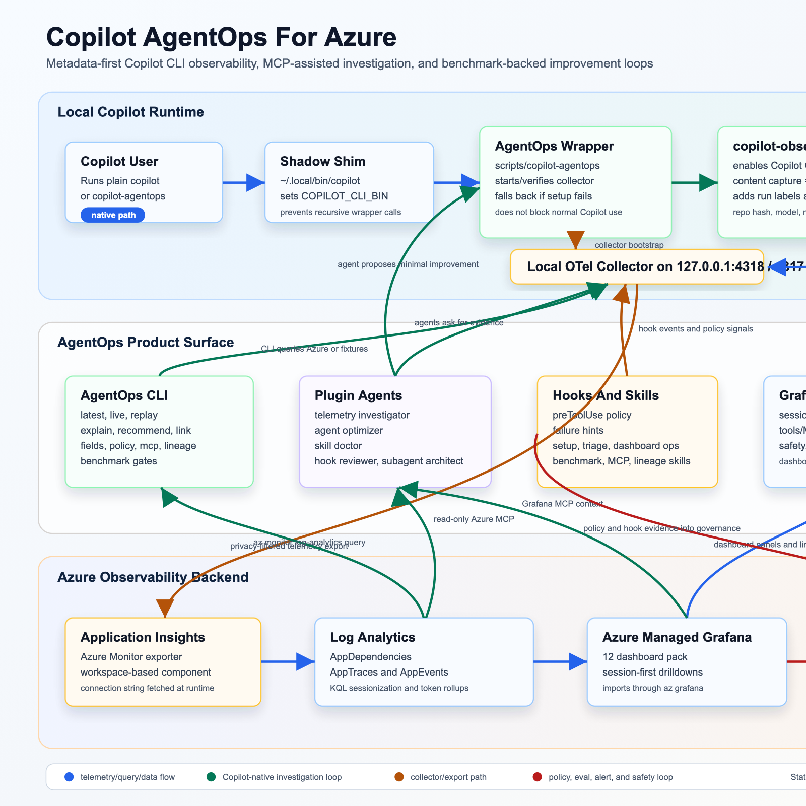

# AgentOps Documentation

This directory is the product manual for Copilot AgentOps for Azure.

Start here when you want the shortest path through the repo:

```text
README.md
  -> docs/README.md                 # docs index
  -> docs/architecture.md            # system shape
  -> docs/grafana-dashboard-tour-v2.md
  -> docs/release-checklist-v2.md
```

## Product In One Screen

```text
Copilot CLI / SDK / VS Code + MCP
  -> local AgentOps wrapper or proxy
  -> localhost OTLP collector
  -> strict privacy processors
  -> Azure Monitor + Log Analytics
  -> Grafana AgentOps for Azure dashboards
```

AgentOps answers:

- what Copilot did;
- which run, session, agent, skill, sub-agent, model, tool, or MCP server was involved;
- what failed, slowed down, or cost too much;
- what privacy or policy signals fired;
- whether code changed, tests ran, CI passed, or a PR was opened.

## Visual Architecture

Use the ASCII diagrams in [architecture.md](architecture.md) for terminal-friendly reading.

For rendered docs and presentations:

- source SVG: [agentops-architecture-dataflow.svg](agentops-architecture-dataflow.svg)
- rendered PNG: [images/agentops-architecture-dataflow.png](images/agentops-architecture-dataflow.png)



## Reading Paths

### New User

1. [Secure by default](secure-by-default.md)
2. [Collector modes](collector-modes.md)
3. [Privacy modes](privacy-modes.md)
4. [Grafana dashboard tour V2](grafana-dashboard-tour-v2.md)
5. [E2E validation](e2e-validation.md)

### Operator

1. [Grafana dashboard tour V2](grafana-dashboard-tour-v2.md)
2. [KQL query library](kql-query-library.md)
3. [Evals and insights](evals-and-insights.md)
4. [GitHub outcome enrichment](github-outcome-enrichment.md)
5. [Troubleshooting](troubleshooting.md)

### Implementer

1. [Agent run data model](agent-run-data-model.md)
2. [OTel GenAI and MCP schema](otel-genai-mcp-schema.md)
3. [Copilot CLI instrumentation](copilot-cli-instrumentation.md)
4. [Copilot SDK adapter](copilot-sdk-adapter.md)
5. [MCP observability proxy](mcp-observability-proxy.md)
6. [Azure V2 ingestion](azure-v2-ingestion.md)
7. [Azure production hardening](azure-production-hardening.md)

### Coding Agent Or LLM

Use [llm-map.md](llm-map.md). It names the core files, safe edit zones, verification commands, and product invariants.

## What Is Stable

Stable product surface:

- `agentops setup`
- `agentops collector ...`
- `agentops copilot ...`
- `agentops latest`, `replay`, `open`
- `agentops dashboard validate|links-check|ux-check|content-check|verify|import`
- V2 dashboards in `grafana/dashboards/v2/`
- strict privacy mode and local collector boundary

Experimental or data-dependent:

- custom actioner destinations;
- benchmark promotion loops;
- prompt/response transcript viewer, which is explicit opt-in only;
- legacy raw-OTel dashboards.

## Documentation Rules

Keep docs useful to both humans and LLMs:

- put the answer first;
- prefer ASCII diagrams for architecture and flows;
- link to exact commands and files;
- call out privacy defaults clearly;
- avoid raw prompt, response, source-code, tool-argument, or secret examples unless they are fake poison fixtures;
- keep README short and move deep detail here.
