# AgentOps Dashboard Tour

Use the dashboards in this order: start broad, then drill down only when you need more detail.

```text
Overview
   |
   +--> Sessions ---------> Session Detail
   |        |                    |
   |        |                    +--> replay-style span/event timeline
   |        |                    +--> Live Replay
   |        |
   |        +--------------> Traces / Spans
   |
   +--> Tools & MCP -------> failed tools, MCP servers, tool waterfall
   |
   +--> Attribution -------> custom agents, skills, MCP, scripts/hooks
   |
   +--> Safety & Policy ---> content capture signals, broad permissions, policy blocks
   |
   +--> Alert Tuning ------> threshold evidence before enabling real alert rules
```

## Overview

Use this as the front door. It answers: **is Copilot/agent activity flowing, how much did it cost, how many tools ran, and are failures rising?**

Good for daily health checks and quick demos. If this page is empty after setup, run the real quick-start Copilot check first.

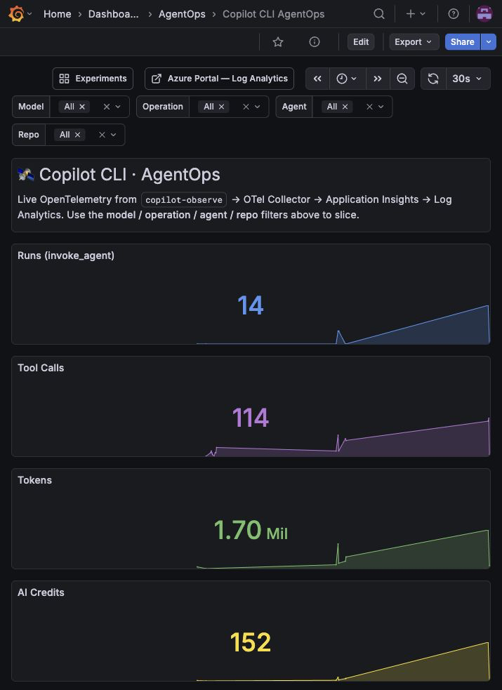

## Sessions

Use this when someone asks: **which run should I look at?**

Each row is a session. Sort by failures, cost, token use, duration, or risk. This is usually the best place to start an incident or cost investigation.

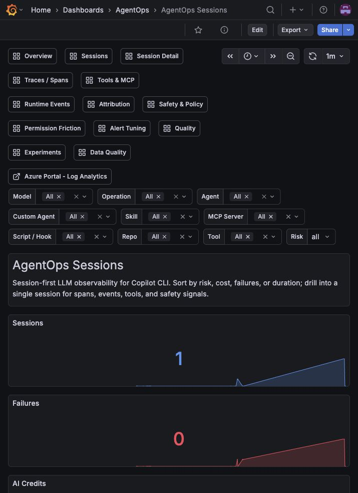

## Session Detail

Use this after choosing one session. It answers: **what happened during this run?**

You get span count, failures, token/cost summary, tool waterfall, runtime events, and safety signals for one conversation/session.

Think of this as the first version of live session replay. For a simple agent, it shows one run timeline with LLM calls, tools, MCP calls, scripts/hooks, timings, cost, and errors. For an orchestrator agent, the same view can become a delegation tree when spans include parent/child IDs or optional `agentops.parent_agent.*` and `agentops.delegation.*` fields. No sub-agents are required.

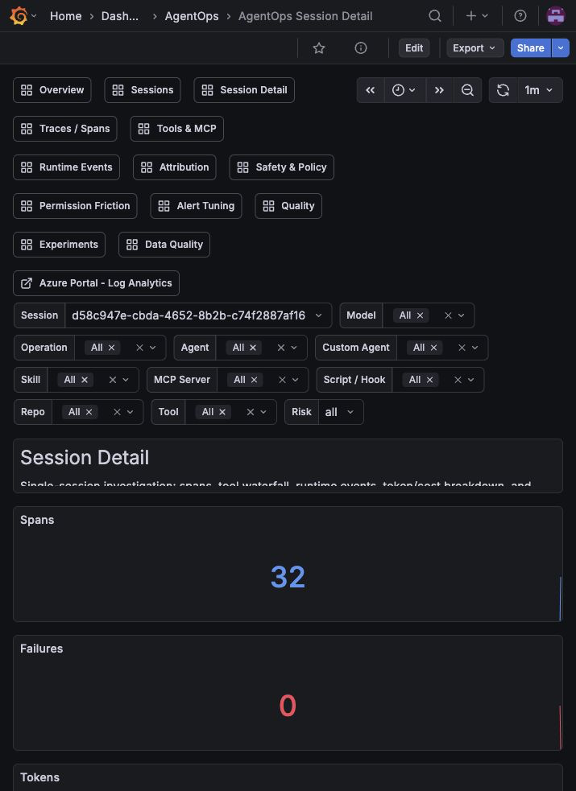

## Live Replay

Use this when you want to watch a full run unfold. It answers: **which agent lane did each event belong to, what tools/MCP servers/scripts ran, what took time, and where did failures or policy/content signals appear?**

Single-agent runs show one lane. Orchestrator runs become a tree when spans include parent/child IDs or optional `agentops.parent_agent.name` and `agentops.delegation.id` fields. This keeps the dashboard generic: it works for Copilot CLI, Codex, VS Code, SDK agents, CI agents, and agents that never delegate.

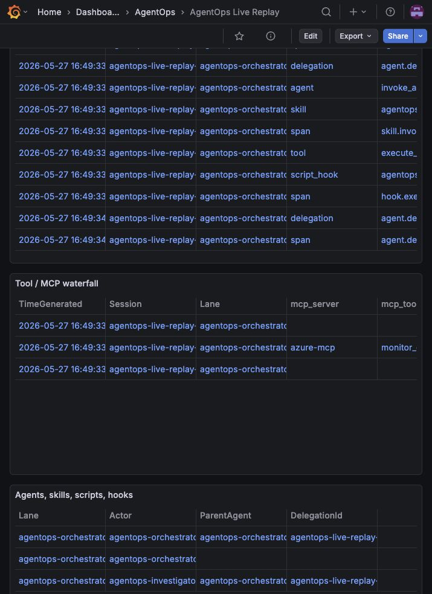

## Traces / Spans

Use this when you need raw evidence. It answers: **what exact spans did Copilot emit?**

This page is intentionally lower-level: operation IDs, parent/child spans, durations, tool names, models, result codes, and errors.

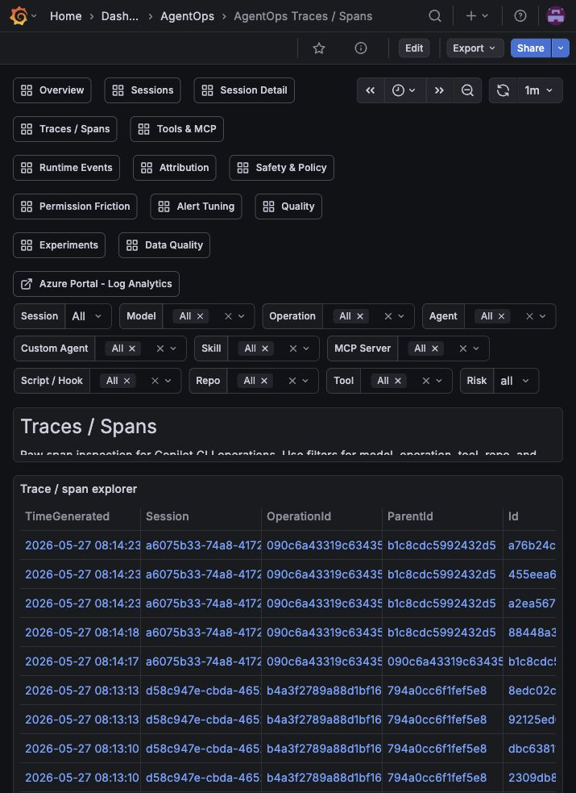

## Tools & MCP

Use this for tool reliability. It answers: **which tools or MCP servers are being used, and which ones fail?**

This is where Azure MCP, shell tools, custom tools, and likely MCP-provided tools show up. Tools are auto-detected from `gen_ai.tool.name`; MCP server/tool attribution is exact for names such as `mcp__server__tool` or `server/tool`, and inferred for known prefixes such as Azure MCP.

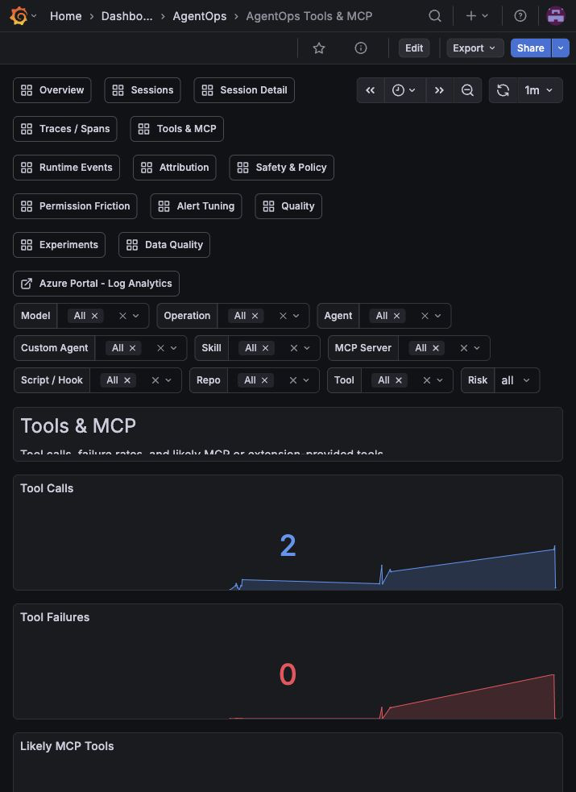

## Attribution

Use this to understand ownership. It answers: **which custom agents, skills, MCP servers, scripts, or hooks are responsible for usage and failures?**

This is useful when teams share one Azure workspace but want to know what agent/plugin/workflow generated the traffic.

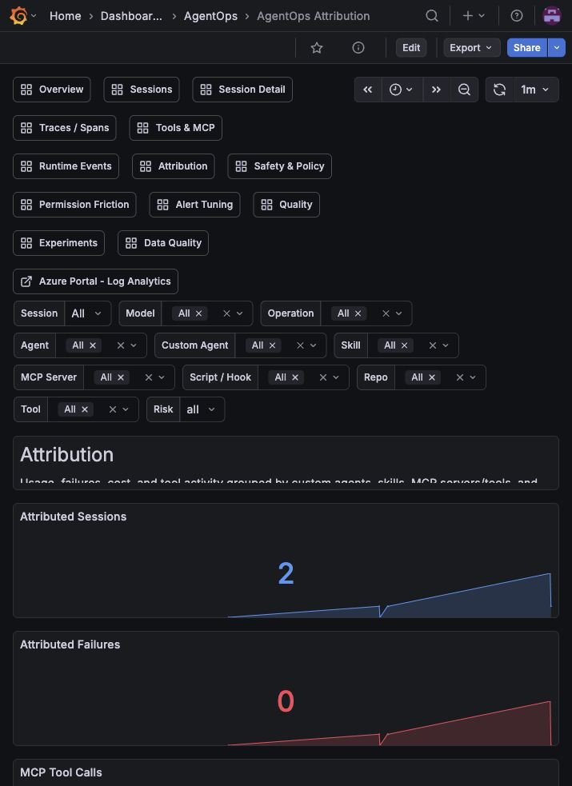

## Runtime Events

Use this for Copilot runtime behavior. It answers: **did hooks, skills, truncation, compaction, policy, or lifecycle events happen?**

This page can be intentionally quiet in a healthy setup. Content-capture, truncation, compaction, and policy panels only light up when those events actually happen. Treat quiet panels here as a signal to check whether the event was expected, not as a setup failure.

To populate this page with real signals, install the Copilot plugin and run a small observed agent task:

```bash
copilot plugin install c-mongan/copilot-cli-agentops-azure:plugin
agentops copilot --agent agentops-orchestrator \
  --allow-tool=bash --add-dir . --no-ask-user --no-remote \
  -p "Do not edit files. Use read-only shell commands: pwd and ls docs | head. Summarize what you saw."
```

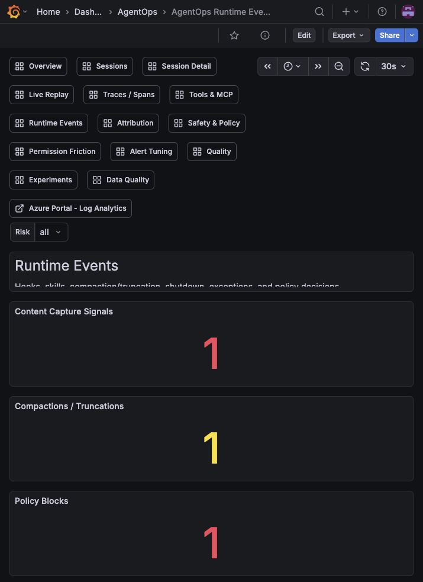

To generate lifecycle-style data for this page:

```bash
agentops custom emit --event agent.step.started --agent my-agent --workflow investigation --step collect --outcome started
```

## Safety & Policy

Use this for enterprise review. It answers: **are broad permissions, content capture, sharing, remote mode, policy blocks, or risky session settings present?**

Quiet content-capture panels are good when content capture is intentionally disabled. Permission and policy panels only show rows when a run actually hits those controls.

For a first pass, use this page to confirm the absence of unsafe signals, then rely on [Secure by default](secure-by-default.md) and [Threat model](threat-model.md) for the policy posture.

For a safe policy-block check, ask the agent to try a fake Key Vault secret-read command. The hook should deny it before it reaches Azure:

```bash
agentops copilot --agent agentops-orchestrator \
  --allow-tool=bash --add-dir . --no-ask-user --no-remote \
  -p "Use bash once to run: az keyvault secret show --vault-name agentops-nonexistent-vault --name agentops-nonexistent-secret. If AgentOps blocks it, do not retry."
```

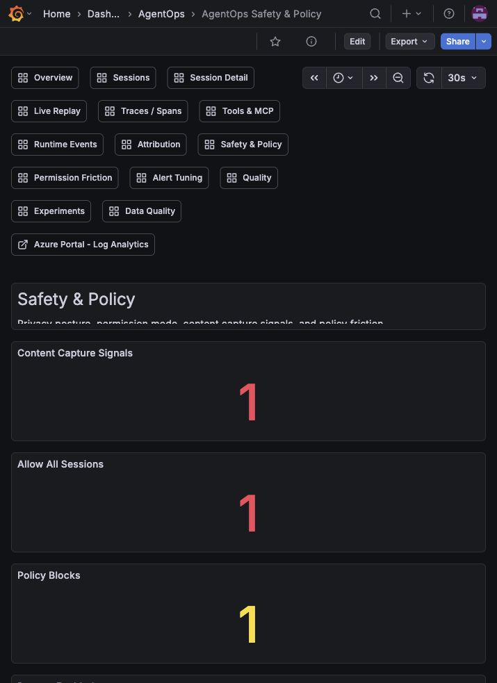

## Permission Friction

Use this to tune developer experience. It answers: **where are permissions, denied tools, policy blocks, or repeated failures slowing people down?**

This helps decide whether a tool should be allowed, denied, documented, or replaced.

This page is most useful after real users have hit approval prompts, denials, or policy blocks. On a fresh install, quiet panels usually mean there has not been much permission friction yet.

To create real policy-friction data for this page, run the safe policy-block check from **Safety & Policy**. To create ordinary tool-failure data, run a harmless failing command through an observed Copilot task.

Retry-hint panels stay quiet unless a real post-tool-failure hook emits a recovery hint.

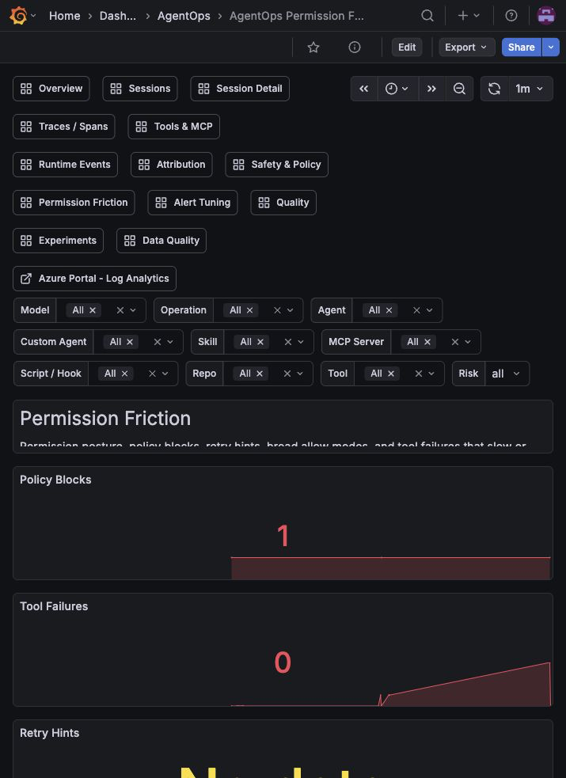

## Alert Tuning

Use this before enabling real alerts. It answers: **what thresholds are reasonable for failures, tool failures, AIU/cost, latency, and content capture?**

The alert rules are disabled by default. This page is evidence for choosing thresholds and reviewing fired-alert candidates, not an emergency console on day one.

The **Suggested threshold impact** table compares current and proposed alert-window counts so an owner can review likely noise reduction before running `agentops alert threshold-simulate` or `agentops alert threshold-patch`.

This page needs enough history before it becomes visually interesting. On a fresh install, it may have little to recommend. Run real traffic, real custom lifecycle events, and the safe policy-block check over time, then use the recommendations here before turning on scheduled-query alerts.

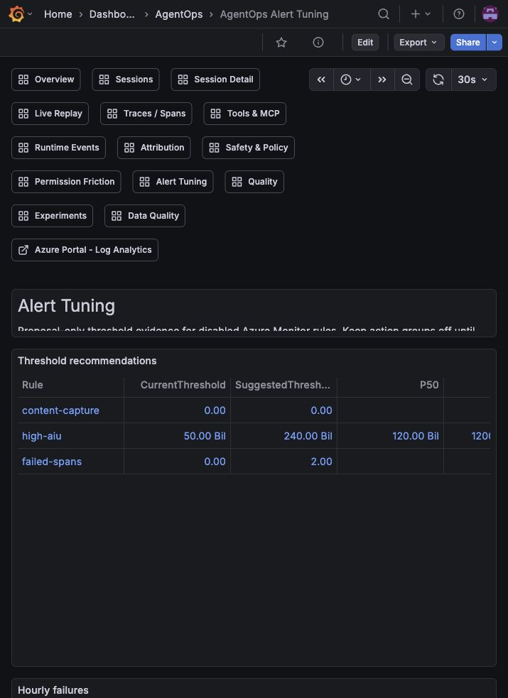

## Quality

Use this for improvement work. It answers: **which sessions are slow, expensive, failing, or inefficient?**

This page is where you find candidates for better prompts, safer tools, smaller context, cheaper models, or workflow changes.

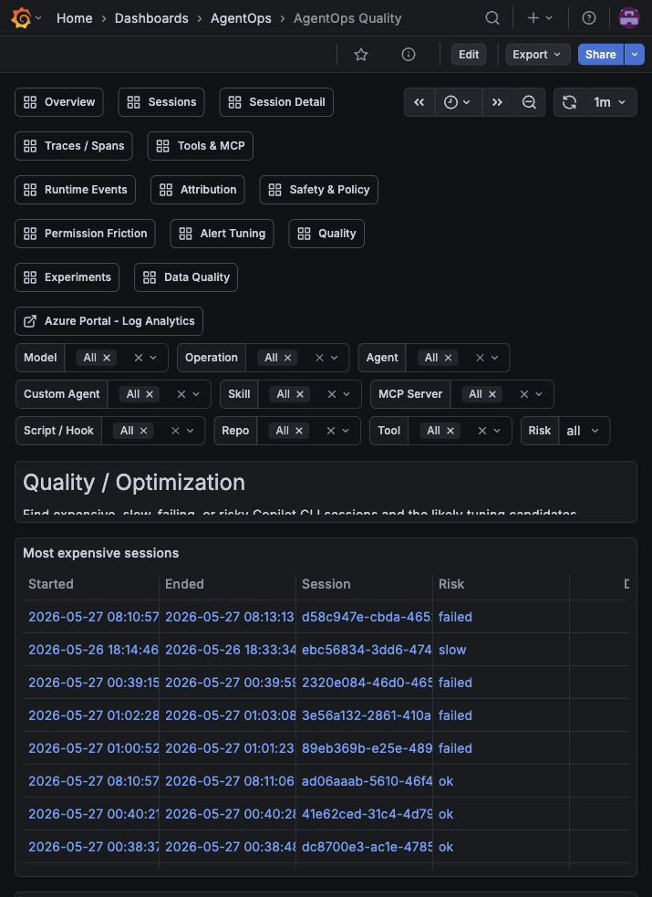

## Experiments

Use this for benchmark and variant comparisons. It answers: **did a change help or regress?**

Run `agentops benchmark run ...` or label real runs with experiment metadata, then compare pass rate, score, token use, cost, safety issues, and failures.

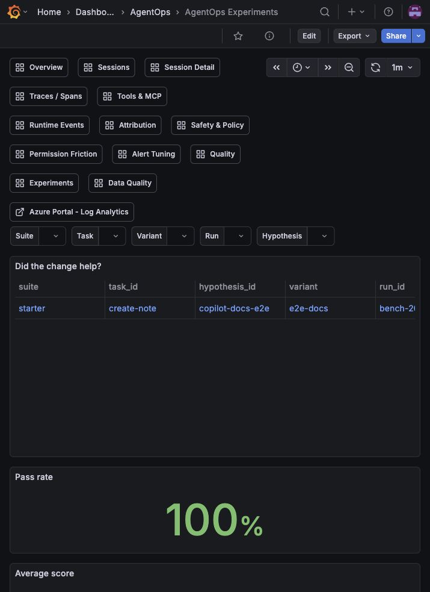

## Data Quality

Use this when something looks wrong. It answers: **are the fields, token rollups, collector health, and real-ingestion assumptions valid?**

This is the troubleshooting dashboard for schema drift and ingestion issues.

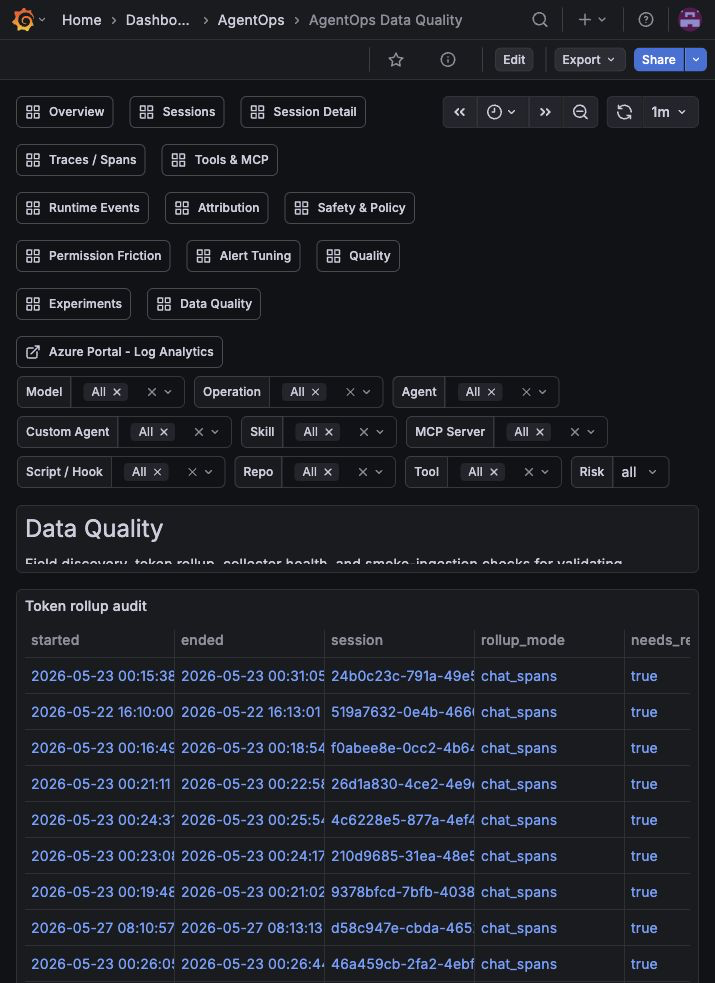

## Expected Quiet Panels

Some panels stay quiet until matching telemetry exists:

- **Safety & Policy** stays mostly empty when content capture is off and no policy block happened.
- **Runtime Events** needs hook, skill, truncation, compaction, shutdown, or policy events.
- **Permission Friction** needs permission, denial, retry, policy, or failure events.
- **Alert Tuning** is evidence-first; alert rules are disabled by default until you have enough clean history.
- **Experiments** needs benchmark telemetry or experiment labels.
- **Attribution** needs custom agent, skill, MCP, or script labels. Run a real observed Copilot task and optional `agentops custom emit` lifecycle events to verify the wiring.
- **Live Replay** needs at least one session inside the selected time range. Single-agent runs are valid; add `--parent-agent` and `--delegation-id` on custom lifecycle events when an orchestrator delegates work.

For real Runtime Events, Safety & Policy, Permission Friction, and Alert Tuning evidence, run:

```bash
copilot plugin install c-mongan/copilot-cli-agentops-azure:plugin
agentops copilot --agent agentops-orchestrator --allow-tool=bash --add-dir . --no-ask-user --no-remote -p "Do not edit files. Use read-only shell commands: pwd and ls docs | head."
agentops copilot --agent agentops-orchestrator --allow-tool=bash --add-dir . --no-ask-user --no-remote -p "Use bash once to run: az keyvault secret show --vault-name agentops-nonexistent-vault --name agentops-nonexistent-secret. If AgentOps blocks it, do not retry."
agentops custom emit --event agent.delegation.started --agent investigator --parent-agent agentops-orchestrator --delegation-id tour-delegation --workflow investigation --step delegate --outcome started
```
