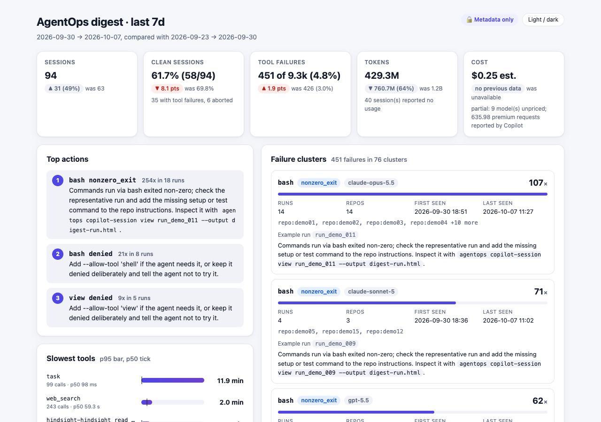
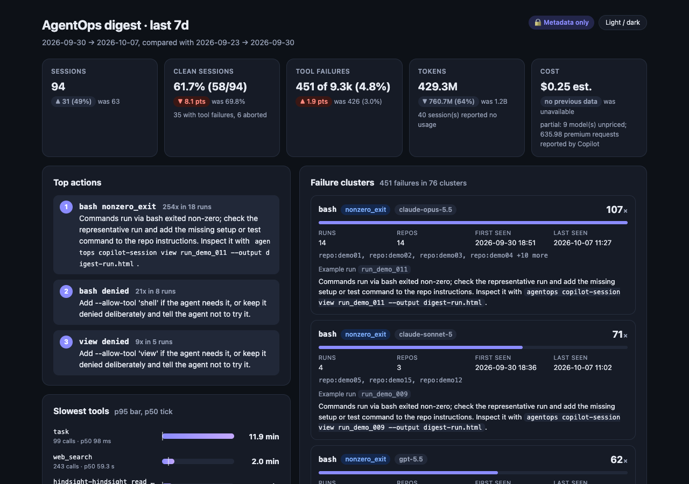

# Weekly digest and failure clusters

`agentops digest` turns the Copilot CLI sessions on this machine into a short weekly report. It answers these questions:

- How many sessions ran, and how many were clean?
- Which failures keep coming back, and what should I change?
- Which tools are slow?
- How many tokens were used, and roughly what did they cost?
- How does this compare with the previous period?



<details>
<summary>Dark theme</summary>



</details>

The screenshots come from real local sessions. Session IDs, run IDs and repository labels were replaced with `run_demo_*` and `repo:demo*` placeholders before the capture.

## Usage

```bash
agentops digest                                   # last 7 days, Markdown to the terminal
agentops digest --since 24h                       # periods: 24h, 7d, 2w (max 365d)
agentops digest --format html --output digest.html
agentops digest --output digest.json              # format inferred from the extension
agentops digest --prices prices.json              # add or override model prices
agentops digest --repo-names                      # show repo basenames instead of hashes
```

| Option | Default | Meaning |
| --- | --- | --- |
| `--since <n>h\|d\|w` | `7d` | Length of the current period. The previous period has the same length and ends where this one starts. |
| `--format md\|html\|json` | `md` | Output format. `--json` is a shortcut for `--format json`. |
| `--output <file>` | stdout | Writes the report and prints a one-line headline. `.html` and `.json` extensions set the format. |
| `--prices <file.json>` | built-in table | Adds or overrides prices; see [Cost estimate](#cost-estimate). |
| `--repo-names` | off | Shows the repository folder name. By default, repositories appear as `repo:<sha8>`. |
| `--copilot-home`, `--agentops-home` | `~/.copilot`, `~/.agentops` | Alternative data roots (also `COPILOT_HOME` and `AGENTOPS_HOME`). |

The HTML is a single self-contained page with no external assets. Its content security policy blocks every network request. It follows the system light or dark preference. You can switch theme with the **Light / dark** button or with `?theme=light` or `?theme=dark` in the URL.

## What it reads

| Source | Used for |
| --- | --- |
| `~/.copilot/session-state/*/events.jsonl` | Sessions, tool calls, failures, durations and token usage. Files last modified before the previous period starts are skipped. |
| `~/.agentops/runs/*/run-context.json` | Links a Copilot session to its AgentOps run ID so the report can name the run. |

The digest reads only these events: `session.start`, `tool.execution_start`, `tool.execution_complete`, `abort`, `session.shutdown` and `model.model_call_success`. It does not upload anything or call any network service.

## Privacy

The digest is metadata only. From each event it copies an allowlist of fields: timestamps, tool name, model, success flag, error code, shell exit code and token counts.

The digest never copies these into the report:

- prompts and assistant messages
- tool arguments and tool results
- error messages and stack traces
- file paths, working directories and branch names

Error messages are matched against fixed patterns to pick an error type (for example `denied` or `timeout`) and are then discarded.

There is one narrow exception. When a tool is denied, Copilot names the permission rule that matched, such as `` `shell(curl:*)` ``. The digest keeps this as the label `shell(curl)` only when the rule target is a short plain word. A rule that contains a URL, a path, shell syntax or anything else is dropped. The rule comes from your own `--allow-tool` or `--deny-tool` setup, not from the command the model tried to run.

Repository labels are hashes unless you pass `--repo-names`. The unit tests plant secret prompt, argument, result and error text in fixture sessions. They then check that none of it appears in the Markdown, HTML or JSON output.

## Failure clusters

A failure is a tool call with one of these outcomes:

- `success: false`
- a shell command that exited non-zero. Copilot records these as successful, but the digest counts them as failures, the same as the session waterfall.

Each failure gets a deterministic fingerprint:

```text
<tool>|<error type>|<model>
```

| Error type | Trigger |
| --- | --- |
| `denied` | Error code `denied` or a permission-denied message. The tool becomes the rule label, e.g. `shell(curl)`, when one is available. |
| `blocked` | Copilot's built-in safety rules refused the command. |
| `timeout`, `rate_limited` | Timeout or rate-limit codes and messages. |
| `nonzero_exit` | Shell exit code other than 0. |
| `unknown_tool`, `invalid_input`, `not_found` | The model called a missing tool, sent invalid input or targeted a missing path. |
| `error` or `error:<code>` | Anything else. A short machine-readable error code is kept, e.g. `error:quota_exceeded`. |

Failures with the same fingerprint form one cluster. Clustering uses no embeddings and no text similarity. The same input always gives the same clusters, IDs (`fc_<sha10>` of the fingerprint) and order (count descending, then fingerprint).

Each cluster reports:

- its count
- when it was first and last seen
- the affected runs and repositories
- a representative run (the latest failure)
- a suggested next step

For example, a real `--deny-tool 'shell(curl)'` run on this machine produced:

```text
1. **shell(curl)** · denied · claude-haiku-4.5: 3 failures in 3 runs
   Example run: `native_run_…`
   Next: Add --allow-tool 'shell(curl)' if the agent needs it, or keep it denied deliberately and tell the agent not to try it.
```

## Metrics

| Metric | Definition |
| --- | --- |
| Sessions | Sessions that started inside the period. A session belongs to the period of its start time. |
| Clean sessions | Sessions with no failed tool calls and no `abort` event. |
| Tool failures | Failed tool calls divided by all completed tool calls. Repeated completion events for the same call ID count once. |
| Slowest tools | p50 and p95 (nearest rank) per tool, from tools with at least 3 calls; the top 5 are shown. Tools that wait for a person or poll other work (`ask_user`, `read_bash`, `read_agent` and similar) are excluded. |
| Tokens by model | From the session's last `session.shutdown` event. Copilot reports cumulative totals there, so resumed sessions are counted once. If no shutdown exists, the digest uses `model.model_call_success` usage, counted once per call ID. Input tokens include cache reads and writes. |
| Premium requests | Copilot's own `totalPremiumRequests` from the last shutdown. |
| Trend | Counts show the change and the percentage change. When the previous value is 0, the change is shown as "new". Rates show the change in percentage points. |
| Top actions | Up to 3 actions, ranked by cluster size × error-type weight × number of affected runs. They are followed by any tool-failure-rate rise, the slowest tool and any unpriced models. |

## Cost estimate

Cost is always labelled **est.**. It is an estimate from public API list prices, not your Copilot bill. Copilot plans charge by premium requests, which the digest reports separately.

For a priced model, the estimate is:

```text
(input − cache read − cache write) × input price
+ cache read × cacheRead price
+ cache write × cacheWrite price
+ output × output price
```

Prices are in USD per 1 million tokens. Models without a known price show **unavailable**. When some models are priced and some are not, the total is marked **partial** and lists the unpriced models.

To add or correct prices, pass a JSON file:

```json
{
  "gpt-5.5": { "input": 1.25, "output": 10, "cacheRead": 0.125 },
  "claude-sonnet-5": { "input": 3, "output": 15, "cacheRead": 0.3, "cacheWrite": 3.75 }
}
```

`input` and `output` are required. If `cacheRead` or `cacheWrite` is missing, the input price is used for it.

## Limits

- Only sessions on this machine are included. Cloud agent sessions, other machines and the Azure tables are not read.
- Sessions are assigned to a period by their start time. A long session that crosses the boundary counts in the period it started.
- Non-zero shell exits are counted as failures. Some are expected, for example a failing test that the agent then fixes. Treat the `nonzero_exit` clusters as a signal to investigate, not proof of a fault.
- The fingerprint includes the model. The same denial from two models appears as two clusters.
- Sessions that never wrote a shutdown event and made no model calls have no token data. The report counts them as "reported no usage".
- The built-in price table is small, so newer models show "unavailable" until you pass `--prices`.
- Large `session-state` folders take a few seconds to read. Every session modified inside both periods is parsed.

## Run it weekly

The digest is a normal command, so any scheduler can run it. AgentOps installs no scheduler. Copy one of the snippets below if you want a weekly report.

### macOS launchd

Save this as `~/Library/LaunchAgents/com.example.agentops-digest.plist`. Then load it with `launchctl bootstrap gui/$(id -u) ~/Library/LaunchAgents/com.example.agentops-digest.plist`.

```xml
<?xml version="1.0" encoding="UTF-8"?>
<!DOCTYPE plist PUBLIC "-//Apple//DTD PLIST 1.0//EN" "http://www.apple.com/DTDs/PropertyList-1.0.dtd">
<plist version="1.0">
<dict>
  <key>Label</key><string>com.example.agentops-digest</string>
  <key>ProgramArguments</key>
  <array>
    <string>/bin/zsh</string><string>-lc</string>
    <string>agentops digest --since 7d --output "$HOME/AgentOps/digest-$(date +%F).html"</string>
  </array>
  <key>StartCalendarInterval</key>
  <dict><key>Weekday</key><integer>1</integer><key>Hour</key><integer>9</integer><key>Minute</key><integer>0</integer></dict>
</dict>
</plist>
```

### cron (Linux or macOS)

```cron
# Every Monday at 09:00. % must be escaped in crontab.
0 9 * * 1  agentops digest --since 7d --output "$HOME/AgentOps/digest-$(date +\%F).md"
```

### GitHub Actions on a self-hosted runner

The digest reads local session files, so it must run on the machine where Copilot CLI runs. A GitHub-hosted runner has no sessions. Use a self-hosted runner on that machine, and keep the report as a private artifact:

```yaml
name: Weekly AgentOps digest
on:
  schedule:
    - cron: '0 9 * * 1'
  workflow_dispatch:
permissions:
  contents: read
jobs:
  digest:
    runs-on: [self-hosted, macOS]
    steps:
      # Assumes the agentops CLI is installed on the runner.
      - run: agentops digest --since 7d --output digest.html
      - uses: actions/upload-artifact@v4
        with:
          name: agentops-digest
          path: digest.html
          retention-days: 30
```

## Related

- [Evals and insights](evals-and-insights.md) cover run-level scoring from the AgentOps ledger.
- `agentops health --runs <file>` summarises run health from AgentOps run summaries.
- `agentops copilot-session view <run-id> --output run.html` opens the waterfall for a representative run.
