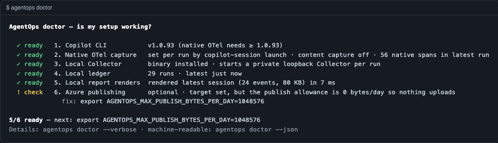
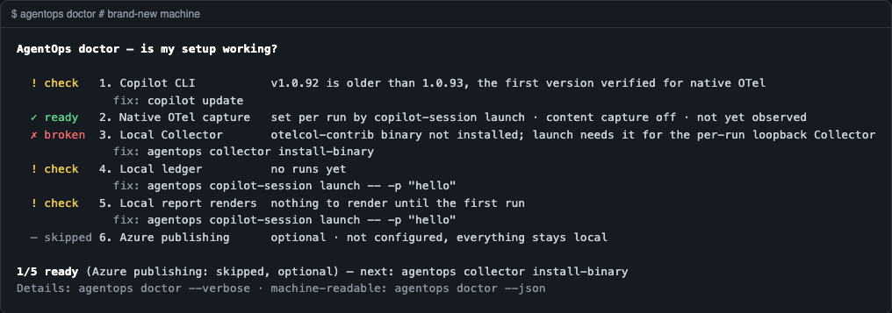

# `agentops doctor`: is my setup working?

`agentops doctor` checks the whole local pipeline, from the Copilot CLI to the
local report, and optionally Azure. Each stage gets one line with a status, a
reason, and a command you can paste to fix it.

```bash
agentops doctor            # checklist; no network calls, about 1 s
agentops doctor --cloud    # also counts AgentOps rows in Azure (read-only KQL)
agentops doctor --verbose  # checklist followed by every low-level check
agentops doctor --json     # machine-readable; legacy fields plus a `pipeline` section
```

## What it looks like

A working machine. Azure is set up, but the daily publish allowance is still 0:



A brand-new machine (`HOME` pointed at an empty folder):



## The stages

| # | Stage | Ready when | Typical fix |
|---|-------|-----------|-------------|
| 1 | Copilot CLI | The real `copilot` binary (not an AgentOps shim) is found, and `copilot --version` reports **1.0.93 or later** | `npm install -g @github/copilot`, `copilot update`, or `export COPILOT_CLI_BIN=/path/to/real/copilot` |
| 2 | Native OTel capture | Content capture is off, and the latest run (if any) recorded native spans | `unset OTEL_INSTRUMENTATION_GENAI_CAPTURE_MESSAGE_CONTENT` |
| 3 | Local Collector | `otelcol-contrib` is installed, the Collector config binds to `127.0.0.1`, and a loopback port can be opened | `agentops collector install-binary` |
| 4 | Local ledger | `~/.agentops/runs` has at least one run. Shows the run count and the age of the latest run | `agentops copilot-session launch -- -p "hello"` |
| 5 | Local report renders | The latest run's session view **actually renders** to a scratch file under `~/.agentops`, which is then checked and deleted | the `agentops copilot-session view …` command shown |
| 6 | Azure publishing *(optional)* | A target is configured, the publish allowance is above 0, and nothing is waiting to publish | `export AGENTOPS_MAX_PUBLISH_BYTES_PER_DAY=1048576`, `agentops delivery drain --yes` |

Statuses are `✓ ready`, `! check` and `✗ broken`. A stage that is optional and
not configured shows as `– skipped`. Every glyph has a word next to it, so the
output still reads correctly without colour.

The last line counts the stages that are ready, leaving out skipped ones. It
then names the single most important next fix. Broken required stages come
first, then required stages that need checking, then the optional Azure stage.

### Why 1.0.93?

Copilot CLI 1.0.93 is the first version we verified end to end to emit the
native OTel spans that the per-run AgentOps Collector receives. Older versions
still run, but the local report has no native span waterfall. Note that a
Homebrew-installed `copilot` launcher can report a different version when run
under a fresh `HOME`. In our test it reported 1.0.92 under an empty `HOME`,
probably because the launcher keeps its downloaded CLI under `HOME`.

### Content capture

`copilot-session launch` turns on native OTel for each run with
`COPILOT_OTEL_CAPTURE_CONTENT=false`. The launch copies your shell's
environment, so doctor fails stage 2 if any of these are set in it:

- `OTEL_INSTRUMENTATION_GENAI_CAPTURE_MESSAGE_CONTENT`
- `COPILOT_OTEL_CAPTURE_CONTENT`
- both `AGENTOPS_CAPTURE_CONTENT` and `AGENTOPS_ALLOW_CONTENT_CAPTURE`

## Network and speed

- The default checklist makes **no network calls**. It reads local files, runs
  `copilot --version`, opens and closes one loopback port, and renders one
  report in-process. It takes about 1 s on a laptop.
- `--cloud` runs one read-only `az monitor log-analytics query`. It counts rows
  in `AgentOpsEvents_CL` and `AgentOpsSpans_CL` over the last 24 hours in the
  configured workspace. If the workspace has no AgentOps tables, doctor tells
  you to point `--workspace-id` at the workspace your DCR writes to. It never
  prints subscription or workspace IDs.
- `--json`, `--verbose` and `--cloud` also run the historical Azure and Grafana
  validation unless you add `--local-only`, as before.

## Exit code and JSON

The exit code still reflects only the blocking low-level checks, such as a
connection string stored on disk. So `agentops doctor --local-only` in CI and in
install smoke tests means the same as before. A red pipeline stage on a fresh
machine is guidance, not a failure.

`--json` keeps every existing field (`ok`, `checks`, `collector`, `copilot`, …)
and adds:

```json
{
  "pipeline": {
    "stages": [
      { "id": "copilot", "title": "Copilot CLI", "status": "ready", "optional": false,
        "reason": "v1.0.93 (native OTel needs ≥ 1.0.93)", "fix": null, "version": "1.0.93" }
    ],
    "summary": { "ready": 5, "total": 6, "allReady": false,
                 "next": { "stage": "azure", "fix": "export AGENTOPS_MAX_PUBLISH_BYTES_PER_DAY=1048576" } },
    "cloudReadback": false,
    "durationMs": 540
  }
}
```

Colour follows the [`NO_COLOR`](https://no-color.org) convention: it is off
when output is not a terminal or when `NO_COLOR` is set. Set `FORCE_COLOR=1` to
force it on.
