# E2E Validation

Use E2E validation to prove the loop with real Copilot CLI telemetry.

## Native capture walkthrough (VS Code)

These screenshots come from a single sample run on 2026-10-06 of the
[AgentOps Native Capture extension](../extensions/agentops-native/README.md).
It ran in an isolated, signed-in VS Code Insiders test profile, and computer use
drove each step through the Command Palette. The account avatar is masked. The
publish path sends only the approved metadata projection: span names, timings,
token counts, trace and event IDs, and hashed run, session and repository
identifiers. Prompts, responses, code and tool arguments are not sent.

| Step | Command | Result |
|---|---|---|
| 1 | Copilot Chat: "Reply with just: pong e2e" | Reply received; status bar shows `AgentOps: Collector ready` |
| 2 | `AgentOps: Capture status` | Collector ready; 6 native spans received; Azure stages not yet attempted |
| 3 | `AgentOps: Publish native metadata to Azure` | Azure accepted 6 metadata events; refused 0 |
| 4 | `AgentOps: Verify Azure cloud readback` | Verified: 6 of 6 published events found with the expected typed fields |
| 5 | `az monitor log-analytics query` on `AgentOpsEvents_CL` | 6 rows; the `chat` span's tokens match the Chat response details |

**1. Chat with capture connected.** Connect ran automatically at startup.

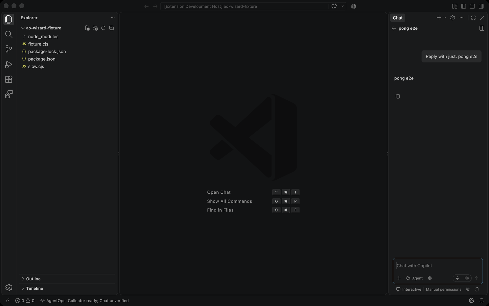

**2. Capture status.** Each stage is listed separately, so a stage that has not
happened never reads as passing. Here the upload is `not-attempted`, readback is
`unverified` and the project-script receipt is `none`.

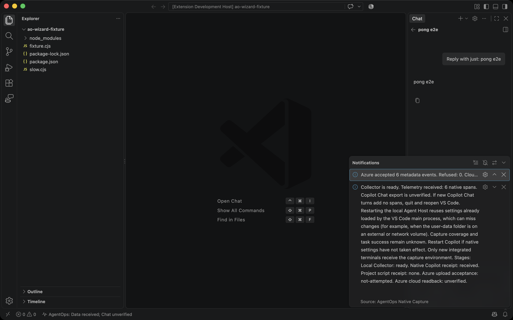

**3. Publish to Azure.** Acceptance is not proof of storage, so the message points to
the readback command.

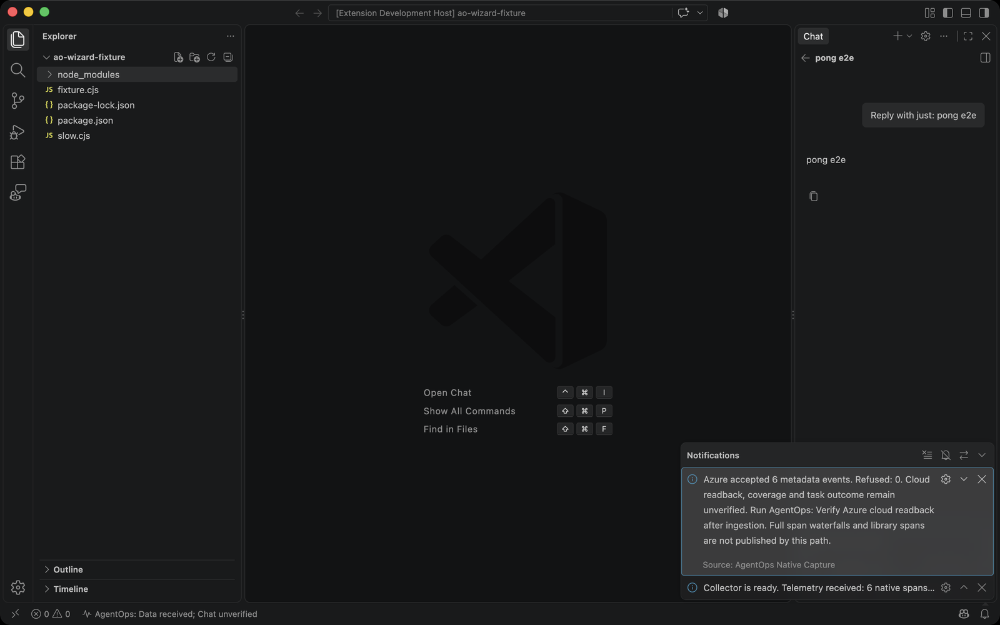

**4. Cloud readback.** The extension queries Log Analytics for the exact event IDs
it published.

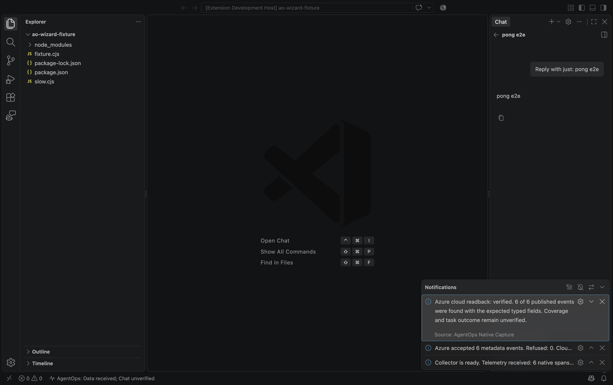

**5. Independent Log Analytics check.** This image is rendered from the rows that
`az monitor log-analytics query` returned. Workspace and resource IDs are omitted.
The `chat` span reports 28,656 input and 8 output tokens, which matches the
response details in VS Code.

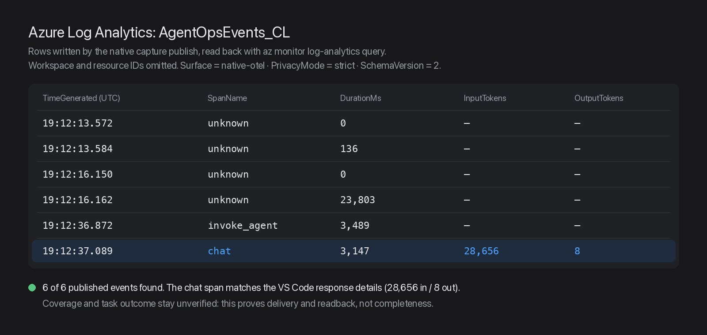

**6. Azure Monitor Workbook.** The saved Workbook "AgentOps Diagnostic Pilot" opened
in the user's existing signed-in browser session; the agent did not enter any
credentials. Images are cropped below the portal header, so no account,
subscription or resource ID is shown. Overview counts 4 native runs and 12 events.
The Spans tile reads 0 span-table rows and says that 12 native span events are
counted in Events.

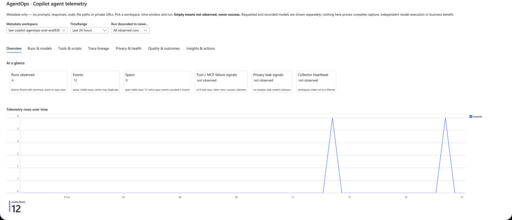

The Observed streams table lists each native run, its source table and readback
row count. Upload acknowledgment and capture completeness stay "unknown" because
row presence does not prove coverage.

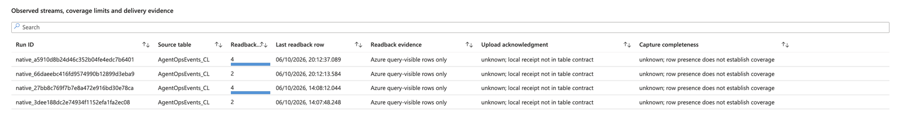

**7. Trace lineage.** Native capture writes span observations to
`AgentOpsEvents_CL` as `native.span.observed` events, not to `AgentOpsSpans_CL`.
This walkthrough found that Trace lineage read only the span table and wrongly
told users to start capture. It now unions both sources. Native rows show their
operation (`invoke_agent`, `chat` or `unknown`) and say that span and parent IDs
are not exported.

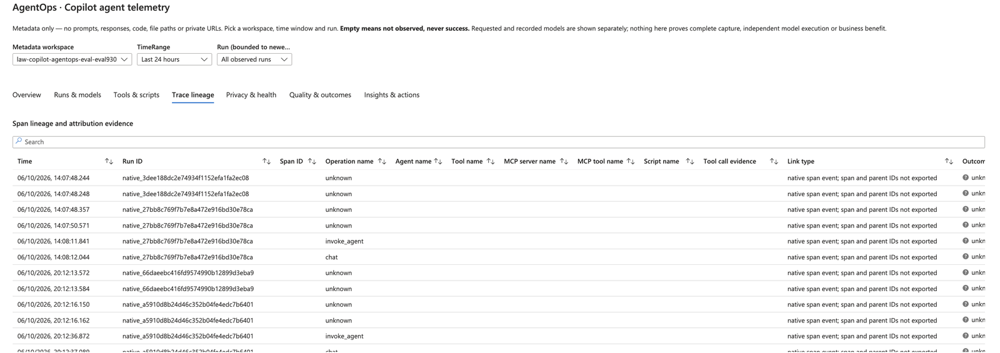

Coverage and task outcome stay unverified by design. This run proves capture,
delivery and readback; it does not prove that every span was captured.

## Copilot CLI walkthrough (2026-10-07)

Three real Copilot CLI 1.0.93 sessions (`claude-haiku-4.5`) ran against a small
demo repository. The repository has a `divide` bug, and its test fails until the
bug is fixed. Each session was launched with
`agentops copilot-session launch --repo . --upload --yes --json -- -p "..."`.
This starts a scoped strict Collector and runs Copilot with native
OpenTelemetry, content capture off. It then publishes the metadata streams
through the Data Collection Rule to Log Analytics. The daily publish cap was
1 MiB.

| Run | Scenario | Local rows (spans / events) | Azure rows | Result |
|---|---|---|---|---|
| 1 | Run the failing test | 65 / 14 | 65 / 14 | Accepted and read back |
| 2 | Fix the bug and retest | 67 / 26 | 67 / 26 | Accepted and read back |
| 3 | `sleep 12` test plus a `curl` the policy denied | 55 / 16 | 55 / 16 | Accepted and read back |

What this verified:

- **Delivery.** Azure accepted every stream. A KQL readback returned exactly the
  local row counts for each run.
- **Tokens.** For run 1, the `chat` spans sum to 60,243 input tokens: 15 fresh,
  29,804 cache read and 30,424 cache write. That equals Copilot CLI's own
  "↑ 60.2k" summary. The 351 output tokens also match.
- **Latency.** The `sleep 12` shell step reads back as a 12,109 ms
  `execute_tool` span.
- **Failures.** The denied `curl` reads back with `ErrorType=denied` and
  `Outcome=failed`. The local run view shows it as a failure signal with its
  preceding context, with the content redacted.
- **Privacy.** The metadata-only run view contains no prompt or command text.
  We searched it for the prompt keywords and found no matches.

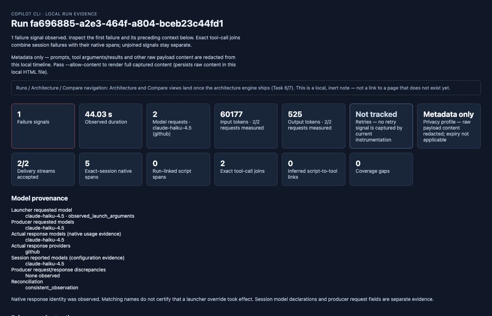

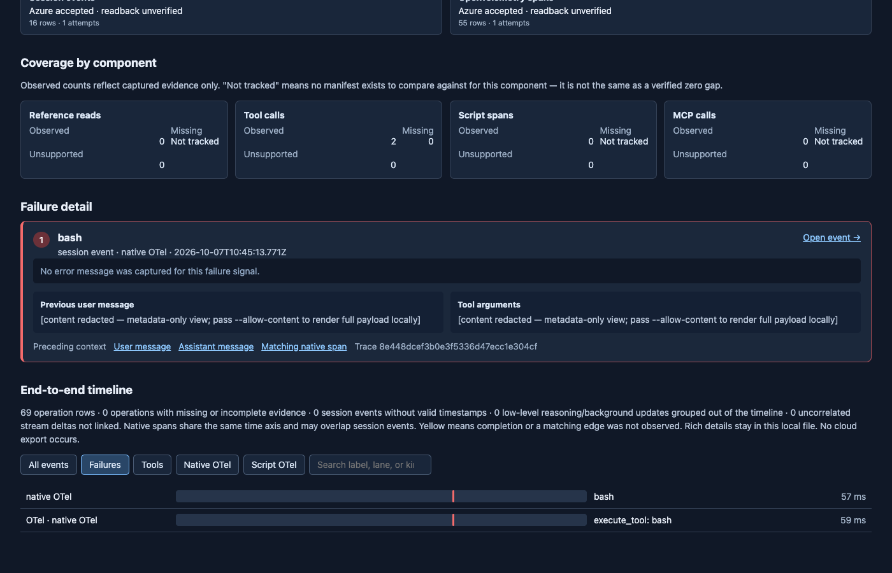

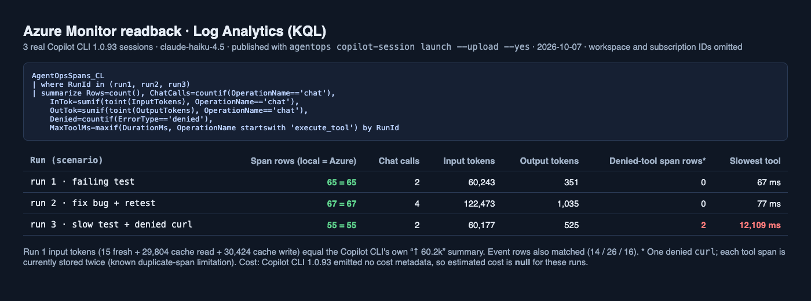

A fourth, local-only session (no `--upload`) checked the README quickstart. It
kept both streams `pending` with 0 upload attempts, and `copilot-session view`
rendered the run.

Limits found by this run:

- **Cost.** Copilot CLI 1.0.93 emitted no cost or premium-request fields, so
  `EstimatedCostUsd` stays null. Cost appears only where the runtime emits cost
  metadata.
- **Non-zero exits.** A shell command that exits non-zero, such as the failing
  `node test.js`, is a successful `execute_tool` span. The local
  `tool.execution_complete` event still records it as failed.
- **Duplicate spans.** Each tool span is stored twice in `AgentOpsSpans_CL`,
  with the same `SpanId`. Run 3 therefore shows two denied rows for one denied
  `curl`.
- **Token sums.** Sum tokens over `OperationName == 'chat'` rows or the
  `session.shutdown` event. A naive sum over every span row over-counts by
  roughly 60x, because span-event rows repeat the token attributes.
- **Workbook usage.** The Azure Workbook reads usage from
  `AgentOpsRunSummary_CL`. A launch-only run has no run summary there, so its
  usage shows as "partial or unknown".
- **Local report.** The `product build` report needs `agentops attach` first and
  a ledger directory that contains only complete runs.

Readback query:

```kusto
AgentOpsSpans_CL
| where RunId in ("<run-1>", "<run-2>", "<run-3>")
| summarize Rows=count(), ChatCalls=countif(OperationName == "chat"),
    InTok=sumif(toint(InputTokens), OperationName == "chat"),
    OutTok=sumif(toint(OutputTokens), OperationName == "chat"),
    Denied=countif(ErrorType == "denied"),
    MaxToolMs=maxif(DurationMs, OperationName startswith "execute_tool") by RunId
```

## CLI live E2E (scripted)

```bash
agentops e2e run --live --browser-report --last 2h --json
agentops e2e report --last 2h --out .agentops/e2e/latest/report.html
agentops e2e browser-check --report .agentops/e2e/latest/report.html --json
```

The run should:

- capture a redacted environment summary
- force `AGENTOPS_PRIVACY_MODE=strict` and content capture off for live E2E commands
- run `doctor`
- start or verify the local collector
- run strict poison smoke
- run a safe `copilot -p` prompt
- query latest Azure telemetry
- generate a local HTML report
- print Grafana URLs
- validate the local report for PASS state, evidence links, Grafana links, and secret-looking strings

Do not commit `.agentops/e2e/` live evidence unless it is intentionally redacted fixture data.

Codex browser validation is deterministic for the local report. When Playwright is available, `browser-check --playwright` can capture a local report screenshot. Add `--grafana` to attempt dashboard screenshots; authenticated Azure Managed Grafana may still require a normal signed-in browser. If Grafana redirects to Microsoft sign-in, the check records `auth-blocked` and does not copy those sign-in screenshots into `docs/screenshots/v2/`.

To refresh the V2 dashboard-tour screenshots from an authenticated browser profile:

```bash
AGENTOPS_E2E_PLAYWRIGHT=1 \
  agentops e2e browser-check \
    --report .agentops/e2e/latest/report.html \
    --playwright \
    --grafana \
    --grafana-v2-only \
    --require-grafana-visible \
    --v2-docs-screenshots \
    --json
```

When the browser profile is authenticated and the dashboards render, that command writes stable V2 filenames under `docs/screenshots/v2/`:

- `agentops-v2-home-live.png`
- `agentops-v2-runs-explorer-live.png`
- `agentops-v2-run-replay-live.png`

Without `--require-grafana-visible`, auth-blocked Grafana pages are recorded as `auth-blocked` without failing the local report QA. With `--require-grafana-visible`, the command fails until the V2 dashboards actually render in the browser profile.

When strict visual QA is auth-blocked, `browser-check` writes an **Auth Remediation** section to `.agentops/e2e/latest/browser-notes.md` with the exact sign-in command and the exact rerun command for the same report.

For repeatable authenticated QA, pass either a signed-in persistent browser profile or a saved Playwright storage state:

```bash
agentops e2e auth-profile \
  --report .agentops/e2e/latest/report.html \
  --browser-executable "/Applications/Google Chrome.app/Contents/MacOS/Google Chrome" \
  --browser-user-data-dir "$HOME/.agentops/browser/grafana-profile"
```

That prints the one-time sign-in command and the strict visual rerun command.

```bash
agentops e2e browser-check \
  --report .agentops/e2e/latest/report.html \
  --playwright \
  --grafana \
  --grafana-v2-only \
  --require-grafana-visible \
  --browser-executable "/Applications/Google Chrome.app/Contents/MacOS/Google Chrome" \
  --browser-user-data-dir "$HOME/.agentops/browser/grafana-profile" \
  --headed \
  --json
```

Use `--storage-state <path>` instead of `--browser-user-data-dir` if you export cookies/local storage from another Playwright run.

The final product-level gate can include this same visual proof:

```bash
agentops product audit \
  --live \
  --last 2h \
  --require-rows \
  --require-visual \
  --report .agentops/e2e/latest/report.html \
  --browser-executable "/Applications/Google Chrome.app/Contents/MacOS/Google Chrome" \
  --browser-user-data-dir "$HOME/.agentops/browser/grafana-profile" \
  --json
```

This gate requires real rendered dashboard pages. Static report links alone do not count. If the report file is missing, the visual product audit returns the recovery commands to regenerate live E2E evidence before rerunning the visual gate. If Grafana redirects to Microsoft sign-in, run `agentops e2e auth-profile` and sign in once with the printed browser profile before rerunning the visual gate. If screenshots come from another authenticated browser harness, pass the generated evidence JSON with `--visual-evidence <json>`; every V2 dashboard must be visible, unblocked, and backed by a screenshot file.
