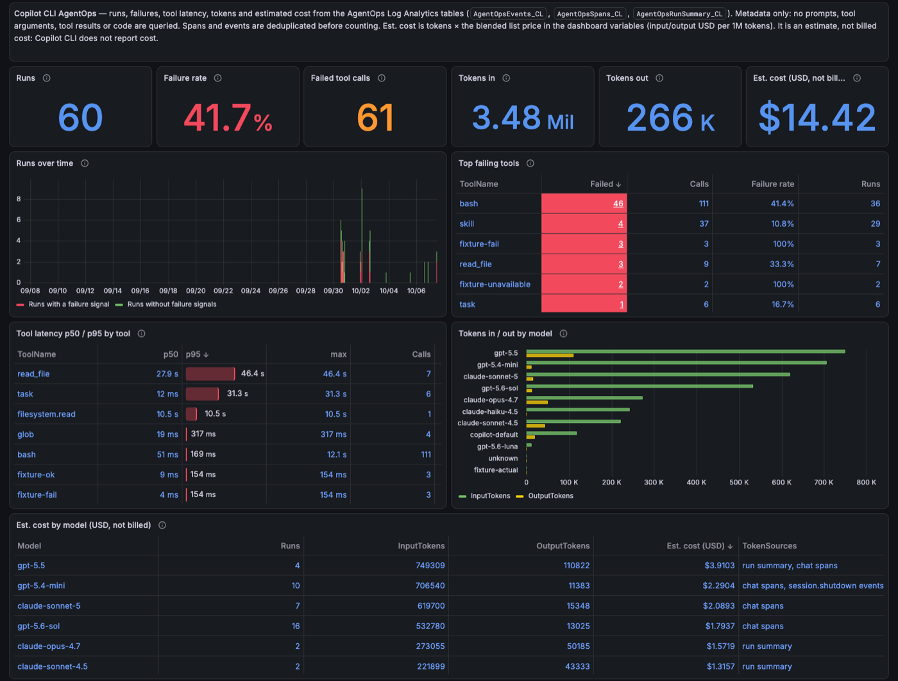

# Portable Grafana dashboard

> **Which file?** Import `grafana/agentops-copilot-cli.json`. It is the one recommended dashboard. The other JSONs under `grafana/` (the legacy pack and the advanced `grafana/dashboards/v2/` pack) are listed in [`grafana/README.md`](../grafana/README.md); you do not need them to get started.

`grafana/agentops-copilot-cli.json` is one dashboard for Copilot CLI runs. It reads the AgentOps Log Analytics custom tables that the current ingestion path writes:

- `AgentOpsEvents_CL`
- `AgentOpsSpans_CL`
- `AgentOpsRunSummary_CL`

It only uses the built-in **Azure Monitor** data source. It needs no plugins and no alert rules, and it contains no subscription, workspace or data source IDs. The same JSON imports unchanged into three places:

| Tier | Cost | Status |
|---|---|---|
| 1. Azure Monitor dashboards with Grafana (Azure portal) | No Grafana instance to run | Import steps from Microsoft Learn; render not verified by this repo |
| 2. Azure Managed Grafana | Paid Azure resource | Same data source type; render not verified by this repo |
| 3. Self-hosted Grafana with the built-in Azure Monitor data source | Your own host | Verified with Grafana 13.2.3 against a real workspace (see [Evidence](#evidence)) |



## What the dashboard shows

| Panel | Source and rule |
|---|---|
| Runs, Failure rate, Failed tool calls | Distinct `RunId`s. A run fails if its run summary is failed/blocked/error, any event status is failed/error/denied/blocked, or any span outcome is failed/error. |
| Runs over time | Runs per `$__interval`, split by failure signal. |
| Top failing tools | Tool calls deduplicated by `RunId` + `ToolCallId`. Start/complete events are paired; `execute_tool` spans only fill gaps. |
| Tool latency p50 / p95 by tool | Complete time minus start time for each paired tool call, or the span duration. |
| Tokens in / out (stats and by model) | One token source per run, never summed across sources (see below). |
| Est. cost (stats and by model) | Tokens × the price variables. Labelled **Est.** and **not billed**. |
| Slowest runs | Top 20 runs by first-to-last timestamp, with models, tool counts and tokens. |

### Token source order

Spans are written more than once, so every query first deduplicates them with `arg_max(TimeGenerated, *) by RunId, SpanId, OperationName`. Each run then takes its tokens from the first source that has any:

1. `AgentOpsRunSummary_CL`
2. `chat` spans
3. `invoke_agent` spans
4. `session.shutdown` events

The sources disagree. For example, native runs' `session.shutdown` input count excludes cached tokens. The **Est. cost by model** table shows which source each model's numbers came from.

### Estimated cost

Copilot CLI does not report cost. The dashboard multiplies tokens by two textbox variables:

- `est_price_in_usd_per_mtok` (default `3`): input price in USD per 1M tokens.
- `est_price_out_usd_per_mtok` (default `15`): output price in USD per 1M tokens.

Edit them to match your model mix. The result is a rough estimate. It is not your Copilot or Azure bill.

## Variables

| Variable | Type | Purpose |
|---|---|---|
| `datasource` | Data source (`grafana-azure-monitor-datasource`) | Which Azure Monitor data source to use |
| `subscription` | Query: Azure Subscriptions | Lists subscriptions the data source can read |
| `workspace` | Query: Azure Workspaces in `$subscription` | The Log Analytics workspace with the AgentOps tables |
| `est_price_in_usd_per_mtok`, `est_price_out_usd_per_mtok` | Textbox | Prices for the estimate |

The identity behind the data source needs **Log Analytics Reader** (or **Monitoring Reader**) on the workspace.

## Tier 1: Azure Monitor dashboards with Grafana (Azure portal)

This tier has no Grafana instance to run. See [Use Azure Monitor dashboards with Grafana](https://learn.microsoft.com/azure/azure-monitor/visualize/visualize-use-grafana-dashboards).

1. Download `grafana/agentops-copilot-cli.json` from this repo.
2. In the Azure portal, open **Monitor** > **Dashboards with Grafana**.
3. Select **New** > **Import**, choose the JSON file and select **Load**.
4. Enter a name, then choose the subscription, resource group and region where the dashboard resource is saved.
5. Open the dashboard and pick your **Subscription** and **Log Analytics workspace**.

The portal only imports dashboards that use supported data sources. This one uses only Azure Monitor.

## Tier 2: Azure Managed Grafana

1. Ensure the workspace's managed identity (or your sign-in) has **Log Analytics Reader** on the Log Analytics workspace. The default Azure Monitor data source uses the managed identity.
2. In Grafana, open **Dashboards** > **New** > **Import**.
3. Upload `grafana/agentops-copilot-cli.json` and select **Import**.
4. Choose the Azure Monitor data source, then the subscription and workspace.

From the CLI (the `amg` extension):

```bash
az grafana dashboard import -g <grafana-rg> -n <grafana-name> \
  --definition grafana/agentops-copilot-cli.json --overwrite true
```

## Tier 3: Self-hosted Grafana

Grafana ships the Azure Monitor data source built in. No plugin install is needed.

1. Add an **Azure Monitor** data source. Pick an authentication method your host supports:
   - **Managed identity** when Grafana runs on an Azure VM, App Service or container with an identity.
   - **Workload identity** on AKS.
   - **App registration** (client secret) elsewhere.
   - **Current user** if Grafana signs users in with Microsoft Entra ID and the feature is enabled.
2. Grant that identity **Log Analytics Reader** on the workspace.
3. Open **Dashboards** > **New** > **Import**, upload the JSON and select **Import**.
4. Pick the data source, subscription and workspace.

Over the HTTP API:

```bash
jq '{dashboard: (. | del(.id)), overwrite: true}' grafana/agentops-copilot-cli.json |
  curl -sS -u "admin:$GRAFANA_PASSWORD" -H 'content-type: application/json' \
    -X POST --data @- http://localhost:3000/api/dashboards/db
```

## Changing the dashboard

The JSON is generated. Edit `scripts/build-grafana-portable-dashboard.js` and run:

```bash
node scripts/build-grafana-portable-dashboard.js          # rewrite the JSON
node scripts/build-grafana-portable-dashboard.js --check  # fail if the JSON is stale
```

Checks:

- `agentops dashboard validate` runs the portability checks: no GUIDs or `/subscriptions/` IDs, `${datasource}` on every panel and target, `$workspace` as the only resource, unique panel IDs and a structural KQL lint.
- `agentops dashboard kql-check --local-only` renders every panel query, including the price defaults.
- `agentops dashboard kql-check --live --workspace-id <id> --require-rows` runs every panel against a real workspace.
- `agentops-cli/test/grafana-portable-dashboard.test.js` covers the above.

The offline lint checks structure only (brackets, quotes, pipes, time bounds). It does not parse KQL. Real parsing comes from `kql-check --live` or from Log Analytics itself.

## Evidence

Run on 2026-10-07 against a test workspace with 61 runs in the last 30 days (synthetic enterprise fixtures plus real native Copilot CLI runs):

- **Live KQL:** every panel query ran through `az monitor log-analytics query` with the time macros replaced, over 30 days and 24 hours.
  - 30-day row counts: 1/1/1/1/1/1 for the six stats, 26 for Runs over time, 8 for Top failing tools, 15 for Tool latency, 11 for Tokens by model, 11 for Cost by model and 20 for Slowest runs.
  - One native run was hand-checked against its raw rows: 60,177 input / 525 output tokens, 1 failed tool, a 12.1 s bash call, 44 s duration and the claude-haiku-4.5 model.
- **`agentops dashboard kql-check --live --last 30d --require-rows`:** all 47 checks passed (35 V2 and 12 portable).
- **Self-hosted Grafana 13.2.3 (Homebrew build, localhost):**
  - The JSON was imported over the HTTP API.
  - All 12 panel queries returned data through Grafana's own `/api/ds/query` using the built-in Azure Monitor data source, with no errors.
  - The screenshot above comes from that instance. It is cropped to remove subscription, workspace and session identifiers.
  - Test-harness note: the data source used managed-identity auth, served by a localhost-only token endpoint that handed out the operator's `az` CLI token. No service principal was created. This is a test convenience, not a recommended production setup.
- **Tiers 1 and 2** use the same data source type and query model, but this repo has not rendered the dashboard in them.
