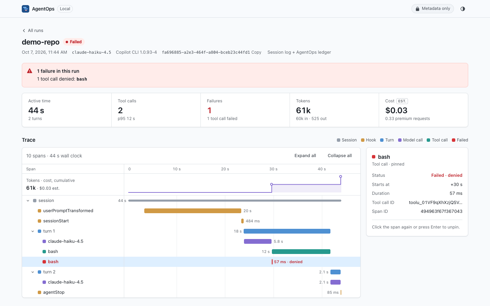
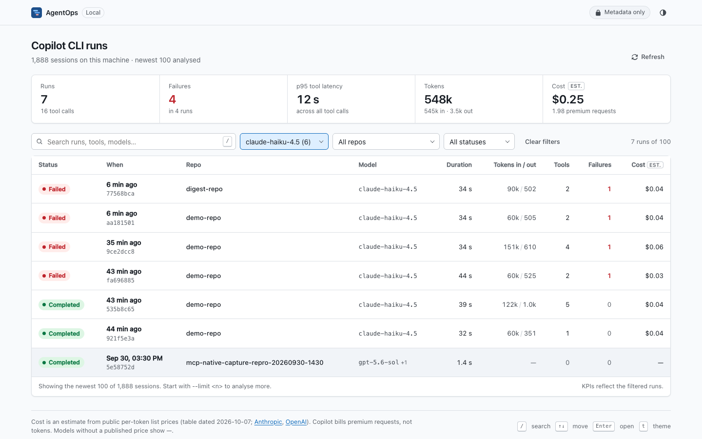
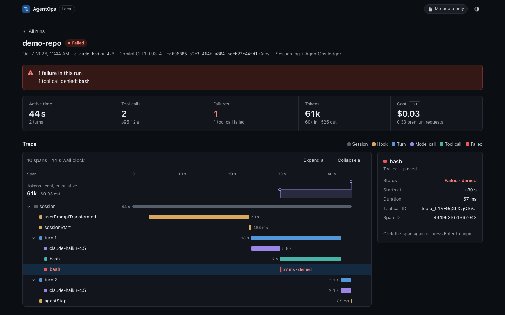

# Local web UI

`agentops ui` opens a local, read-only web UI for the Copilot CLI sessions on your machine. It needs no Azure, no Docker, no build step and no network. It has zero dependencies: Node's built-in `http` server serves plain HTML, CSS and JavaScript. Nothing is fetched from a CDN, so it also works offline.



## Quick start

You need Node.js 20+ and at least one Copilot CLI session on this machine.

```bash
git clone https://github.com/c-mongan/copilot-cli-agentops-azure && cd copilot-cli-agentops-azure
alias agentops="node $PWD/agentops-cli/src/index.js"

agentops ui                 # runs list; opens your browser when run in a terminal
agentops ui latest          # jump straight to the latest run's waterfall
agentops open latest --ui   # same thing, from the run receipt command
```

The command prints `AgentOps UI running at http://127.0.0.1:<port>/`. Press `Ctrl+C` to stop it.

`latest` (in `agentops ui latest`, `agentops open latest --ui` and `/api/runs/latest`) picks, in order of most recent activity:

1. a run recorded by AgentOps (`agentops copilot-session launch`, from its `~/.agentops/runs/*/run-context.json`) or a finished Copilot CLI session, whichever is newest;
2. a still-running (live) Copilot CLI session only when there is nothing else.

So a Copilot session you have open in another terminal never hides the run you just launched.

| Option | Effect |
|---|---|
| `--open` / `--no-open` | Launch the browser, or only print the URL. By default it opens only in an interactive terminal outside CI. |
| `--port <n>` | Bind a fixed port. The default is a free port chosen by the operating system. |
| `--limit <n>` | Analyse the newest `n` sessions (default 100, maximum 5000). |
| `--allow-content` | Also serve redacted prompts, tool arguments and results for local sessions. See [privacy](#privacy). |
| `--copilot-home`, `--agentops-home` | Read from other homes than `~/.copilot` and `~/.agentops`. |

**Time to first graph** (measured 2026-10-07 on macOS, Node 22, 1,888 local sessions, from a clean `env -i` shell to a rendered waterfall):

| Path | Cold | Warm |
|---|---|---|
| `agentops ui latest` → waterfall rendered | 2.2 s (URL printed after 1.9 s) | 0.44 s |
| `agentops ui` → runs list rendered (newest 100) | 1.5 s | — |

The browser was already running during these measurements.

## Screens

### Runs home



- **KPI strip:** runs, failed runs, p95 tool latency, total tokens in/out and estimated cost.
- **Runs table:** newest first. Each row shows when the run started, repository (basename only), model, duration, tokens in/out, tool calls, failures and a status pill (`ok`, `attention`, `failed`, `incomplete`, `live`). See [How run status is decided](#how-run-status-is-decided).
- **Filters:** model, repository, status and a search box. Filters are kept in the URL, so you can reload or share a view on the same machine.

Sources are Copilot CLI session folders (`~/.copilot/session-state/*/events.jsonl`) and AgentOps ledger runs (`~/.agentops/runs`). A session that also has a ledger run is merged into one row.

### Run detail

- **Failure callout:** for example "1 tool call denied: bash". It uses only the tool name and outcome, never arguments.
- **Waterfall:** session → hooks, turns → chat calls and tool calls, on a shared time axis. Bars are coloured by kind; failed spans are red and denied tool calls are amber. Hover or focus a row to inspect it; click to pin. The inspector shows metadata only: kind, tool name, duration, status, token counts and span ID. Duplicate spans with the same span ID are shown once.
- **Token and cost meter:** cumulative tokens and estimated cost along the same time axis.
- **Tool latency:** count, p50, p95, max and failures per tool.
- **Tokens by model:** input, output, cache reads and estimated cost per model.



### Keyboard

| Key | Runs home | Run detail |
|---|---|---|
| `/` | Focus search | — |
| `↑` `↓` / `j` `k` | Move between runs | Move between spans |
| `Home` `End` | — | First / last span |
| `Enter` | Open run | Pin span in the inspector |
| `←` `→` | — | Collapse / expand a span |
| `Esc` | Clear search (in the search box) | Back to the runs list |
| `r` | Reload runs | — |
| `t` | Cycle theme: system, light, dark | Same |

The theme follows `prefers-color-scheme` until you pick one. Motion is reduced when the operating system asks for it.

## How run status is decided

`copilot-session launch`, `copilot-session view` and this UI use one shared classifier ([`run-status.js`](../agentops-cli/src/lib/copilot/run-status.js)). The same session gets the same status everywhere.

Each completed tool call is classified from its `tool.execution_complete` event:

| Tool outcome | Rule | Counts as |
|---|---|---|
| `ok` | `success` is not `false` and any shell exit code is 0 | — |
| `denied` | `success: false` with `error.code` `denied`, `rejected`, `permission_denied`, `user_rejected` or `policy_denied` | denial |
| `failed` | `success: false` with any other or no error code | failure |
| `nonzero_exit` | `success: true` but `shellExecution.exitCode` is not 0 (for example a failing `npm test`) | non-zero exit |

A failed hook (`hook.end` with `success: false`) and a failed sub-agent (`subagent.failed`) also count as failures. A denial means a permission gate stopped the tool before it ran. It is not a tool malfunction. A non-zero shell exit is a successful tool call to Copilot CLI: the command ran and reported a result, which the agent may have expected.

The run status is the first rule that matches:

| Status | Label | Rule |
|---|---|---|
| `live` | Live | The session is still running (UI only). |
| `failed` | Failed | The run errored (launch: Copilot exited non-zero, was cancelled or was signalled) or at least one failure was observed. |
| `incomplete` | Incomplete | No `session.shutdown` event was observed. |
| `attention` | Needs attention | At least one denial or non-zero shell exit, and no failures. |
| `ok` | Completed | None of the above. |

The `copilot-session view` HTML still shows a detail card for every denial and non-zero shell exit, so you can inspect them. Its summary states the run status and the breakdown, so the card count does not imply a failed run.

JSON output keeps every existing field and adds `status`, `statusLabel` / `status_label`, `statusReasons` / `status_reasons` (`run_errored`, `failures`, `denials`, `nonzero_exits`) and the signal counts. `ok` in `launch --json` still means "Copilot exited 0 and evidence was collected"; it is not the run status.

### What each span count means

| Name | Where | Counts |
|---|---|---|
| Native OTel spans | launch `spanCounts.nativeSpans`, view `native_spans`, UI toolbar | Unique native spans, deduplicated by trace ID and span ID. Span-event rows are excluded. |
| Span-table rows | launch `spanCounts.spanRows` and the legacy `evidence.spans` | Rows written to `AgentOpsSpans_CL.jsonl`: each span plus one row per span event. Always at least the native span count. |
| Trace spans | UI toolbar | Rows in the UI waterfall: session, turns, hooks, model calls and tool calls, built from session events and spans. |

For example, one QA run had 57 span-table rows, 16 native OTel spans and 24 trace spans. These numbers describe different things and are labelled as such on every surface. `copilot-session view` counts native spans only when `--run-id` points to the run's local evidence.

## Privacy

- **Loopback only.** The server binds to `127.0.0.1` and rejects requests whose `Host` header is not `127.0.0.1`, `localhost` or `[::1]` on its own port. This blocks DNS-rebinding attacks.
- **Read-only.** Only `GET` and `HEAD` are accepted. The UI never writes to `~/.copilot` or `~/.agentops`.
- **Metadata only by default.** The data layer copies only whitelisted fields from each event: types, timestamps, tool names, outcomes, models and token counts. Prompts, responses, reasoning, tool arguments, tool results and error messages are never parsed into API responses. Repositories are shown by basename only; branches and parent directories are not shown. Unit tests plant canary strings in every content field of the real event shapes and assert that none reach the API.
- **`--allow-content`** adds a per-run content endpoint for local Copilot CLI sessions only (not for ledger-only runs). Text goes through the same secret redaction as `copilot-session view`. Use it only on your own machine.
- **Hardened responses.** A strict Content Security Policy (`default-src 'none'`, same-origin scripts and styles only), `nosniff`, `no-referrer` and `no-store` on API responses. The client renders with `textContent` only.

## Estimated cost

Copilot CLI bills by premium requests, not tokens, and emits no cost metadata. The UI multiplies observed tokens by public API list prices to give an order-of-magnitude estimate. It is always labelled "est." and is never billed cost.

- The UI and `agentops digest` share one estimator and price table, [`agentops-cli/src/lib/cost-estimate.js`](../agentops-cli/src/lib/cost-estimate.js), with its date and source links ([Anthropic](https://platform.claude.com/docs/en/about-claude/pricing), [OpenAI](https://developers.openai.com/api/docs/pricing)). For the same runs both show the same total.
- Cache reads and writes are priced at their own rates and the rest of the input at the input rate.
- A model that is not in the table is **unpriced**: its cost shows "n/a", never $0 or a guess. Totals add up the priced models and say how many are unpriced, for example `$12.34 est. (2 models unpriced)`. The runs table footer shows that total; a run with some unpriced models shows `+n/a` next to its cost.
- `GET /api/runs?since=7d` limits the list and KPIs to runs that started in the window. Add `&source=copilot` to drop AgentOps ledger runs that have no Copilot session file, which the digest does not read. That request covers the same runs as `agentops digest --since 7d`, so the totals match when `--limit` is large enough to include the whole window.

## Known limits

- Per-call token points need an AgentOps ledger run (`agentops copilot-session launch`). For plain Copilot CLI sessions the meter shows one end-of-session point from the shutdown totals. With a ledger, the estimated cost is spread across calls by token share so it ends at the run's figure.
- Only the newest 100 sessions are analysed by default. Use `--limit` for more.
- A session that is still running, or ended without a shutdown event, is shown as `incomplete` with partial data.
- A shell command that exits non-zero is a successful tool call to Copilot CLI. AgentOps marks the run `attention`, not `failed`. See [How run status is decided](#how-run-status-is-decided).
- The UI reads local files only. For team-wide views, use the [Azure Workbook](enterprise-workbook.md) or [Grafana](grafana-dashboard-tour-v2.md).
