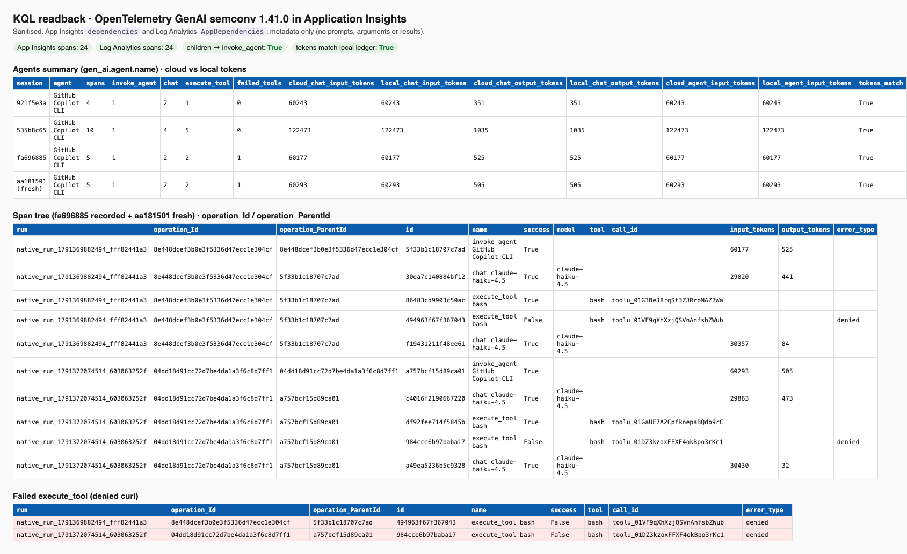

# OpenTelemetry GenAI export for the Application Insights Agents view

`agentops copilot-session export-otel` converts one recorded Copilot CLI session into standard OpenTelemetry GenAI spans (`invoke_agent` → `chat` / `execute_tool`). It sends them to Application Insights, where they land in `dependencies` (Log Analytics: `AppDependencies`) in the shape that the **Agents (preview)** experience reads.

It exports metadata only. Prompts, responses, tool arguments and tool results are never exported, and `--allow-content` is rejected.



## Pinned semantic-conventions version

| Item | Value |
|---|---|
| Semconv version | `1.41.0` (`SEMCONV_VERSION`) |
| Schema URL | `https://opentelemetry.io/schemas/1.41.0` (resource and scope `schemaUrl`) |
| Adapter module | [`agentops-cli/src/lib/otel/genai-semconv.js`](../agentops-cli/src/lib/otel/genai-semconv.js) |
| Instrumentation scope | `agentops.genai-export` |

`1.41.0` is the last tagged `open-telemetry/semantic-conventions` release that still contains the GenAI pages. Later tags moved them to the untagged `semantic-conventions-genai` repository. The GenAI conventions are still at **Development** stability. Every `gen_ai.*` key, span name and span kind is defined only in the adapter, so a future rename changes one file and its golden test.

## Span model

| Operation | Span name | Kind | Parent |
|---|---|---|---|
| `invoke_agent` | `invoke_agent {gen_ai.agent.name}` | `INTERNAL` (the agent runs in process) | none (trace root) |
| `chat` | `chat {gen_ai.request.model}` | `CLIENT` | `invoke_agent` |
| `execute_tool` | `execute_tool {gen_ai.tool.name}` | `INTERNAL` | `invoke_agent` |

Trace and span IDs are reused from Copilot CLI's native OTel, so the exported spans join `AgentOpsSpans_CL` on `TraceId` / `SpanId`. Copilot CLI 1.0.93 parents tool calls on `invoke_agent`, not on the preceding `chat`. The export keeps that native parentage rather than inventing one.

A failed tool span gets status `ERROR` and `error.type` (for example `denied`), and App Insights shows `success == false`. A shell command that exited non-zero is also exported as `ERROR` with `error.type = shell_nonzero_exit`; filter it out if you only want hard failures.

## Attributes

| Attribute | Spans | Source | Notes |
|---|---|---|---|
| `gen_ai.operation.name` | all | native operation | Required. |
| `gen_ai.provider.name` | all | native provider (`github`) | Required on agent and inference spans. `github` is a custom value, which the spec allows. |
| `gen_ai.system` | all | same as provider | Deprecated alias. Kept because existing Azure Monitor queries still use it. |
| `gen_ai.agent.name` | all | `--agent-name`, else the native agent name, else `GitHub Copilot CLI` | The Agents view groups by this. Strict collector configs keep `copilot`, `copilotcli` and `claude` readable and replace any other label with its SHA-256 digest. |
| `gen_ai.conversation.id` | all | Copilot session ID | |
| `gen_ai.request.model` / `gen_ai.response.model` | `chat` | native model requested / actual | |
| `gen_ai.usage.input_tokens` / `output_tokens` | `invoke_agent`, `chat` | native usage | `invoke_agent` holds the session total (see the limits section). |
| `gen_ai.usage.cache_read.input_tokens` / `cache_creation.input_tokens` | `chat` | native usage | Set when the native span records them. |
| `gen_ai.tool.name` | `execute_tool` | native tool name | Required. |
| `gen_ai.tool.call.id` | `execute_tool` | native tool call ID | |
| `gen_ai.tool.type` | `execute_tool` | `extension` for MCP tools, else `function` | |
| `error.type` | failed spans | native error type, else `_OTHER`; `shell_nonzero_exit` for a shell exit code other than 0 | |
| `agentops.run.id` | all | `--run-id` | Joins to the AgentOps ledger. |
| `agentops.agent.name_source` | all | `override`, `native` or `default` | |
| `agentops.semconv.version` | all | `1.41.0` | |
| `agentops.mcp.server` | MCP tool spans | native MCP server name | |
| `agentops.parent_tool_call.id` | sub-agent tool spans | native parent tool call | |

The export sets nothing else. The opt-in content attributes (`gen_ai.input.messages`, `gen_ai.output.messages`, `gen_ai.system_instructions`, `gen_ai.tool.definitions`, `gen_ai.tool.call.arguments`, `gen_ai.tool.call.result`) are never set. The temporary Collector also deletes them in case another sender adds them. String values are limited to 128 characters from a conservative allow-list (letters, digits, spaces and `_.:/@()+-`). Anything else, such as newlines, quotes or semicolons, is dropped, so free text cannot leak through a name or ID field.

## Send

The input is the AgentOps run ledger (`~/.agentops/runs/<run-id>/AgentOpsSpans_CL.jsonl`), written by `copilot-session launch`. Native receipts are used as a fallback. Find the run ID in `~/.agentops/runs/*/run-context.json`.

```bash
# Inspect first: no network, prints the operation counts, failed tools and tokens
agentops copilot-session export-otel <session-id> --run-id <run-id> --dry-run [--output otlp.json]

# Send to any OTLP/HTTP endpoint (plain http only for loopback)
agentops copilot-session export-otel <session-id> --run-id <run-id> --endpoint http://127.0.0.1:4318

# Send to Application Insights through a short-lived local Collector (azuremonitor exporter)
export APPI_CS="$(az monitor app-insights component show -g <rg> -a <app-insights> --query connectionString -o tsv)"
agentops copilot-session export-otel <session-id> --run-id <run-id> --appinsights-connection-string-env APPI_CS --json

# Re-running the same command sends nothing new; --force re-sends every span
agentops copilot-session export-otel <session-id> --run-id <run-id> --appinsights-connection-string-env APPI_CS --force
```

In `--appinsights-connection-string-env` mode, the CLI reads the connection string only from the named environment variable. It then starts `otelcol-contrib` from `~/.agentops/collector/bin` on loopback ports and gives it the secret through its process environment only. The generated config holds `${env:...}`, never the value. The CLI posts OTLP JSON, waits for the exporter to flush, stops the Collector and fails if the exporter logged errors.

The route uses a Collector because App Insights native OTLP ingestion needs a resource created with OTLP support. See [azure-native-otlp-preview.md](azure-native-otlp-preview.md).

## Verify with KQL

```kusto
dependencies
| where timestamp > ago(1h)
| where customDimensions has 'gen_ai.operation.name'
| project timestamp, operation_Id, operation_ParentId, id, name, success,
          op = tostring(customDimensions['gen_ai.operation.name']),
          agent = tostring(customDimensions['gen_ai.agent.name']),
          model = tostring(customDimensions['gen_ai.request.model']),
          tool = tostring(customDimensions['gen_ai.tool.name']),
          call_id = tostring(customDimensions['gen_ai.tool.call.id']),
          input_tokens = tolong(customDimensions['gen_ai.usage.input_tokens']),
          output_tokens = tolong(customDimensions['gen_ai.usage.output_tokens']),
          error_type = tostring(customDimensions['error.type']),
          run = tostring(customDimensions['agentops.run.id'])
| order by operation_Id asc, timestamp asc
```

For Log Analytics, query `AppDependencies` and use `Properties`, `OperationId`, `ParentId` and `Id`. The root `invoke_agent` has `operation_ParentId == operation_Id`. Every `chat` and `execute_tool` has `operation_ParentId` equal to the root's `id`.

### Verified end to end

On 2026-10-07, four real Copilot CLI 1.0.93 sessions were exported to an existing App Insights resource: three recorded sessions and one fresh session that ran `node test.js` and a denied `curl`. The App Insights `dependencies` table and the Log Analytics `AppDependencies` table each returned the same **24 spans**:

- Each trace had one `invoke_agent` root, and every child pointed to it.
- The `chat` and `invoke_agent` token counts matched the local ledger exactly. For example, the fresh session showed 60293 in / 505 out, the same as the Copilot CLI footer (↑60.3k / ↓505).
- Both denied curls appeared as `execute_tool bash` with `success == false` and `error.type == denied`.

The screenshot above shows the sanitised readback.

## Portal: Agents (preview)

Go to Application Insights resource → **Investigate** → **Agents (preview)**. The view uses OpenTelemetry GenAI semantics and groups by `gen_ai.agent.name` (here, `GitHub Copilot CLI`). See [Microsoft Learn: Agents view](https://learn.microsoft.com/azure/azure-monitor/app/agents-view).

The portal visual for this export has **not been captured yet**: it needs an interactive Azure sign-in. The KQL readback above is the verified evidence until then.

## Limits

- **Tokens:** `invoke_agent` carries the session total, which equals the sum of its `chat` spans. Sum one or the other, never both.
- **Re-exporting** is idempotent per destination. Trace and span IDs are the native Copilot IDs, so the same session always exports the same IDs. After a successful send, the CLI records a local marker in `~/.agentops/exports/otel/` keyed by session, run and a SHA-256 hash of the destination. A rerun to the same destination sends only spans not already sent, and skips with `skipped-already-exported` when nothing is new. `--force` re-sends every span, and App Insights then stores duplicate rows (dedupe on `id` in KQL). The marker holds the session ID, run ID, destination kind, the destination hash and hashed span identities. It never holds the endpoint URL or the connection string. `--dry-run` and `--output` never write it. Exports to a different destination, or from another machine, are not tracked. Duplicate records within one export are dropped (a failure on any copy is kept).
- **Agent name:** Copilot CLI 1.0.93 does not record an agent name. Without `--agent-name`, every session shows as `GitHub Copilot CLI`.
- **Parentage:** tools are siblings of `chat` under `invoke_agent`, as Copilot CLI emits them.
- **Skipped records:** AgentOps script spans and other operations outside the GenAI model are skipped and counted (`non_genai_skipped`).
- **Shell exit codes:** Copilot CLI reports a shell command that exits non-zero as a successful tool call. AgentOps reads the numeric `shellExecution.exitCode` from the matching `tool.execution_complete` event (by tool call ID; never the command or output) and exports that span with status `ERROR` and `error.type = shell_nonzero_exit`. The CLI summary counts it as a shell non-zero exit (a warning), not a failed tool. Without the session `events.jsonl`, or for tools that report no exit code, the span stays successful.
- **Spec stability:** the GenAI conventions are still in Development. `gen_ai.system` is deprecated, and `github` is not a well-known provider value.
- **Ingestion cost:** each exported span is billable App Insights ingestion (a few cents for a handful of sessions).

Related: [OTel GenAI and MCP schema](otel-genai-mcp-schema.md), [telemetry schema](telemetry-schema.md).
