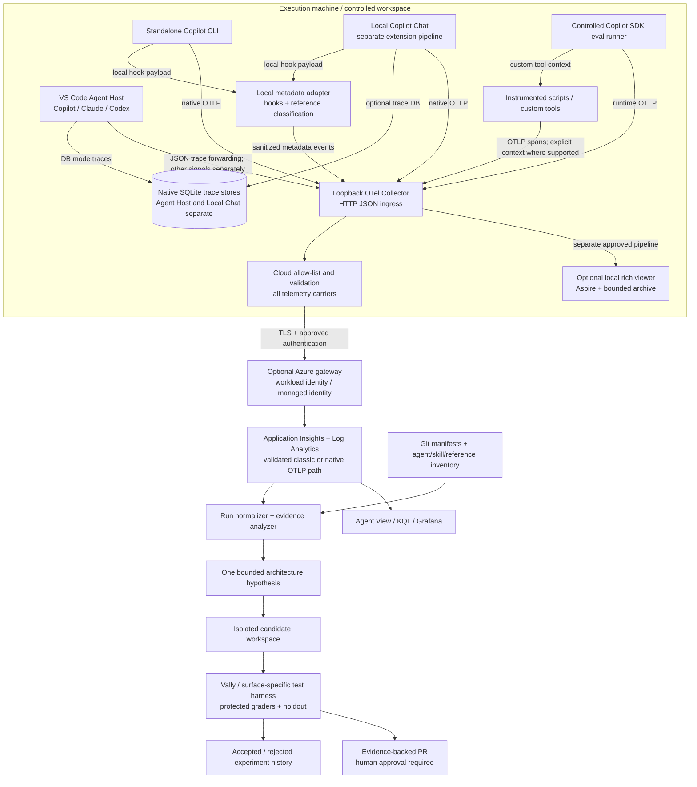

# Executive Summary

**End-to-end observability and architecture intelligence for GitHub Copilot agent systems**\
**Research date:** 29 September 2026. **Deliverable:** research and proposed design, not an implemented system.\
**Basis:** the supplied 30-area research brief, current official documentation, selected repository source files, and one explicitly bounded local experiment.

## Answer to the core question

**Do not build another tracing platform. Reuse native Copilot/VS Code OpenTelemetry, an OpenTelemetry Collector, Azure Monitor/Application Insights, local SQLite/Aspire, and an existing evaluation runner. Build a small architecture-awareness layer around them.** The minimum useful custom work is four modules, which initially can live in one repository and mostly run as local commands or batch jobs:

1. A **local boundary adapter** for reference-read metadata, controlled script launches, runtime identity, and privacy enforcement.
2. A **run/trajectory normalizer** that preserves native identities, causal relationships, coverage, and runtime differences.
3. A **static architecture inventory and evidence analyzer** joining declared agents/skills/references/scripts with observed execution.
4. An **evaluation and proposal bridge** that turns evidence into one-change experiments and human-reviewed patches.

This recommendation follows the existing native telemetry and Azure integration contracts rather than assuming a blank slate. Microsoft documents a Collector-based coding-agent ingestion path. Native telemetry already supplies much of the timing, model, tool, subagent, and token foundation; it does not supply the complete architecture graph or trustworthy evidence that arbitrary reference content influenced an answer. [GitHub telemetry][gh-otel] [VS Code monitoring][vscode-monitor] [Azure coding-agent integration][azure-coding]

## Findings that materially change the design

**VS Code is not one telemetry runtime.** Current source separates **Agent Host** sessions from **Local Copilot Chat**. Agent Host hosts provider-native Copilot, Claude, and Codex runtimes; Local Copilot Chat retains an independent extension-host pipeline. Their settings, persistence, routing, and instrumentation ownership differ. The older extension-host Copilot CLI bridge is a compatibility path, not the architecture to build around. [Current ownership guide][vscode-ownership] [Agent Host reference][agenthost]

**Use OTLP/HTTP JSON for the initial local ingress.** In current Agent Host DB mode, provider traces enter a private JSON loopback and SQLite. Simultaneous external trace forwarding supports HTTP JSON; configuring external protobuf/gRPC does not make Agent Host transcode those traces. Provider metrics and some providers' logs take a separate direct route. This can otherwise produce a misleading “local traces work, Azure traces are missing” failure. [Agent Host routing][agenthost]

**Reference observability is an adapter problem, not a solved native skill feature.** Skill activation and a file-read operation are different observations. A locally sanitized read-tool hook can identify a reference without exporting its contents. Local Copilot Chat documents `tool_use_id`; the CLI hook contract is not equivalent and does not document that identifier for ordinary pre/post-tool hooks. Exact attribution must therefore be conditional, not reconstructed from timestamps alone. [CLI hooks][hooks] [Local hooks][vscode-hooks]

**Same backend does not mean same distributed trace.** Copilot SDK supports explicit W3C context across its JSON-RPC boundary. Its Python helper explicitly injects/extracts and attaches context. This is not proof that arbitrary shell-launched programs automatically receive the active tool span. The local experiment in this report verifies explicit Python process propagation, not Copilot shell behavior. [SDK tracing][sdk-otel] [Python helper source][sdk-python]

**The hve-core starter is useful but not a drop-in architecture-analysis pipeline.** Its inspected collector policy drops identifiers needed for joins and normalizes all span-event names. Its classic Azure exporter configuration does not enable span-event export, and its Bicep template sets `DisableLocalAuth: false`. Reuse its structure, security analysis, validators, and infrastructure patterns; revise its signal contract and authentication deliberately. [Collector source][hve-collector] [Bicep source][hve-bicep]

**Microsoft has substantial evaluation and improvement building blocks, but no verified drop-in solution for this entire brief.** Vally provides evaluation/experiment workflows; SkillOpt and Sleep provide bounded skill improvement; AgentRx diagnoses trajectories; Scope provides an agentic testing environment; Foundry's preview optimizer supplies another improvement loop for supported Foundry agents. These are complementary, not interchangeable. [Vally][vally-how] [SkillOpt integration][skillopt-research] [AgentRx][agentrx] [Scope][scope] [Foundry optimizer][foundry-opt]

## Evidence and uncertainty

“Confirmed” below means supported by the cited current contract or inspected source, **not necessarily exercised against an installed client**. Native Copilot CLI, VS Code, Docker, and authenticated Azure were unavailable in this execution environment. The requested seven real-client experiments were consequently **not run**. One generic Python/OpenTelemetry process-boundary probe was run and passed four assertions. Vally's public documentation was accessible, but repository-content access returned 404; its implementation was not audited.

Labels used throughout:

| Label | Meaning here |
|---|---|
| **CONFIRMED NATIVE** | The runtime owns and documents the signal or behavior. Export may still require opt-in. |
| **CONFIRMED WITH CONFIGURATION** | An existing component supports it when configured correctly. |
| **REQUIRES CUSTOM INSTRUMENTATION** | A boundary adapter, custom event, or explicit application span is needed. |
| **EXPERIMENTAL** | Preview/research functionality or insufficiently stable integration. |
| **UNVERIFIED** | The available evidence does not settle the claim. |
| **NOT CURRENTLY POSSIBLE** | The requested conclusion cannot be obtained from the specified evidence alone. This is not a blanket claim that a future platform could never support it. |

# Recommended Architecture

## Three approaches considered

| Approach | Strength | Limitation | Decision |
|---|---|---|---|
| Native telemetry directly to Azure | Few components | No strong local sanitization boundary, weak reference/script enrichment, producer-specific authentication | Not the default for sensitive engineering workflows |
| Native telemetry → local Collector + small adapters → Azure | Preserves existing clients, local-first debugging, centralized policy, incremental enrichment | Some exact joins remain client-dependent | **Recommended** |
| Move all execution into a custom Copilot SDK harness or hosted evaluation platform | Stronger control over run IDs, tool handlers, context, and fixtures | Changes the user experience and the system being evaluated | Use for controlled evals and automation, not as a prerequisite for observing normal VS Code use |

These are proposed trade-offs. Native SDK context support and the Azure Collector integration establish feasibility of the middle and third approaches; they do not erase differences between interactive and harness-driven execution. [SDK tracing][sdk-otel] [Azure integration][azure-coding]

## Recommended responsibilities

**On each execution machine:** preserve the native runtime, send telemetry to a loopback Collector, and add a narrowly scoped local adapter only where native signals are insufficient. Keep script instrumentation in the scripts or in a controlled launcher, not in model-generated guesses about trace IDs. Keep a versioned architecture manifest beside the repository. The adapter should emit bounded metadata and never turn telemetry collection into an extra LLM call.

**At the telemetry boundary:** independently route optional approved rich local data and strict metadata-only cloud data. Normalize only what is needed for interoperability. Preserve original field names and producer identity in the permitted native record; create a canonical analytical projection rather than destructively rewriting every producer into one shape.

**In Azure:** use workspace-based Application Insights and Log Analytics for the validated classic route; use the separately provisioned native OTLP route only after its regional, tenant, metric, and authentication requirements have been verified. Start with KQL, Azure Monitor dashboards/Grafana, and an offline analyzer. Add Azure Blob Storage for approved evaluation artifacts and manifests. Do not initially require a graph database, vector database, event bus, AKS cluster, or autonomous always-on optimizer.

**In evaluation:** run frozen baseline and candidate configurations against the same tasks and protected graders. Reuse Vally where its executor matches the target surface. A CLI/SDK evaluation is evidence about that surface, not automatic certification of Local Copilot Chat or Agent Host UI behavior. [Vally execution model][vally-how]

## The identity contract

Define a **workflow run** as one submitted task and its explicitly related continuations, with a recorded boundary policy. A conversation can contain many runs. A run can contain more than one trace. A trace can cover more than one conversational turn. A VS Code window `session.id` is not a workflow ID.

Use native parent/child spans where they exist. Use span links for explicitly related asynchronous work. Use a separate logical correlation edge where only session/run/tool IDs are known. Never rewrite a span's parent merely because it was exported near another span. Current Agent Host already supplies a session anchor and cross-provider context, but its zero-duration metadata spans must not be counted as model execution. [Agent Host identity and context][agenthost] [Local resource identity][vscode-monitor]

# Architecture Diagram

The diagram is a **proposed logical design**. Solid arrows describe data movement, not an assertion that every operation shares one distributed trace.



**Transport caveat:** the native Azure OTLP route stores metrics in an Azure Monitor workspace, while logs/traces use the provisioned Log Analytics/Application Insights arrangement. Do not model it as the same physical storage layout as the classic exporter route. [Native OTLP ingestion][azure-native]

# End-to-End Dataflow

## One complete run

The following is the target reconstruction, not a trace observed in this environment:

```text
workflow.run_id = W; architecture.version = H; runtime profile = P

native session anchor, where the runtime supplies one
  invoke_agent A                         trace T, span A
    chat M1                              trace T, parent A
    skill.invoked event S                native event or normalized observation
    execute_tool R                       trace T, call-id C1
      reference-read observation         exact link only when ID mapping is proven
    execute_tool MCP                     trace T, call-id C2
      remote MCP internals               separate unless remote instrumentation propagates context
    execute_tool L                       trace T, call-id C3
      controlled launcher                explicit traceparent derived from active tool context
        python script                    trace T, parent L or launcher span
          phase.validate                 trace T
          HTTP request                   trace T; remote service joins only if instrumented
    execute_tool delegate                trace T, call-id C4
      invoke_agent worker                trace T when runtime provides parentage
        chat M2
        execute_tool ...
    final response                       content retained only under the selected policy

native records + adapter records
  → local Collector
  → optional isolated rich-local branch
  → sanitized cloud branch
  → Azure ingestion
  → idempotent canonical trajectory + coverage report
  → architecture statistics / controlled evaluation case
```

Native tool/subagent relationships and SDK custom-tool propagation are supported by their respective contracts. The reference observation and controlled-launcher boundaries are proposed custom components. The remote MCP boundary is **not** assumed to propagate context simply because the local MCP call is traced. [CLI reference][cli] [Local monitoring][vscode-monitor] [SDK tracing][sdk-otel]

## Arrow-by-arrow contract

| Arrow | Protocol / mechanism | IDs and correlation | Native or custom | Sensitivity and qualification |
|---|---|---|---|---|
| User → runtime | UI submission or CLI prompt | Native conversation/turn/request ID; custom W only if securely bound | Native submission; custom run binding | Prompt is content; do not export by default |
| Runtime → model | Provider API | Native chat span, trace/parent, requested/actual model | Native when instrumented | Messages optional; provider URL may need normalization |
| Agent → skill | Runtime skill selection/loading | Native skill event and enclosing span | Native signal, runtime-specific coverage | Skill path can identify a person/repository |
| Agent → read tool | Runtime tool dispatch | `gen_ai.tool.call.id`, span IDs | Native tool span | Arguments/results are content-sensitive |
| Read hook → reference observation | Local command/stdin; SDK handler where available | Exact tool ID when available; otherwise session + explicitly uncertain association | Custom | Parse path locally; export approved identity/hash, not raw payload |
| Agent → MCP tool | MCP stdio/HTTP as configured | Local tool-call ID | Native local boundary | Does not prove remote server spans share T |
| Tool handler → launcher | In-process call / subprocess environment carrier | Verified active context → W3C `traceparent`/`tracestate`; W and call ID | Custom launch boundary | Carrier contains identifiers, not authorization credentials |
| Launcher → script phases | OTel API context attach + spans | Same T and correct parent after explicit extraction | Custom instrumentation | Phase name is bounded; no arbitrary command line |
| Script → HTTP API | Instrumented client + headers | W3C context if accepted downstream | Existing library instrumentation + server configuration | Strip query strings, request/response bodies and secrets |
| Parent → subagent | Runtime internal dispatch / SDK RPC | Native parentage; preserve provider conversation IDs | Native where documented | Built-in hook coverage is not uniform |
| Producers → local Collector | Prefer OTLP/HTTP JSON initially | Original OTel envelope | Existing components | Treat all incoming attributes and names as untrusted |
| Agent Host → SQLite → Collector | Private JSON loopback + optional JSON forwarding | Native IDs preserved; trace-only persistence | Native configuration | Other signals bypass SQLite; route them to the local boundary too |
| Collector → Azure gateway | TLS; approved per-device or workload auth | IDs retained; environment stamped by trusted gateway | Configuration | No raw content in STANDARD; reject invalid payloads |
| Gateway → classic Azure ingestion | `azuremonitor` exporter + verified auth extension | AI operation/parent mappings | Existing exporter | Explicitly preserve span events; inspect mapping loss |
| Gateway → native Azure OTLP | `otlphttp` to provisioned endpoints + Entra token | OTel IDs | Preview/tenant-dependent configuration | DCR permissions and metric destination differ |
| Azure + manifest → analyzer | Read-only KQL/export + manifest JSON | W, H, native span IDs, source profile | Custom analyzer | Queries bounded; no write or deployment permission |
| Analyzer → experiment | Reviewed hypothesis + frozen task set | Experiment ID, baseline/candidate hashes | Custom bridge; existing runner | Sanitized fixtures; protected holdout |
| Experiment → PR | Repository patch + result artifact | Commit hashes and evidence links | Custom workflow | Human review; never auto-edit production |

The Azure protocols and Agent Host forwarding constraints are documented; the exact correlation behavior of local hooks must be tested on the pinned client build. [Agent Host][agenthost] [Azure native OTLP][azure-native] [Classic exporter][azure-exporter]

# Native GitHub Capabilities

## CLI signal contract

**CONFIRMED NATIVE, documentation-level:** the current CLI reference describes `invoke_agent`, `chat`, and `execute_tool` spans; skill, hook, compaction, truncation, and shutdown-related events; and model/agent/tool metrics. Native export is opt-in. The accessible SDK code substantiates SDK context handling, but the underlying native runtime source was not accessible for a complete audit. [CLI reference][cli] [SDK source][sdk-python]

| Family | Fields/signals to preserve | Interpretation rule |
|---|---|---|
| Agent | `gen_ai.agent.id/name/description/version`, `gen_ai.conversation.id`; start/end, parent, status | Definition identity is not an invocation instance; use span identity for the latter |
| Model | `gen_ai.request.model`, `gen_ai.response.model`, response ID, finish reasons | Requested and actual model are separate values; retain missing values |
| Usage | Input/output, cache-read/cache-creation counters where emitted | Do not add parent totals to child model totals |
| Tool | `gen_ai.tool.name/type/call.id`, span timing/status, `error.type` | A repeated call is not automatically a retry |
| Content | Input/output messages, system instructions, tool definitions, arguments/results when enabled | Disable at source for STANDARD, then sanitize independently |
| Skill | `github.copilot.skill.invoked`; name/path/plugin metadata | Activation is not reference consumption |
| Context | Compaction start/complete, truncation and related counts | Keep event identity and success/failure; distinguish the two operations |
| Hooks | Hook start/end/error observations | Hook failures and tool failures are different |
| Accounting | Runtime usage/cost indicators, including nano-AIU where emitted | Preserve units; do not present AIU as currency |

For CLI AI-unit totals, use `github.copilot.nano_aiu` from the root `invoke_agent` span rather than summing it with child `chat` spans. `github.copilot.cost` is a model billing multiplier, not a monetary amount. [CLI accounting guidance][cli]

Detailed native field spelling is pinned to the producer profile rather than copied into an unversioned universal parser. In particular, reasoning-token availability is not assumed across CLI and Local Chat, and provider/native model counters may differ from aggregates. [CLI reference][cli] [Local signal tables][vscode-monitor]

### Initial CLI configuration to test

This is a **research test recipe**, not a deployed configuration:

```bash
export COPILOT_OTEL_ENABLED=true
export OTEL_EXPORTER_OTLP_ENDPOINT=http://127.0.0.1:4318
export OTEL_EXPORTER_OTLP_PROTOCOL=http/json
export OTEL_INSTRUMENTATION_GENAI_CAPTURE_MESSAGE_CONTENT=false
copilot --version
# Run an approved synthetic task interactively or with the documented -p option.
```

For a local capture-only test, use the documented file exporter and `COPILOT_OTEL_FILE_EXPORTER_PATH` rather than inventing an Azure-specific client exporter. Native CLI transport is HTTP JSON/protobuf; do not infer gRPC support from the Collector's ability to receive gRPC. [CLI transport configuration][cli]

## CLI hooks: complete investigation map

The table summarizes the **current CLI hook family**, including events beyond those anticipated in the brief. Treat payloads as untrusted input. The ordinary CLI envelope includes session/time/workspace information; fields vary by event. It is not the same schema as Local Copilot Chat's hooks. [GitHub hooks reference][hooks]

| Hook | Useful payload / identifiers | Matcher and execution implications | Observability use / limitation |
|---|---|---|---|
| `sessionStart` | Session ID; source; optional initial prompt | Startup/resume/new boundaries | Start a session ledger, not necessarily one workflow per session |
| `userPromptSubmitted` | Prompt | Content-sensitive; mutation behavior differs for programmatic SDK hooks | Bind a run when a reliable submission identity exists |
| `userPromptTransformed` | Original/transformed prompt | Potentially modifies content | EVAL-only comparison of effective input, not STANDARD export |
| `subagentStart` | Agent name/display/description, transcript path | Documented matcher support | Does not supply a universal invocation ID in the CLI start payload |
| `preToolUse` | Tool name and arguments | Matcher; awaited; denial semantics | Local path extraction possible, but no documented ordinary `tool_use_id` |
| `postToolUse` | Tool name/arguments/result | Matcher; awaited | Completed-read evidence; CLI exact span join remains conditional |
| `postToolUseFailure` | Tool information and error | Do not assume matcher parity with post-success | Keep failed read distinct from successful load |
| `errorOccurred` | Error, context, recoverability | Error callback behavior | Runtime failure classification; scrub message/stack |
| `preCompact` | Trigger, transcript, custom instructions | Matcher | Pre-compaction observation; not proof compaction succeeded |
| `subagentStop` | Agent ID/type/name, response, transcript | Coverage limited by agent type | More identity than start, but response is rich content |
| `agentStop` | Stop reason, transcript, stop-hook state | May affect continuation | Distinguish task completion from hook-requested continuation |
| `sessionEnd` | End reason | Special detached behavior can apply during clear/end | Best-effort ledger closure; hard crashes may omit it |
| `permissionRequest` | Tool/permission request | Matcher; decision hook | Keep security policy separate from telemetry adapter |
| `notification` | Type/message/title | Matcher; asynchronous notifications | Useful completion/idle hints, not authoritative duration measurement |

**Important behavioral qualifications.** Normal command hooks can add synchronous process-launch and handler latency; the documented default timeout is 30 seconds, not an acceptable telemetry latency target. Notification hooks are asynchronous, and some session-end handling is detached. Command `preToolUse` failures can deny execution, while timeouts are fail-open; HTTP-hook failure behavior is also not a general fail-closed security boundary. An observability hook should therefore be bounded, non-mutating, and independent of permission enforcement. Measure its overhead rather than assigning an unsupported latency estimate. [Hook execution/error behavior][hooks]

The CLI documentation explicitly excludes built-in `general-purpose` agents from subagent start/stop hook coverage while describing other built-in/custom-agent behavior. A directly selected top-level custom agent must not be detected solely through delegated-subagent hooks. Preserve native agent spans and the invocation configuration as separate evidence. The absence of a hook is not proof that no agent ran. [Subagent hook limitations][hooks]

**Matcher rule:** only rely on matchers for the event types explicitly documented by the pinned version. The inspected reference lists them for notification, permission request, pre/post-tool success, pre-compaction, and subagent start; it is unsafe to invent uniform matcher support for every event.

## Execution-mode matrix

Legend: **N** native contract, **C** existing configuration, **A** adapter, **U** unverified for that surface. “Skills” means activation, not reliable observation of every reference.

| Invocation mode | Deep tracing | Parent/child | Tools | Skills/references | Content optional | Boundary |
|---|---|---|---|---|---|---|
| Direct Local VS Code custom agent | N+C | N | N | Native skill-related signals; A for references | Yes | Local extension pipeline |
| Local VS Code automatic subagent | N+C | N documented | N | A for complete attribution | Yes | Local hooks have IDs that CLI hooks lack |
| VS Code Agent Host Copilot | N+C | Host anchor + native runtime | Native runtime | Runtime-version dependent; A for references | Yes | Not Local Chat settings |
| Standalone CLI custom agent | N+C | Native agent/tool hierarchy | N | N activation; A references | Yes | No automatic script-context claim |
| CLI delegated subagent | N+C | N contract | N | A enrichment; hook exceptions | Yes | Built-in hook coverage differs |
| CLI autopilot | Expected same instrumented runtime; U actual run | N contract, U live test | N contract | A | Yes | Need version-specific terminal/continuation tests |
| Non-interactive CLI `-p` | N+C contract, U live test | N contract | N | A | Yes | Flush and process-exit loss must be tested |
| GitHub.com cloud coding agent | Hooks/session logs available; full arbitrary OTLP parity U | U deep hierarchy | Hooks can observe boundary | A under cloud restrictions | Not assumed identical | Repo hooks, ephemeral Linux, network/firewall restrictions |
| `/delegate` remote execution | Local dispatch evidence, remote deep trace U | U across handoff | Remote surface dependent | U/A | Surface dependent | Local job span is not the remote trajectory |
| Controlled Copilot SDK runner | N+C plus explicit app spans | Strongest controlled context boundary | Native + custom handlers | A under controlled execution | Yes | Best first eval surface, not a substitute for UI tests |

These classifications combine the CLI, SDK, Local Chat, Agent Host, and cloud-hook contracts. Remote full-trace support is deliberately not promoted from local capabilities. [CLI][cli] [SDK][sdk-otel] [Local Chat][vscode-monitor] [Agent Host][agenthost] [Cloud hooks][hooks]

# Native VS Code Capabilities

## Current source takes precedence over older architecture assumptions

The current ownership guide places Local Copilot Chat under `extensions/copilot/` in the main VS Code repository. Its native OTel service owns local model/tool/agent/hook instrumentation. Agent Host is a different utility-process integration. Source links in the catalogue distinguish this from the older extension repository and legacy bridge. [Ownership map][vscode-ownership]

The inspected `otelConfig.ts`, pinned at VS Code commit `a0c82f9df6268b5d35d109254b995190b02d2aa5`, explicitly prioritizes **enterprise policy over environment variables and personal settings**. It also checks `telemetry.telemetryLevel === 'off'` for the Local Chat path and carries exporter headers out-of-band rather than placing them in tool-subprocess environment variables. This is stronger evidence for current Local configuration than an older summary describing environment precedence. **Agent Host has its own policy and consent behavior; do not extrapolate the Local kill switch to it.** [Pinned configuration source][vscode-config] [Agent Host reference][agenthost]

## Surface profiles

| Profile | Configuration / resource identity | Local storage | Important distinction |
|---|---|---|---|
| Local Copilot Chat | `github.copilot.chat.otel.*`; typically `copilot-chat` service | `<extensionGlobalStorage>/otel/spans.db` | Extension-owned spans; local `session.id` is a window/session dimension |
| Agent Host integration | `chat.agentHost.otel.*`; shared `vscode.agent-host` namespace with distinct producer names | `<userData>/agent-host/otel/agent-host-traces.db` | Native providers plus host metadata; traces only enter the DB loopback |
| Standalone CLI launched in terminal | CLI environment configuration | CLI file export if configured | Merely running in VS Code's terminal does not make it a Local Chat trace |
| Legacy extension-host CLI bridge | Compatibility implementation | Version-dependent | Do not design new integration around it |

[Local monitoring][vscode-monitor] [Agent Host][agenthost] [Ownership guide][vscode-ownership]

## Signal normalization

Local Chat emits standard `gen_ai.*`, GitHub-specific fields, and legacy `copilot_chat.*` fields. It documents connected subagent spans, hook spans, model usage, tool timing, and edit-related telemetry. Keep its native fields as provenance, but normalize units and synonymous attributes once. For example, a tool-duration metric in milliseconds must not be compared directly with a seconds-based agent metric. Avoid counting both legacy and canonical spellings as two observations. [Local signal contract][vscode-monitor]

Some tool metadata is available without full content, including skill/tool discriminators and hashed MCP server identity. Commands, file paths, raw server names, and full tool arguments/results are content-sensitive. A dedicated `captureIdentity` concept also exists in current Local configuration source; STANDARD should exclude personal identity independently of message capture. Do not assume a content toggle removes all identity-bearing resource attributes. [Local monitoring][vscode-monitor] [Configuration source][vscode-config]

Current Agent Host adds synthetic session/title and diagnostic spans. A zero-duration anchor or first-response diagnostic is not an inference. Read documented numeric timing attributes, preserve missing values, and use exact provider/turn/request IDs for joins. Synthetic host metadata may follow a different export route from provider-native metrics. [Agent Host diagnostics][agenthost]

**Normalization is feasible without erasing distinctions** if the canonical record retains: runtime profile; producer/version; original schema; native IDs; content policy; signal family; and an explicit correlation/coverage classification. A universal parser that keeps only “agent, tool, duration” is not sufficient.

# Agent Skills Observability

## What the skill specification supplies

Agent Skills use discovery metadata, an activated `SKILL.md`, and optional supporting resources such as `references/`, `scripts/`, and `assets/`. The specification recommends compact activation instructions and shallow reference navigation, but these are authoring guidelines rather than proof that shorter files or fewer skills improve a particular workflow. Metadata available for routing and resources actually loaded are different stages. [Agent Skills specification][skills]

The specification's approximate size guidance—around 100 tokens of discovery metadata per skill, under roughly 5,000 tokens for activated instructions, and keeping `SKILL.md` below about 500 lines—is useful for budgeting. **Do not turn those recommendations into a merge/split algorithm.** Scope, discoverability, conditional knowledge, and evaluation results determine the boundary. [Agent Skills specification][skills]

## Observable states

Use the following proposed state model:

```text
DISCOVERABLE → SELECTED / ACTIVATED → RESOURCE READ → OUTPUT PRODUCED
                                    ↘ READ FAILED
```

Only assign a state from an observed event or controlled boundary. Native skill invocation is strong evidence of activation, not evidence that every linked reference was read. A tool that reads `SKILL.md` may represent activation, a static audit, or a user's explicit file inspection. Classify the operation using its enclosing execution context instead of filename alone. [CLI skill event][cli] [Local skill/tool fields][vscode-monitor]

Canonical skill identity should include repository/plugin identity and architecture version, not just a human-readable name. Two plugins can expose the same skill name; two revisions can have identical paths and different content. Native plugin name/version fields are useful when present, but the architecture manifest must also represent local uncommitted changes.

## Routing ambiguity

Proposed analysis: compare skill descriptions and declared intents statically, then examine activation/confusion patterns against labeled tasks. High coactivation can mean overlap, but it can also mean a healthy pipeline. Absence of activation can mean an undiscoverable description, unsuitable test coverage, or a genuinely unnecessary skill. Preserve these as competing hypotheses until evaluated.

# Tool Observability

Native tool spans provide a useful outer boundary: which tool was called, its duration, status, and its relationship to the surrounding agent/model work. They do not necessarily expose internal retries, pagination, network attempts, browser actions, or work delegated inside an MCP server. Those require instrumentation inside the controlled implementation or the remote service. [CLI tools][cli] [Local tool tracing][vscode-monitor]

The canonical tool-call record should preserve native call ID, span identity, start/end, a bounded tool name, runtime-specific type, and outcome. Add a derived family such as `filesystem_read`, `shell`, `mcp`, `browser`, or `delegation` through a **versioned tool dictionary**. Do not infer the family from a mutable display name alone.

### Ordering and repeated work

Proposed detectors:

| Detector | Metadata needed | Safe conclusion | Unsafe conclusion |
|---|---|---|---|
| Repeated tool name | Ordered call IDs | Repetition occurred | Every repetition was waste |
| Repeated argument fingerprint | Local normalized argument HMAC, outcome | Semantically equivalent invocation candidates | A cryptographic hash makes sensitive arguments anonymous |
| Repeated failed search | Search family + failure/empty-result classification | Candidate search thrashing | The task was solvable with fewer searches |
| Read-after-read | Reference ID/version/range | Duplicate or overlapping read | The content remained in model context |
| Agent bounce | Delegation edges + role IDs | Alternation between roles | Delegation was causally responsible for failure |
| Long tool span | Duration + completion/error | Outer operation was slow | The external service itself was slow |

Explicit retries should have an attempt/group identifier emitted by an instrumented library or wrapper. Otherwise call them **repeated attempts**, not confirmed retries. Record cancellation, timeout, denial, partial output, and telemetry loss separately from ordinary errors.

# Reference Observability

## Least intrusive reliable mechanism

**Recommendation:** locally derive reference identity from a successful, schema-recognized file-read boundary; join it to the static skill inventory; export only bounded metadata. Prefer Local Chat's documented tool IDs or a controlled SDK/custom tool. Use CLI hooks where adequate, but downgrade ambiguous attribution instead of inventing exact lineage. [Local hook schema][vscode-hooks] [CLI hook schema][hooks] [SDK context][sdk-otel]

| Mechanism | Evidence obtained | Assessment |
|---|---|---|
| Native skill event | Skill activated, optional path/plugin | Reuse, but not a reference-read event |
| Native read-tool span with approved content | Tool arguments can identify file | Viable only with local extraction/redaction; content capture broadens exposure |
| Local pre/post-tool hook | Input path and outcome; Local Chat documents tool ID | Preferred adapter where ID correspondence is verified |
| Controlled read wrapper / SDK tool | Exact path/version/range, result and active context | Most reliable for controlled workflows; changes tool boundary |
| Filesystem watcher | Commonly change notifications, not a complete semantic read history | Not recommended as the primary method |
| Access times / OS audit | Some process-level access evidence | Cache/platform/attribution problems; disproportionate complexity |
| Transcript scraping | Potentially rich narrative/tool records | Unsupported schema drift and privacy burden; optional forensic fallback only |

## Proposed local extraction algorithm

1. Validate the tool schema and size-limit the payload. Reject malformed JSON without logging it verbatim.
2. Resolve the requested path against the known workspace, normalize separators/case according to the filesystem, and handle symlinks explicitly. Reject paths outside approved roots.
3. Match against the versioned architecture inventory. A path named `references/x.md` is not enough to infer the owning skill when multiple definitions or symlinks exist.
4. Wait for the result. Emit separate attempted, failed, partial, and successful read states. Preserve byte/line ranges when the boundary exposes them.
5. Generate a reference version from the actual read snapshot when controlled, otherwise use the inventory snapshot with a `version_source` qualification. A later file hash is not proof of the bytes previously read.
6. Emit identity, version, size/range, timestamp, outcome, observation method, and proven IDs. Discard raw arguments/results before cloud export.

Use a repository-relative approved path only when it is acceptable metadata. Otherwise export a keyed pseudonymous ID and keep the path mapping local. A plain path hash is vulnerable to dictionary matching and is not an anonymity guarantee.

## What cannot be claimed

`reference.read` means **observed access**, not “the model understood or used this reference.” An external program may read a file without returning all its contents; a tool may truncate output; the context may later compact. These require separate observations.

“Reference Y was not opened” is supportable only within a defined run, known inventory, and measured complete read coverage. Otherwise the correct value is **unobserved/unknown**, not zero. This distinction is essential before promoting or deleting references.

# Script Observability

## Language strategy

| Language / boundary | Reuse | Custom work | Qualification |
|---|---|---|---|
| Python | OTel API/SDK, supported zero-code library instrumentation | Root script span, business phases, explicit incoming context extraction | Auto-instrumentation wraps supported libraries, not arbitrary semantic phases |
| TypeScript/Node | Node SDK, supported HTTP/client instrumentation | Load instrumentation before instrumented modules; phase spans and explicit context | Check ESM/CommonJS startup and installed package versions |
| Azure-hosted Python/Node applications | Azure Monitor OTel distribution where supported | Business spans and policy | Avoid configuring a second global provider/export path accidentally |
| Shell / PowerShell | Small trusted launcher; language SDK in actual worker | Process duration, exit code, timeout and explicit carrier | No verified universal shell auto-instrumentation contract |
| Child process / worker | Existing propagation APIs | Inject/extract at process boundary | Parent environment inheritance alone is insufficient in the executed probe |
| External API | Supported HTTP instrumentation | Server-side instrumentation for deeper trace | A client span does not reveal remote internals |

[Python zero-code instrumentation][otel-python] [Node instrumentation][otel-node] [Azure Monitor distribution][azure-distro] [SDK Python helper][sdk-python]

## Proposed launcher behavior

The launcher accepts an allow-listed program and structured arguments, not arbitrary code invented by the telemetry system. It obtains the **actual active span context** from a supported tool-handler boundary, injects a W3C carrier, and starts the child with that carrier plus bounded logical IDs. It never discovers the parent by asking an LLM to copy IDs from a trace UI.

The child extracts the carrier, creates a `script.run` span and named phases such as `load_inputs`, `validate`, and `call_api`, and flushes telemetry on normal shutdown within a bounded timeout. Capture exit code and explicit error class, but omit command-line secrets, environment dumps, source text, and raw stdout/stderr from STANDARD.

Where the built-in CLI shell boundary does not expose active context, retain a **logical correlation** to `workflow.run_id` and a proven tool-call ID if available. Do not advertise a launcher-created new trace as a native tool child unless parentage was actually established.

# Trace Propagation

## Findings

| Boundary | Classification | Evidence |
|---|---|---|
| Agent Host → supported provider runtime | CONFIRMED WITH CONFIGURATION | Host session anchor and provider-specific W3C delivery documented |
| Copilot SDK → CLI JSON-RPC operations | CONFIRMED WITH CONFIGURATION | SDK context hooks/helpers |
| CLI → SDK custom tool callback | CONFIRMED WITH CONFIGURATION | Callback context contract; language-specific handling |
| SDK Python helper → application spans | CONFIRMED source behavior | Explicit extract/attach/detach implementation |
| Arbitrary CLI built-in shell → Python | **UNVERIFIED** | No real CLI process experiment was possible here |
| Generic controlled Python parent → child with explicit extraction | **VERIFIED LOCAL EXPERIMENT** | Four-case probe in Experiments Conducted |
| Local tool → arbitrary MCP server internals | UNVERIFIED without server instrumentation | Local tool trace alone is insufficient |
| All producers use same exporter endpoint | CONFIRMED backend co-location only | Does not establish a distributed trace |

[Agent Host][agenthost] [SDK contract][sdk-otel] [SDK implementation][sdk-python]

## Recommended fallback ladder

**A: native context**, wherever the runtime/SDK already supplies it. Preserve it.

**B: explicit controlled propagation**, through a custom tool/launcher using W3C inject/extract. Parent span identity must come from the executing tool context, not from a session root selected after the fact.

**C: logical correlation**, with run, conversation and proven call IDs, plus `correlation.kind = logical`. Keep separate traces and store a typed relationship. If multiple parallel tools are equally plausible, store ambiguity rather than assigning the nearest timestamp.

These levels should be visible in the UI. A dotted “logically associated” edge is more trustworthy than an invented solid parent/child edge.

# OpenTelemetry Schema

## Standards and versioning

**Use standard fields where they exist, preserve native extensions, and version the custom additions.** The GenAI semantic-convention documents now point to the dedicated `open-telemetry/semantic-conventions-genai` repository. Its agent, model, metric, and registry documents are the relevant sources; the version of the general OTel specification is not proof that every GenAI attribute is stable. Pin the convention revision used by each producer adapter. [GenAI agent conventions][sem-agent] [Model conventions][sem-model] [GenAI registry][sem-registry]

The schema below is a **proposed contract**, not a claim that Copilot emits every row. **N** means native envelope/producer field where available; **S** means an existing standard field populated by an adapter; **C** means a proposed custom field. Cardinality: **L** bounded vocabulary, **M** bounded inventory, **H** per-run/per-event/high-cardinality. Privacy: **P0** bounded operational metadata, **P1** linkable or identifying metadata, **P2** content or sensitive metadata. These are design classifications, not legal anonymization claims.

### Native envelope and producer identity

| Field | Type | Source | Card. | Privacy | N/S/C |
|---|---|---|---|---|---|
| `trace_id` | 16-byte ID / hex representation | OTel envelope | H | P1 | N |
| `span_id` | 8-byte ID / hex representation | OTel envelope | H | P1 | N |
| `parent_span_id` | Optional 8-byte ID | OTel envelope | H | P1 | N |
| `links[]` | Span-context links + approved attrs | OTel envelope / explicit app relationship | H | P1 | N/S |
| `start_time`, `end_time` | Nanosecond timestamps | OTel envelope | H | P1 | N |
| `status.code` | Enum | OTel envelope | L | P0 | N |
| `status.message` | String | Native error text | H | P2 | N; omit STANDARD |
| `resource.service.name` | String | Producer | M | P0/P1 | N |
| `resource.service.namespace` | String | Producer or trusted gateway | M | P0 | N/S |
| `resource.service.version` | String | Installed producer | M | P0 | N |
| `resource.telemetry.sdk.*` | Strings | SDK name/language/version | M | P0 | N |
| `scope.name`, `scope.version`, `schema_url` | Strings | Instrumentation scope/schema | M | P0 | N |
| `deployment.environment.name` | Enum/string | Trusted collector deployment | L | P0 | S |
| `agentobs.runtime` | Enum | CLI / Local Chat / Agent Host provider / eval executor | L | P0 | C |
| `agentobs.producer_profile` | Versioned string | Normalizer contract | M | P0 | C |
| `agentobs.schema.version` | String | This proposed canonical schema | L | P0 | C |

`resource.` and `scope.` here describe OTel envelope placement; do not literally prefix every exported resource attribute with `resource.`. Trace IDs are envelope identities, not duplicate custom attributes. Preserve provider service names instead of flattening every producer to `copilot`.

### Agent, conversation, model, tool and errors

| Field | Type | Source | Card. | Privacy | N/S/C |
|---|---|---|---|---|---|
| `gen_ai.operation.name` | String/enum | Producer, validated normalization | L | P0 | N/S |
| `gen_ai.provider.name` | String | Producer | M | P0 | N |
| `gen_ai.agent.id` | String | Native definition identity, when present | M/H | P1 | N |
| `gen_ai.agent.name` | String | Native agent identity | M | P1 | N |
| `gen_ai.agent.description` | String | Native description | H | P2 | N; omit STANDARD |
| `gen_ai.agent.version` | String | Native definition/runtime version | M/H | P1 | N |
| `gen_ai.conversation.id` | String | Native provider conversation | H | P1 | N |
| `gen_ai.workflow.name` | String | Known bounded workflow name | M | P1 | S if not native |
| `gen_ai.request.model` | String | Requested model | M | P0 | N |
| `gen_ai.response.model` | String | Actual model when reported | M | P0 | N |
| `gen_ai.response.id` | String | Provider response ID | H | P1 | N |
| `gen_ai.response.finish_reasons` | String array | Producer | L/M | P0 | N |
| `gen_ai.usage.input_tokens` | Integer | Producer | Numeric | P0 | N |
| `gen_ai.usage.output_tokens` | Integer | Producer | Numeric | P0 | N |
| `gen_ai.usage.cache_read.input_tokens` | Integer, optional | Producer | Numeric | P0 | N |
| `gen_ai.usage.cache_creation.input_tokens` | Integer, optional | Producer/convention mapping | Numeric | P0 | N/S |
| `gen_ai.usage.reasoning.output_tokens` | Integer, optional | Only producers that report it | Numeric | P0 | N |
| `gen_ai.conversation.compacted` | Boolean, optional | Current operation uses compacted context, when known; not a compaction counter | L | P0 | N/S |
| `gen_ai.tool.name` | String | Native tool dispatch | M | P1 | N |
| `gen_ai.tool.type` | String | Native type; retain runtime semantics | L/M | P0 | N |
| `gen_ai.tool.call.id` | String | Native tool invocation | H | P1 | N |
| `gen_ai.tool.call.arguments` | Serialized content | Native rich capture | H | P2 | N; omit STANDARD |
| `gen_ai.tool.call.result` | Serialized content | Native rich capture | H | P2 | N; omit STANDARD |
| `gen_ai.input.messages`, `gen_ai.output.messages` | Structured/serialized messages | Native rich capture | H | P2 | N; omit STANDARD |
| `error.type` | Bounded class where possible | Producer / adapter | L/M | P0/P1 | N/S |
| `agentobs.tool.family` | Enum | Versioned tool dictionary | L | P0 | C |
| `agentobs.tool.outcome` | Enum | Success/error/denied/cancelled/timeout/unknown | L | P0 | C |
| `agentobs.tool.attempt_group` | String, optional | Instrumented retry owner, not inferred from name | H | P1 | C |

The native/standard rows are conditional on the producer contract, not defaults to manufacture. Native skill fields remain `github.copilot.skill.*`; a general `skill.name` view can alias them, but should not create a competing exported name unnecessarily. Similarly, use standard VCS fields rather than inventing `git.commit.sha`. [CLI contract][cli] [Local contract][vscode-monitor] [GenAI registry][sem-registry] [VCS registry][sem-vcs]

### Architecture-aware additions

| Field | Type | Source | Card. | Privacy | N/S/C |
|---|---|---|---|---|---|
| `workflow.run_id` | Opaque string | Controlled submission binding or exact run ledger | H | P1 | C |
| `agentobs.turn_id` | String, optional | Exact native turn/request mapping | H | P1 | C |
| `agentobs.agent.definition_hash` | Digest | Static manifest | H | P1 | C |
| `github.copilot.skill.name` | String | Native invocation event where emitted | M | P1 | N |
| `github.copilot.skill.path` | String | Native event | H | P2 | N; transform/omit STANDARD |
| `github.copilot.skill.plugin_name` | String, optional | Native event | M | P1 | N |
| `github.copilot.skill.plugin_version` | String, optional | Native event | M | P1 | N |
| `agentobs.skill.id` | Qualified opaque ID | Repository/plugin manifest | M | P1 | C |
| `agentobs.skill.version` | Digest | Skill directory/manifest snapshot | H | P1 | C |
| `reference.id` | Opaque or keyed ID | Local canonicalization | M/H | P1 | C |
| `reference.path` | Approved relative path, optional | Local inventory | M/H | P2 | C; restricted |
| `reference.skill_id` | Opaque ID, optional | Proven inventory ownership | M | P1 | C |
| `reference.size_bytes` | Integer, optional | Controlled read or snapshot | Numeric | P0/P1 | C |
| `reference.version` | Digest/keyed digest | Actual snapshot or qualified inventory | H | P1 | C |
| `reference.version_source` | Enum | `read_snapshot`, `inventory`, `unknown` | L | P0 | C |
| `reference.read_id` | Opaque string | Local read observation | H | P1 | C |
| `reference.read_state` | Enum | attempted/succeeded/partial/failed | L | P0 | C |
| `reference.range_start`, `reference.range_end` | Integers, optional | Actual tool input/output | Numeric | P0/P1 | C |
| `reference.range_unit` | Enum | bytes/lines | L | P0 | C |
| `reference.observation_method` | Enum | hook/SDK/wrapper/native-rich/manual | L | P0 | C |
| `script.name` | Approved stable name | Launcher manifest | M | P1 | C |
| `script.version` | Digest | Script/dependency snapshot | H | P1 | C |
| `script.phase` | Bounded string | Explicit instrumentation | M | P0 | C |
| `script.exit_code` | Integer, optional | Process completion | Numeric | P0 | C |
| `vcs.ref.head.revision` | String | Git HEAD | H | P1 | S |
| `vcs.ref.head.name` | String, optional | Git ref | H | P2 | S; usually omit STANDARD |
| `vcs.repository.url.full` | URL, optional | Git remote | H | P2 | S; usually omit STANDARD |
| `agentobs.repository.id` | Opaque approved ID | Local repository mapping | M | P1 | C |
| `architecture.version` | Digest | Entire relevant configuration snapshot | H | P1 | C |
| `architecture.manifest_version` | String | Manifest schema | L | P0 | C |
| `architecture.dirty` | Boolean | Working tree snapshot | L | P0 | C |
| `experiment.id` | Opaque string | Experiment controller | H | P1 | C |
| `experiment.variant` | Enum/string | Baseline/candidate identifier | M | P0 | C |
| `experiment.trial_id` | String | Existing Vally/native trial ID mapping | H | P1 | C projection |
| `experiment.dataset_version` | Digest | Protected dataset manifest | H | P1 | C |
| `experiment.grader_version` | Digest | Protected grader manifest | H | P1 | C |
| `gen_ai.evaluation.name` | String | Evaluation integration | M | P0 | S |
| `gen_ai.evaluation.score.value` | Number | Grader result | Numeric | P0/P1 | S |
| `gen_ai.evaluation.explanation` | String, optional | Grader | H | P2 | S; restricted |

### Coverage, sequence and policy fields

| Field | Type | Source | Card. | Privacy | N/S/C |
|---|---|---|---|---|---|
| `agentobs.event_id` | Opaque stable ID | Canonical ledger | H | P1 | C |
| `agentobs.producer_sequence` | Integer, optional | Observing producer | Numeric | P0 | C |
| `agentobs.observed_at` | Timestamp | Collector/adapter | H | P1 | C |
| `agentobs.correlation.kind` | Enum | native_parent/explicit_link/logical/ambiguous/none | L | P0 | C |
| `agentobs.correlation.evidence` | Bounded enum | Native ID / SDK context / hook ID / manual | L | P0 | C |
| `agentobs.coverage.reads` | Enum | complete/partial/unknown | L | P0 | C |
| `agentobs.coverage.termination` | Enum | observed/missing/in_progress | L | P0 | C |
| `agentobs.sampling.probability` | Number, optional | Actual sampling policy | Numeric | P0 | C |
| `agentobs.policy.mode` | Enum | STANDARD/EVAL/FORENSIC | L | P0 | C |
| `agentobs.policy.version` | String | Trusted boundary policy | M | P0 | C |
| `agentobs.record.truncated` | Boolean | Adapter/export validation | L | P0 | C |
| `agentobs.instrumentation.error` | Bounded enum, optional | Adapter/collector health | L | P0 | C |

Do not put run IDs, paths, trace IDs, message text, or content hashes into metric labels. Keep them in traces/events and analytical records. Counts such as reference load count are **derived aggregates**, not a mutable counter attached inconsistently to every read.

## Ordered trajectory data model

Proposed storage initially needs five logical tables/files, not a dedicated graph database:

| Dataset | Key | Contents |
|---|---|---|
| `Runs` | Run ID + boundary-policy version | Start/end, task label, architecture, runtime, outcome, coverage |
| `Events` | Stable event ID | Native envelope, approved attributes, source profile, sequence, observation time |
| `Edges` | Source + target + type | Parent, explicit link, logical association, declared dependency; evidence class |
| `Definitions` | Definition ID + version | Agents, skills, references, scripts, tools, MCP/config nodes |
| `Experiments` | Experiment + variant + task + trial | Frozen configuration, grades, uncertainty, artifacts, decision |

A UI can sort by event time, producer sequence and event ID for a deterministic display. **That is not a globally exact execution order.** Parallel branches form a partial order; clocks and export delays can differ. Store start and end separately, preserve causal edges, and never infer a dependency from display adjacency alone.

Deduplicate native spans by source identity plus trace/span ID, merging only compatible updates. Deduplicate adapter events by their own event ID, not by `(tool name, timestamp)`. When native and adapter observations describe the same call, retain both evidence sources but count the call once. Resume/replay can produce repeated terminal segments; mark them instead of summing duplicate durations.

# Azure Architecture

## Supported service versus community integration

Azure Monitor/Application Insights/Log Analytics are Microsoft services. The generic OTel Collector Contrib and its `azuremonitor` exporter have their own component stability/support boundaries. Microsoft's coding-agent guide uses this path, but that does not make every community processor/exporter feature a Microsoft-supported production guarantee. [Azure guide][azure-coding] [Exporter stability][azure-exporter]

## Route A: classic exporter, conservative first integration

```text
CLI / Local Chat / Agent Host / scripts / Vally
    → local Collector
    → strict cloud projection
    → optional Azure gateway with workload identity
    → azuremonitor exporter
    → workspace-based Application Insights
    → Log Analytics
    → KQL / Agent View / Azure Monitor dashboards with Grafana
```

Required conditions before selecting it:

* Confirm the pinned exporter supports the intended authentication extension and role assignment.
* Explicitly set `spaneventsenabled: true` when relying on skill and compaction span events.
* Preserve IDs, event names and event attributes through the privacy policy.
* Validate the actual table mapping by querying stored records, not merely observing HTTP success.

The classic exporter maps INTERNAL/CLIENT/PRODUCER spans to dependencies and SERVER/CONSUMER spans to requests. Consequently, a Copilot `invoke_agent` root may be a dependency rather than an Application Insights request. Its documentation also distinguishes event, exception, metric, link, and attribute mappings. The canonical query layer must read the actual mapping; it must not assume that all agent roots live in `AppRequests`. [Exporter mapping][azure-exporter]

## Route B: Azure native OTLP ingestion

The native ingestion documentation describes an OTLP-enabled Application Insights setup with provisioned endpoints/data collection resources. Logs/traces and metrics have different destinations; metrics use an Azure Monitor workspace. Authentication uses Entra credentials with DCR-scoped access. This is a different path from passing an Application Insights connection string to the community exporter. [Native ingestion][azure-native]

**Recommendation:** evaluate this route as a simplification opportunity, but keep it **EXPERIMENTAL / availability-gated** until verified in the target subscription and region. Record the service status from the deployment surface, use the provisioned signal-specific endpoints, and test metric temporality/histogram compatibility. Do not copy a generic example's endpoint suffixes or assume every region has equivalent rollout.

## Authentication source discrepancy resolved narrowly

The classic exporter authentication document contains a standard authenticator-extension example as well as an older section directing users to an AAD proxy. The inspected current `config.go` embeds the Collector HTTP client configuration. Together these support evaluating the current `auth.authenticator` route rather than claiming a proxy is always mandatory. They do **not** substitute for testing the pinned binary against Entra-only Application Insights. [Authentication document][azure-exporter-auth] [Exporter source][azure-exporter-config]

For outbound authentication, the Azure auth extension documents managed identity, workload identity, service principal and default credentials. Prefer explicit workload/managed identity in production. Keep developer credentials outside the agent's tool environment. `APPLICATIONINSIGHTS_AUTHENTICATION_STRING` belongs to documented application/autoinstrumentation scenarios; it is not a universal magic switch for every Collector binary. [Azure auth extension][azure-auth-ext] [Application Insights Entra guidance][azure-entra]

## KQL and visualization strategy

Start with views for run reconstruction, missing parentage, tool latency/error distributions, skill activation, reference-read coverage, compaction, and baseline/candidate outcomes. Agent View is a useful GenAI trace surface, not a static/dynamic architecture analyzer. Its rich-content views depend on having content; an empty prompt view under STANDARD is expected, not necessarily broken ingestion. [Agent View][agent-view]

Keep a saved mapping contract for the chosen ingestion route: span table, trace ID column, parent column, attributes, numeric measurements, events, and dropped/truncated fields. The schema should be tested with a synthetic sentinel trace containing one instance of each required record type. Only then write stable KQL functions or import a dashboard.

Azure MCP can be an optional **read-only analyst interface**, not the ingestion architecture. Restrict it to approved resources, bounded queries, and no deployment or secret-management operations. This design does not depend on it to make telemetry available. [Azure MCP overview][azure-mcp]

## Collector design requirements

Use existing receivers, processors, exporters and authentication extensions. The Collector can perform filtering, transformation, enrichment and fan-out; its configuration is part of the tested product, not an incidental deployment file. [Collector transformation guide][otel-transform]

Proposed processing order for cloud data:

```text
bounded receive / memory limit
  → schema-aware local enrichment (only known fields)
  → strict allow-list
  → intrinsic-carrier sanitization
  → trusted environment/resource stamping
  → validation and size limits
  → batch / bounded retry queue
  → authenticated export
```

The optional rich-local branch must be distinct from the sanitized branch, with verified copy/mutation behavior and explicit retention. A privacy processor that operates only on attribute maps cannot by itself protect span names, status text, event names, log bodies, scope/resource attributes, trace state, URLs, or metric/exemplar carriers. The inspected hve-core scrubber demonstrates why these need separate handling. [hve-core policy source][hve-collector]

For initial architecture metrics, prefer complete low-volume metadata over sampling. Tail sampling is valuable for rich traces, but favors errors/slow runs and can bias coactivation or reference-frequency estimates. Long-running sessions can also outlive sampling decision windows. Record inclusion probabilities only when known, show coverage, and never apply an invented universal sampling weight.

# Security and Privacy

## Threat model

The system handles prompts, code, credentials accidentally embedded in outputs, repository paths, enterprise account details, tool arguments, and persistent identifiers. Even metadata can identify a person or customer. The local agent can often read files available to its own operating-system user; a loopback port or a same-user configuration file is therefore **not a hard security boundary against a compromised agent**.

Proposed controls: a separate collector/service identity for sensitive deployments; OS/container isolation where needed; authenticated remote ingress; bounded queues and request sizes; least-privilege ingestion and read identities; repository allow-lists; and a cloud egress policy owned independently of the editable agent repository. Never let an optimizer change that policy or grant itself broader permissions.

## Development versus production

| Concern | Development | Production |
|---|---|---|
| Ingress | Bind loopback; no LAN exposure by default | TLS and explicitly validated source authentication |
| Azure credentials | Approved developer identity through supported credential flow | Managed/workload identity; distinct from agent execution identity |
| Application Insights access | Development resource only | Entra-only ingestion after compatibility test; `DisableLocalAuth: true` |
| RBAC | Narrow development scope | Monitoring Metrics Publisher at the correct AI/DCR scope; readers separately scoped |
| Secrets | Local credential tooling, never instructions/tool args | Identity first; Key Vault only where a secret is actually needed |
| Storage | Local short-lived captures | Separate environment/security-boundary workspaces and protected artifact stores |
| Rich data | Synthetic fixtures or approved local debugging | Explicit case/consent/purpose; never general shared capture |
| Policy failures | Visible diagnostics with scrubbed details | Fail closed for cloud export; do not silently upload unsanitized records |

Application Insights documentation scopes its publishing role to the Application Insights resource, while native OTLP instructions scope the relevant role to a DCR. These are not interchangeable role assignments. [Entra ingestion][azure-entra] [Native OTLP roles][azure-native]

### Important Collector security advisory

The project advisory **GHSA-pjv4-3c63-699f / CVE-2026-42602**, published 29 April 2026, identifies an **inbound** `azure_auth` authentication bypass in versions **0.124.0 through 0.150.0**. Its outbound exporter usage is explicitly unaffected. The retrieved advisory lists no patched version, while current main documentation describes a revised inbound JWT-validation contract. **Do not infer a released fix from main.** Use a separately validated OIDC/TLS ingress solution or verify an explicitly patched release before using that extension as a receiver authenticator. [Official advisory][azure-auth-advisory] [Current extension documentation][azure-auth-ext]

This distinction matters: “the Collector can acquire an Azure token” is an outbound capability, not proof that it securely validates incoming user tokens.

## What metadata-only can and cannot establish

| Metadata-only can support | Additional evidence still needed |
|---|---|
| Tool timing, error rates, repeated calls | Whether the operation was useful or semantically necessary |
| Observed routing and skill coactivation | A task label or evaluator to call routing “wrong” |
| Reference-read frequency under known coverage | Actual usefulness, comprehension or missing semantic knowledge |
| Native token counts and compaction events | Whether the answer failed because of lost context |
| Subagent latency and delegation structure | A counterfactual eval to decide removal helps |
| Declared/observed structural differences | Whether an unobserved component is genuinely dead |

Rich evidence is usually needed for contradictory instructions, incorrect interpretation, missing semantic context, poor final answers, and reference usefulness. “Rich” should mean approved effective instructions/messages/tool evidence, not a promise of access to hidden model reasoning.

## STANDARD / EVAL / FORENSIC policy

**STANDARD:** source content capture off; emit only allow-listed operational metadata. Keep agent/skill names only when approved. Do not include descriptions, raw paths, prompts, code, or errors merely because a runtime calls them metadata.

**EVAL:** controlled fixtures and approved content in a separate evaluation store; record effective configuration and workspace diffs when permitted. The shared fleet telemetry sink still receives the sanitized projection. A synthetic task can nevertheless generate real credentials or fetch confidential data, so sanitization remains mandatory.

**FORENSIC:** explicit incident/case approval, a time window, smallest necessary capture, short retention, restricted readers, and manual approval for any centralized rich upload. Prefer local review first. Do not turn on rich capture fleet-wide to debug one agent.

### Generated → sanitized → Azure map

| Datum | STANDARD | EVAL | FORENSIC |
|---|---|---|---|
| Prompt | May exist in runtime/local hook memory; discard from telemetry egress | Approved fixture/prompt in protected eval artifact | Case-scoped local capture; approved subset only |
| Response | No raw cloud export | Approved output for graders | Restricted evidence |
| Source code | No raw cloud export | Synthetic/approved workspace snapshots and diffs | Case-scoped, redacted where possible |
| Tool arguments | Parse locally for bounded metadata; discard originals | Approved arguments plus redaction | Local capture with explicit export review |
| Tool result | Outcome/type/size only | Approved result/evidence for eval | Restricted result capture |
| File path | Approved relative path or keyed identifier; strip user root | Fixture-relative path | Real path only with purpose and access controls |
| Agent name | Approved bounded name or pseudonymous ID | Exact definition identity if permitted | Same, case-scoped |
| Skill name | Approved qualified name or opaque ID | Exact fixture skill identity | Same, case-scoped |
| Reference path | Opaque ID or approved relative path | Fixture-relative + snapshot version | Restricted mapping |
| Error | Bounded class/status; scrub text/stack | Redacted text when needed for grading | Restricted diagnostic details |
| Tokens | Numeric metadata | Numeric metadata | Numeric metadata |
| Trace IDs | Retain for joins under scoped access | Retain and link to trial | Retain; linkability acknowledged |
| Titles/descriptions | Exclude unless explicitly approved | Approved fixture context | Restricted content |
| Credentials | Never intentionally retained/exported | Never intentionally retained/exported | Never intentionally retained/exported |

The “generated locally” column is implicit in every row: runtimes may hold more data than the telemetry policy exports. Turning OTel content capture off does not prove that debug logs, transcripts, editor state, or evaluator artifacts contain no content. [Local debugging/export behavior][vscode-monitor] [Vally trajectory artifacts][vally-trajectory]

## Canary and deletion requirements

A proposed privacy regression test should inject **synthetic**, uniquely recognizable fake-secret and fake-path markers into every supported carrier: prompt, tool argument, result, error/status, event name, log body, resource/scope field and metric label. Verify they are absent from the actual cloud-side sink and retained only where policy permits. Do not test using real secrets. Native privacy bug reports are not proof that the pinned build leaks, but they reinforce the need for a boundary test rather than trusting a checkbox. [VS Code issue report][vscode-privacy-issue]

Deletion must cover derived evaluation cases, archived trajectories, embeddings, labels and optimizer memory—not only source traces. Langfuse explicitly documents that dataset copies can outlive their source trace retention, a useful warning for the proposed Azure-native design too. [Dataset retention behavior][langfuse-retention]

# Local Development

## Default local topology

Use one local Collector and Aspire for interactive inspection. Enable the relevant native SQLite exporter for durable trace inspection, but remember that native SQLite storage is **trace-only** and separated by VS Code surface. A local JSONL/archive option can cover CLI and evaluation artifacts. Aspire is a viewing surface, not the sole long-term evaluation archive. [Aspire standalone][aspire] [Agent Host persistence][agenthost]

Proposed Agent Host research settings:

```json
{
  "chat.agentHost.otel.enabled": true,
  "chat.agentHost.otel.captureContent": false,
  "chat.agentHost.otel.dbSpanExporter.enabled": true,
  "chat.agentHost.otel.otlpEndpoint": "http://127.0.0.1:4318"
}
```

Use HTTP JSON for the compatible external trace-forwarding mode. Check inherited environment and managed settings because they can change the effective destination/protocol. Personal setting changes can require an Agent Host/window restart. Use the built-in database export command or a proper SQLite backup rather than assuming a raw copy of the DB file includes all WAL data. [Agent Host settings/store][agenthost]

Local Copilot Chat instead uses `github.copilot.chat.otel.*` and its own export command. Configure and validate each independently. Opening an existing trace DB does not establish that the current session is exporting successfully. [Local configuration][vscode-config] [Local monitoring][vscode-monitor]

## Developer acceptance test

Before Azure, a synthetic local run should demonstrate one agent, one model call, two distinguishable tool calls, one skill activation, one successful and one failed reference read, a controlled script with explicit context, and one subagent. Record fields and omissions rather than merely taking a screenshot. Validate that a second simultaneous session does not steal the first session's correlation IDs.

# Evaluation Architecture

## Reuse Vally, including its native tracing

Current Vally documentation describes a default Copilot SDK executor and normalized trajectories with messages, tools/results, metrics, output, and workspace artifacts. It supports repeated runs, regrading, plugins, baseline/variant experiments and workspace diffs. Repository access was unavailable, so these are **documentation-confirmed capabilities**, not an implementation audit. [Execution model][vally-how] [Trajectory format][vally-trajectory] [Experiments][vally-experiment]

**An important current capability:** `vally eval --otlp-endpoint http://127.0.0.1:4318` exports native Vally trial/attempt traces and telemetry-capable executor traces. The documented hierarchy is a logical trial trace with a `vally.trial` parent, attempt children, and executor runtime spans underneath. This removes the need to build a Vally tracing system from scratch. Still validate the selected executor's content/parentage and the custom architecture-ID joins. [Vally eval tracing][vally-eval]

By default, Vally's eval trace stream is local, with `otel-spans.jsonl` artifacts. OTLP mode has different local-file behavior, so use the Collector's independent local branch when both local and centralized copies are required. Separately, Vally has product-usage telemetry, which can be disabled with `VALLY_TELEMETRY_OPTOUT=1` or `DO_NOT_TRACK=1`; that is not the same stream as eval traces. [Vally telemetry separation][vally-telemetry] [OTLP mode][vally-eval]

## Proposed regression suite

| Grader class | Good use | Guardrail |
|---|---|---|
| Deterministic output | JSON schema, required fields, exact calculations, forbidden changes | Protected outside candidate workspace |
| Tool/trajectory | Correct API/tool constraints, no forbidden actions, required evidence before mutation | Do not overfit to one arbitrary successful sequence |
| Workspace diff | Expected behavior/tests/files, no unrelated edits or secret changes | Empty diff and failed diff capture are different states |
| Task outcome | A reproducible end-to-end result in the target environment | Must distinguish task failure from infrastructure failure |
| LLM judge | Semantic quality, appropriate evidence, explanation completeness | Blind variant labels, calibrated rubric, recorded model/version |
| Human label | Ambiguous correctness, business relevance, high-risk changes | Independent review, not optimizer self-approval |
| Observability conformance | Parentage, IDs, coverage, privacy canaries, exporter mappings | Treat data loss as a failed telemetry test, not a successful agent |

Vally's trajectory format records workspace patch/diff artifacts and error states. Use those instead of inventing a second ad hoc diff-capture layer, but apply the EVAL privacy boundary. [Trajectory artifacts][vally-trajectory]

## Baseline, candidate, holdout and uncertainty

The proposed experiment freezes the task fixture, repository snapshot, effective instructions, tools/MCP versions, permissions, model selection, dataset, grader versions, and resource limits. Compare architecture changes without simultaneously changing the model. Record actual response model and cache conditions; requesting the same model name does not guarantee identical provider routing.

Use paired tasks with repeated independent trials. Report absolute success rates, per-task deltas, failure types, latency/token distributions and confidence intervals. Bootstrap at the task level or use a paired method suitable for the outcome; do not pretend individual calls inside one task are independent samples. Predefine tolerable non-inferiority margins and the minimum practically useful gain. An inconclusive result remains inconclusive.

Keep a discovery set for hypothesis generation, a development set for iteration, and a holdout that the optimizer cannot read or modify. Repeatedly querying the same holdout also leaks information; use a bounded review budget and refresh/rotate under independent ownership.

## CI gates that must be explicit

Vally's experiment documentation distinguishes grading from optional LLM-based `--compare`. **`--compare` alone is not a CI regression gate.** It documents separate `--require-pass` behavior and a `vally compare <run-dir> --fail-on-regression` path. Pin the judge and gate settings rather than assuming a successful command exit means no regression. Sharded runs must be merged and checked as a complete experiment. [Experiment/compare command semantics][vally-experiment]

Proposed acceptance order: telemetry/privacy conformance → critical deterministic outcomes → quality non-inferiority → resource improvement → human review. A candidate that saves tokens by skipping necessary work must fail before cost savings are considered.

## Production trace → evaluation case

A failure case should include: a reviewed task statement, the minimum approved fixture, expected outcome, failure taxonomy, relevant trajectory segment, architecture/runtime versions, provenance, and one or more independent graders. Remove identifiers and secrets before turning a production incident into a reusable fixture. Preserve the original incident linkage in a restricted mapping, not the public test prompt.

Do not automatically label an agent's own final answer as the expected answer. Do not treat a failing tool span as proof the task failed; the agent may have recovered correctly.

# Architecture Optimization Loop

## Proposed controlled loop

```text
complete-enough run metadata + labeled outcomes
  → deterministic aggregation and sequence mining
  → candidate failure clusters
  → static/dynamic architecture graph
  → evidence packet with uncertainty and competing explanations
  → LLM reviewer proposes ONE structural hypothesis
  → policy checks against rejected/accepted experiment memory
  → isolated candidate workspace
  → protected baseline/candidate evaluation
  → holdout and critical regression gates
  → human-reviewed PR or explicit rejection
```

This is proposed orchestration around existing components. Vally contributes execution/tracing/grading. AgentRx can contribute trajectory diagnosis. SkillOpt can contribute bounded skill edits. Foundry's preview optimizer offers related supported-runtime functionality, but no source reviewed here establishes a drop-in optimizer for an arbitrary Copilot agent/skill/reference graph. [Vally][vally-eval] [AgentRx][agentrx] [SkillOpt][skillopt-research] [Foundry optimizer][foundry-opt]

## Static architecture inventory

Scan the brief's `.github/agents/`, `.github/skills/`, `.agents/skills/`, plus **actually configured** user/plugin roots, agent frontmatter, hook configuration, MCP configuration and approved instruction files. Do not hard-code a supposed exhaustive cross-runtime search path from one client.

Proposed node types: agent definition, skill, reference, script, tool, MCP server, configuration, permission boundary, and external service. Proposed edge types: declares, links, invokes, delegates-to, reads, executes, configures, may-use and observed-use.

A Markdown link is a **declared reference**, not proof that the runtime loads it. A tool mentioned in prose is a **possible dependency**, not necessarily an allowed or available tool. Dynamic shell construction means static call graphs are incomplete. Keep `declared`, `inferred_static`, and `observed` edge origins separate.

The manifest should contain relative identifiers, content/dependency digests, parse status, source locations, and relevant config precedence. Compute an architecture version from the complete approved manifest, including dirty working-tree content. A Git commit alone misses user-level skills, plugin versions, environment-selected settings, or uncommitted changes.

## Agent / skill / reference / script decision framework

This is a synthesis of the cited guidance and the proposed evidence model, not a vendor-defined standard. The key question is what responsibility and execution boundary the component needs—not its length. Anthropic distinguishes deterministic workflows from open-ended agent behavior and recommends starting with simple composable patterns. OpenAI distinguishes specialist handoffs from manager-owned agents-as-tools. The Skills specification supplies progressive disclosure. [Anthropic workflow guidance][anthropic-agents] [OpenAI orchestration][openai-orchestration] [Agent Skills][skills]

| Component | Choose it when | Evidence to examine | Counterexample to a simplistic rule |
|---|---|---|---|
| Main agent instructions | Routing/control policy must be available before optional material is loaded | Wrong routing, global constraints, initial context budget | Putting every branch's details here makes all tasks pay the cost |
| Skill | A standalone reusable capability corresponds to a recognizable user intent | Independent invocation, task coverage, description confusion | Frequently coactivated skills may still be clean pipeline stages |
| Reference | Conditional knowledge is needed within a capability | Branch-conditioned load rate, rereads, answer quality | A frequently read reference can still isolate volatile/large material |
| Script | Behavior is deterministic, mechanical and testable | Repeated identical transformations, validation logic, stable APIs | A brittle script can be worse than bounded reasoning for variable tasks |
| Tool | A capability needs a clear executable API/security boundary | Structured input/output, side effects, permission model | Renaming prose as a tool does not make behavior deterministic |
| Subagent | Context isolation, specialization, parallel work or bounded ownership helps | Critical path, independent quality, duplicated context, retries | Another agent is not automatically more capable or cheaper |
| Handoff | A specialist should take over ownership of the conversation | Responsibility transitions and final-answer ownership | A manager consulting a specialist is not a handoff |
| Configuration | A value is structured, reused, environment-dependent and independently validated | Repeated literals, drift and effective-value mismatches | A value in YAML is not automatically injected into all prompts |

## Architecture metrics and their limitations

All metrics below are proposed analytical outputs, preferably stratified by task family, architecture version, runtime and coverage.

| Metric | Definition / calculation | Possible signal | Limitation |
|---|---|---|---|
| Skills/run | Distinct activated skill IDs | Routing breadth | More can mean correct decomposition |
| References/run | Distinct observed references | Knowledge footprint | Only meaningful under measured read coverage |
| Subagents/run | Invocation instances, not unique names | Delegation overhead | Specialization may improve outcomes |
| Tool calls/run | Deduplicated native call IDs | Operational effort | Recovery calls may be beneficial |
| LLM turns/run | Native model invocations under defined scope | Reasoning/orchestration cost | Do not count synthetic metadata spans |
| Input/output/cache tokens | One chosen accounting layer | Context pressure and cache use | Parent/child totals and cache accounting can overlap |
| Compactions/run | Completed native compaction events | Long-context pressure | Compaction is not itself failure |
| P(B\|A) | Runs with A and B / eligible runs with A | Coactivation | Requires reverse conditional and independent-use rates too |
| P(ref X\|skill A) | Reads of X in eligible A runs / eligible A runs | Potential promotion or healthy disclosure | Task mix and read coverage can dominate |
| Reference rereads | Same reference/version, overlapping ranges | Context loss or duplicate work | Partial reads and later compaction explain some rereads |
| Tool sequence entropy | Versioned coarse sequence distribution | Unstable routing or broad tasks | No universal “lower is better” threshold |
| Delegation depth | Longest native/explicit causal chain | Deep orchestration | Unknown edges must not be treated as depth zero |
| Critical-path latency | Longest supported dependency path | Bottleneck contribution | Inclusive parent durations must not be added to children |
| Parallelism | Time-weighted concurrent active branches | Exploited parallel work | Overlap does not prove useful work or independent dependencies |
| Failure association | Stratified outcome difference / odds estimate | Candidate causal factor | Correlation, selection effects and task difficulty remain |
| Coverage rate | Observed required boundaries / expected test boundaries | Trustworthiness of metrics | Expected counts may only be knowable in controlled tests |
| Hook/adapter overhead | Instrumented overhead vs control | Observer effect | Client/process/cache differences confound comparisons |

Critical path must use known dependencies and non-overlapping work segments. A parent that waits for a child contains the child's duration; summing them double-counts. For unrelated remote clocks, report a qualified bound rather than fabricated millisecond precision.

## Hypotheses from the brief: how to validate them

| Observation | Candidate hypothesis | Required counterfactual |
|---|---|---|
| A and B coactivate 94%; B independently 2% | Merge or reorganize routing | Compare both directions, task families, ownership and merged candidate quality |
| Reference X read in 97% of eligible skill runs | Promote a concise stable subset | Measure added activation cost vs fewer reads; retain long/volatile details externally |
| Reference Y read in 14%, aligned with branch Y | Healthy progressive disclosure | Verify coverage and that branch-Y outcomes remain correct |
| Same mechanical multi-turn pattern in 83% | Replace a deterministic segment with a script | Tests for edge cases, error handling and permissions; compare outcomes |
| Worker accounts for 31% of critical-path time | Remove, merge or parallelize worker | Ablation on identical tasks; no measurable quality loss within predefined margins |

The percentages are **illustrative inputs from the brief**, not measurements from this research.

## Deterministic first, LLM second

Use deterministic aggregation for counts, duration distributions, transition matrices, coactivation, duplicate reads, repeated errors, coverage and graph reachability. Use statistical comparisons for version changes and anomalies. Use an LLM for semantic classification, interpreting approved instruction conflicts, suggesting missing eval cases, and explaining competing hypotheses.

Embedding-based clustering is optional and belongs after a stable taxonomy and useful task labels. It requires approved textual input; a vector representation of sensitive text is not an automatic privacy exemption. Start with cheap structural features before adding an embedding service.

## Central configuration

Custom-agent frontmatter, skill metadata, MCP environment/configuration and runtime settings each own specific configuration surfaces. No reviewed source establishes a universal variable-interpolation mechanism that automatically synchronizes arbitrary values across agent instructions, references and scripts. Arbitrary skill metadata is not such a mechanism. [Custom-agent reference][custom-agents] [Skills specification][skills] [Current VS Code configuration][vscode-config]

Propose a versioned `.agentobs/config.yaml` for **this observability system**, not as a claimed Copilot standard. It should define repository identity, scan roots, approved metadata, runtime profiles, privacy mode, adapter settings, telemetry schema version, evaluation references and artifact retention. Keep secrets out.

For application configuration shared by skills/scripts, use a separate typed repo-local configuration file and deterministic validation. A script can read it directly; generated instruction snippets can reference its approved values. Record the resolved values/hash, configuration precedence and generation version. Avoid having each skill re-state the same environment-specific literal.

## Guardrails against self-optimizing nonsense

The optimizer must not modify protected graders, hidden fixtures, permission policy, telemetry policy, model selection, and multiple architectural dimensions in a single attributed experiment. Keep rejected hypotheses with their conditions and failure evidence; a materially changed task distribution or platform version can justify revisiting them, but a superficial rewording cannot reset history.

No automatic production mutation. No automatic adoption of staged skills. No optimizing token counts before correctness. No treating an LLM judge's preference as universal truth. No unbounded retry loop until a noisy evaluation happens to pass. Record the search budget, stopping rule, candidate count and final decision.

# Existing Microsoft Projects

## hve-core: reuse the assets, revise the contract

The `copilot-otel-metrics` skill has real local/Azure examples, collector configuration, infrastructure templates, dashboards and verification helpers. The inspected tree contains `examples/azure/otel-collector-config.yaml`, `main.bicep`, Terraform files, an Agent Host relay, dashboard JSON, `verify.py`, `baseline.py`, `inspect_metrics.py`, `settings_upsert.py`, and `validate_dashboard.py`. This is a concrete starter rather than only an architectural README. [Skill directory][hve-skill] [Examples tree][hve-examples]

| Asset | What to reuse | Required change / remaining verification |
|---|---|---|
| Local and Azure Collector templates | Receiver/pipeline structure, resource enrichment, bounded processing | Preserve the architecture signal contract, not just dashboard fields |
| `azure/otel-collector-config.yaml` | TLS, allow-list approach, non-attribute scrubbing pattern | Preserve conversation/call/skill IDs and approved event names; enable span events |
| `azure/main.bicep` / Terraform | Environment-specific workspace/AI/dashboard structure | Entra-only ingestion, explicit collector hosting, network/security review |
| `azure/agent-host-relay/` | Loopback relay idea for Agent Host header boundary | Validate current Agent Host settings/header behavior and credential isolation |
| Dashboard JSON | Existing metric/table examples | Audit units, new producer identities and metadata-only limitations |
| `verify.py`, `baseline.py`, validators | Verification workflow and conformance approach | Extend with reference, event, identity, content-leak and exact-join sentinels |
| `SECURITY.md` and input policy | Threat-model/checklist material | Reassess against the chosen deployment and actual binary versions |

**Actual source findings:** the Azure template's allow-list keeps `session.id` but not the full conversation/call/skill identity required here; its transform normalizes all span-event names; its exporter lacks an explicit span-event enablement setting. Its Bicep keeps local authentication and public network access enabled, does not deploy the Collector, and provisions an empty Azure Monitor Grafana dashboard resource rather than a fully populated Managed Grafana deployment. These are reasons to adapt it, not to dismiss the entire project. [Collector source][hve-collector] [Infrastructure source][hve-bicep]

Do not repeat the template comment implying that a Collector outside Azure cannot have an Entra path. Current authentication documentation describes service-principal/workload/developer credential options; the exact safe deployment still requires validation. [Azure authentication][azure-auth-ext]

## Vally: evaluation plus existing trace plumbing

**Recommended role:** primary initial evaluation runner where its Copilot SDK surface matches the experiment. Reuse trajectory capture, workspace diffs, repeated trials, grader plugins, experiments, trial/attempt tracing and OTLP export. Custom work remains for architecture manifests, task/coverage semantics, protected regression policy, and joins to non-Vally interactive traces. [Vally model][vally-how] [OTLP integration][vally-eval]

Vally can grade trajectories again without rerunning the agent, but that does not recreate omitted prompts or a missing tool result. Workspace artifacts and runtime events have different completeness guarantees. The experiment controller must distinguish missing artifacts, failed execution, failed grading and a genuine negative task outcome. [Trajectory format][vally-trajectory] [Experiment commands][vally-experiment]

**Verification limit:** documentation was inspected in detail; repository-content access returned 404. No installed Vally version, executable run, source-level grader implementation audit or Azure round trip was available here. Pin a released version and run the proposed acceptance tests before relying on it for gating.

## SkillOpt and SkillOpt-Sleep: useful, but not the whole optimizer

SkillOpt's research integration exposes training/evaluation entry points through a small Copilot-compatible MCP server. Its goal is bounded text-space skill improvement using rollout evidence and validation. The integration permits disabling its gate with `use_gate=false`; the proposed production improvement workflow must prohibit that override. [SkillOpt research integration][skillopt-research]

Sleep supplies a harvest/mine/replay/stage/adopt loop. Current main includes multi-skill fan-out and reviewed subset adoption beyond the documented PyPI 0.2.0 baseline. That is more than editing exactly one fixed file, but it is **not evidence of a complete static/dynamic graph optimizer that decides merge/split/subagent/script boundaries and proves them by counterfactual evaluation**. [Shared plugin status][skillopt-plugins]

The actual inspected Copilot MCP source exposes seven tools, including explicit adoption and scheduling; its schema includes `auto_adopt`, default-off semantics, reviewed task-file input, and per-skill adoption selection. Its transcript `source` choices in that inspected schema are `claude`, `codex`, and `auto`, while its execution backends include Copilot. **A Copilot execution backend is not proof of native Copilot transcript harvesting.** Use reviewed normalized task records or build a validated trajectory adapter rather than assuming end-to-end Copilot harvesting already exists. [MCP implementation][skillopt-mcp]

The Copilot backend documentation describes an isolated `COPILOT_HOME` with built-in MCP/custom instructions disabled unless overridden. That is useful for cheaper bounded text calls, but it is not a faithful replay of the original full production architecture. Sleep's replay and research gates therefore need to be evaluated in context; a stage/adopt gate is not automatically the same as the proposed protected architecture regression suite. Outbound excerpts are not guaranteed secret-free. [Copilot backend boundary][skillopt-copilot] [Shared limitations][skillopt-plugins]

**Recommended integration:** allow SkillOpt to propose a bounded candidate after a reviewed hypothesis, then evaluate that candidate independently in the target architecture harness. Disable auto-adoption and omit scheduling/adoption tools from the optimizer's tool allow-list.

## Scope

Scope is a research-oriented system for testing agentic experiences across interfaces and environments, including criteria and evidence artifacts. It is worth evaluating when UI/workspace/environment behavior is the subject of the test, rather than only a command-line answer. Its repository describes a broader worker/storage/queue/service architecture than needed for a first local telemetry pipeline. [Scope repository][scope]

**Decision:** optional later testing infrastructure, not the mandatory ingestion backend. Its Copilot integration surface and deployment dependencies should be validated at a pinned revision; do not describe every Microsoft agent runner as using the Copilot SDK. This research did not execute Scope or audit all its services.

## AgentRx and AgentPex

**AgentRx** analyzes agent trajectories for failures using a normalized representation, checks and model-assisted diagnosis. It can contribute failure taxonomy and candidate critical-step identification. A Copilot-to-AgentRx adapter must preserve uncertainty and unsupported event types; an LLM-generated conversion is not proof of lossless import. [AgentRx][agentrx]

A particularly relevant existing GitHub workflow is **`github/gh-aw/.github/workflows/daily-agentrx-trace-optimizer.md`**. It connects agent workflow traces with AgentRx-style analysis and an actionable output. Reuse the idea of an evidence-backed, bounded review workflow rather than interpreting its name as a verified universal automatic refactoring engine. [Actual workflow file][agentrx-workflow]

**AgentPex** is relevant for trace-derived specifications and targeted agent testing. It can inform invariant extraction and test generation, but a mined specification can preserve an existing bug. Independently approved requirements and holdouts remain necessary. [AgentPex][agentpex]

These projects were assessed through their current repository material; their complete implementation and runtime compatibility were not exhaustively audited here. Their inclusion is a reuse candidate, not a deployment endorsement.

## Foundry Agent Optimizer and observability projects

Foundry documents a **preview** optimizer for supported agent types, with dataset/evaluation-driven candidate improvement. Related Microsoft projects include observability skills and an agent-optimization workshop. This means Microsoft already has parts of “observability → evaluation → improvement”; it would be inaccurate to say the entire loop must be invented. [Foundry optimizer][foundry-opt] [Dataset construction][foundry-dataset] [Observability skills][foundry-skills] [Workshop][foundry-workshop]

However, its supported hosted/prompt-agent integration is not a transparent observer/refactorer of an arbitrary Copilot repository. Adopting it can imply an execution or protocol adapter and a different evaluation surface. Keep it as an optional candidate engine or benchmark while retaining the native Copilot architecture as the system under test.

# Existing External Products

This is a **feature benchmark**, not a recommendation to move data off Azure. Vendor descriptions establish advertised capabilities, not an independent performance comparison or automatic compatibility with closed Copilot internals.

| System | Relevant documented capability | What the proposed Azure-native product should learn from it |
|---|---|---|
| Braintrust / Loop | Trace-aware analysis, search and evaluation/dataset workflows | Make a failure easy to turn into a reviewed reproducible case |
| Arize Phoenix / current PXI tooling | OTel-oriented tracing, evaluation/annotations, dataset and experiment workflows | Let users move between a trace, an annotation, a task and a candidate comparison |
| Langfuse | Production-linked datasets, experiment/evaluation flows, prompt/trace linkage | Keep dataset provenance and separate retention for copied evidence |
| LangSmith Insights | Trace/thread clustering by behavior and failure patterns | Surface unknown failure categories, not only predefined dashboard metrics |
| LangSmith Trajectories | Session-level chronological projection over traces, launched 24 September 2026 | Provide a readable trajectory view without discarding the underlying causal tree |
| OpenLLMetry / Traceloop | OpenTelemetry-based library instrumentation | Reuse supported library coverage where compatible; avoid rebuilding instrumentation |
| OpenInference | OTel instrumentation plus its own AI semantic conventions | Preserve semantic mapping provenance; do not blindly conflate every AI tracing schema |

[Braintrust Loop][braintrust-loop] [Phoenix][phoenix] [Langfuse datasets][langfuse-datasets] [LangSmith Insights][langsmith-insights] [LangSmith Trajectories][langsmith-trajectories] [OpenLLMetry][openllmetry] [OpenInference][openinference]

The useful gap is not simply “Azure has no traces.” Azure already has tracing, querying and GenAI visualization. The custom product gap is a **cohesive engineering workflow**: complete-enough trajectories → failure categories → reviewed datasets → protected evals → structural hypotheses → evidence-backed changes.

A semantic search box is useful only when semantic content has been approved for storage. Under STANDARD, offer metadata/structural search and a way to request a protected rich fixture. Do not promise semantic diagnosis from timing and tokens alone.

# Public Benchmark Agents

## Candidate suite

The paths below were located in current public repository material. **Expected signals are test hypotheses; none of these agents was executed in this research.** Pin the repository commit, inspect permissions/dependencies, and run only in an isolated synthetic workspace. Do not give a stress-test agent production credentials.

| Category | Repository and exact entry | Architecture / why useful | Dependencies and expected signals |
|---|---|---|---|
| Simple | `github/awesome-copilot` — `agents/adr-generator.agent.md` | One documentation-oriented custom agent; small task can test direct selection and edits | Approved workspace; model/tool spans, output diff, direct-agent identity |
| Skill-heavy | `microsoft/hve-core` — `.github/skills/experimental/copilot-otel-metrics/SKILL.md` | Skill with substantial references/examples and several modes | Use a non-deploying synthetic task; skill event, conditional reads, path privacy |
| Script-heavy | Same hve-core skill; `examples/verify.py`, `baseline.py`, `validate_dashboard.py` | Deterministic helper boundaries, failure/validation paths | Python and synthetic inputs; script phases, exit/error, explicit context experiment |
| MCP/tool-heavy | `github/awesome-copilot` — `agents/context7.agent.md` | Documentation retrieval, MCP calls, subagent instruction/handoff material | Context7 MCP and approved network access; tool IDs, durations, result privacy |
| Browser/tool-heavy | `github/awesome-copilot` — `agents/playwright-tester.agent.md` | Browser/test workflow | Pinned browser/MCP environment and local test site; nested tool operations, screenshots treated as content |
| Multi-agent | `github/awesome-copilot` — `agents/rug-orchestrator.agent.md` | Orchestrator explicitly delegates to SWE/QA and repeats validation | Matching worker files and tool aliases; parent/child spans, repetition, validation overhead |
| Multi-agent breadth | `github/awesome-copilot` — `agents/gem-orchestrator.agent.md` | Orchestrator with many specialized workers | Install compatible worker set; parallel branches, routing, worker contribution |
| Deep delegation | RUG/GEM as starting points **plus an explicit three-level synthetic fixture** | Existing orchestrator breadth alone does not prove nested delegation depth | Verify whether the pinned runtime allows each level; mark rejected/missing levels |
| Long context | Bounded RUG/GEM or hve-core task with controlled expanding fixture | Exercises repeated reads and potential compaction | Token/run caps; compaction is expected only if actually triggered, not guaranteed |
| Trace-to-analysis workflow beyond awesome-copilot | `github/gh-aw` — `.github/workflows/daily-agentrx-trace-optimizer.md` | Existing agentic workflow around trace review | GitHub workflow permissions and fixture logs; analysis output provenance; do not run live mutations |

[ADR agent][bench-adr] [hve-core skill/examples][hve-examples] [Context7 agent][bench-context7] [Playwright agent][bench-playwright] [RUG source][bench-rug] [GEM source][bench-gem] [Trace optimizer workflow][agentrx-workflow]

## What source inspection revealed

RUG's frontmatter allows a broader set of tools than its prose says the orchestrator should directly use. That is a useful **static-policy versus observed-behavior** benchmark: the allowed tool surface and intended orchestration contract are not identical. Do not assume prose-only restrictions are enforced capabilities. [Inspected RUG file][bench-rug]

The Context7 agent names concrete MCP methods in its configuration/instructions. The fixture must check the installed server's tool schema instead of assuming those historical names still match. A public agent is a test input, not proof of present compatibility. [Context7 source][bench-context7]

GEM and RUG are valuable stress cases, but they are not proof that heavy orchestration is a good architecture for every task. Include a simple-agent baseline. Otherwise the benchmark can reward a system merely for faithfully observing avoidable complexity.

# Build-vs-Reuse Matrix

**N** native; **C** configuration; **A** small adapter; **B** custom analysis/component; **U** unverified for the requested boundary. “Microsoft OSS” identifies reusable pieces, not a production support promise. Every row inherits the surface/version qualifications in the earlier sections.

| Capability | Native Copilot | Native VS Code | Azure | Microsoft / GitHub OSS | Custom needed |
|---|---|---|---|---|---|
| Agent span | N | N, distinct Local/Host paths | Stores/views | SDK helpers | Run/definition binding A |
| Subagent span | N contract | N where runtime supports hierarchy | Views parentage | SDK/Vally | Coverage tests A |
| Tool ordering | IDs/timestamps | IDs/timestamps | Queryable | Existing trace stores | Partial-order ledger B |
| Tool duration | N | N | Queries/charts | Existing dashboards | Unit normalization A |
| Skill invocation | Native CLI event | Producer/tool-dependent signals | Can store events | hve-core starter | Canonical identity A |
| Reference loading | No universal semantic event | Local hook/tool evidence | Stores custom records | No verified complete adapter | Local read adapter A/B |
| Script tracing | Outer shell boundary | Outer tool boundary | OTel ingestion | SDKs/distributions | Phase spans and launcher A |
| True script parentage | SDK custom boundary supported; shell U | Host/provider context, arbitrary shell U | Preserves supplied IDs | SDK context helpers | Explicit propagation A |
| Prompt/response capture | Optional | Optional, profile-specific | Can store; policy-sensitive | Vally trajectories | Governance/sanitization A |
| Token usage | N, producer-specific | N, producer-specific | Aggregation | Vally/dashboards | Accounting normalization A |
| Context compaction | Native events | Surface-dependent events | Requires event preservation | Vally trajectory support where emitted | Coverage/normalization A |
| Local trace viewing | File export | Native SQLite | Not required | Aspire | Optional unified index A |
| Privacy gateway | Source toggle only part of answer | Source/policy controls | Entra/RBAC/storage | hve-core policy examples | Approved contract/canary tests A |
| Failure clustering | Not verified as native complete feature | Not verified | KQL foundation; optional model services | AgentRx/AgentPex/Foundry-related tools | Copilot mapping and workflow B |
| Static architecture graph | Definitions exist | Definitions/settings exist | Storage/query foundation | No verified complete ready-made graph | Parser/inventory B |
| Dynamic + static join | Native observations | Native observations | Query foundation | Partial reuse | Graph/provenance analysis B |
| Eval regression | SDK execution foundation | Surface-specific harness needed | Artifact/compute services | **Vally** | Protected gate policy A |
| Eval OTel hierarchy | Runtime child spans | Executor-specific | Can ingest | **Vally trial/attempt traces** | Manifest/interactive-run joins A |
| Skill text improvement | Via MCP/CLI integration | Via MCP | Approved model hosting | **SkillOpt / Sleep** | Independent target-surface gate A |
| Architecture recommendations | No verified end-to-end native feature | No verified end-to-end native feature | Foundry preview covers supported agents, not all Copilot | AgentRx + SkillOpt + Vally pieces | Structural reviewer/experiment coordinator B |
| Automatic safe production refactor | Not established | Not established | Not implied by platform | Staging/adoption mechanisms exist | **Not recommended**; human-approved PR |

Basis: native contracts, inspected hve-core/SDK/VS Code/SkillOpt source, Vally documentation and Azure integration references. [CLI][cli] [VS Code][vscode-monitor] [Agent Host][agenthost] [Vally tracing][vally-eval] [hve-core][hve-collector] [SkillOpt source][skillopt-mcp]

# Capability Gaps

| Desired requirement | Classification | Exact gap / next action |
|---|---|---|
| Native local agent/model/tool telemetry | AVAILABLE WITH CONFIGURATION | Enable the correct producer profile and verify ingestion |
| One schema across CLI/Local/Host | AVAILABLE WITH SMALL ADAPTER | Versioned mapping; preserve differences and missing fields |
| Native skill activation | AVAILABLE WITH CONFIGURATION | Preserve skill events and verify each runtime |
| Reliable reference read metadata | AVAILABLE WITH SMALL ADAPTER for controlled IDs; otherwise REQUIRES CUSTOM COMPONENT | Local tool parser plus manifest; exact correlation conditional |
| Proof a reference was semantically used | BLOCKED BY AVAILABLE SIGNALS | Read metadata alone cannot prove semantic use; use approved content and evals |
| Arbitrary shell automatically joins tool trace | UNVERIFIED / POTENTIAL PLATFORM GAP | Run the real-client process experiment; do not assume |
| Controlled SDK script joins trace | AVAILABLE WITH SMALL ADAPTER | Use actual callback context and explicit child extraction |
| Rich local + sanitized centralized telemetry | AVAILABLE WITH CONFIGURATION plus policy tests | Separate branches; Agent Host JSON forwarding requirement |
| Entra-only Azure ingestion | AVAILABLE WITH CONFIGURATION | Validate exporter/version/identity/role; classic and native routes differ |
| Native Azure OTLP route | EXPERIMENTAL / AVAILABILITY-GATED | Verify tenant/region/provisioned resources and metric behavior |
| Fleet architecture graph | REQUIRES CUSTOM COMPONENT | Static manifest + event joins |
| Statistical architecture signals | REQUIRES CUSTOM COMPONENT | Initially KQL/offline job, not bespoke database |
| Eval experiments and trial tracing | AVAILABLE NOW in documented Vally interface | Install/pin and run conformance; repo implementation not audited |
| Copilot session harvesting in inspected Sleep MCP | AVAILABLE WITH ADAPTER / UNVERIFIED native source | Execution backend exists; inspected source enum does not establish Copilot transcript import |
| Multi-skill adoption | EXPERIMENTAL / VERSION-DEPENDENT | Current main features; not equivalent to released 0.2.0 baseline |
| Full GitHub cloud-agent OTLP parity | UNVERIFIED / POSSIBLE PLATFORM GAP | Validate supported remote hooks/network/trace export; keep separate contract |
| Exact global total order under concurrency | BLOCKED BY AVAILABLE SIGNALS | Preserve a causal partial order; label display ordering |
| Autonomous structural improvement | REQUIRES CUSTOM COMPONENT + EVAL GUARDS | Existing candidate/diagnosis/runner pieces; human approval required |

“Blocked” here is scoped to the requested evidence. It does not assert that the entire project is blocked or that no future instrumentation can improve coverage.

# Required Custom Components

## 1. Boundary adapter

**Input:** approved local hook payloads, SDK tool callbacks, manifest metadata.\
**Output:** bounded reference/script/run observations with native IDs when proven.\
**Must not:** log raw inputs by default, infer parallel parents by timing, alter tool permissions, or fetch cloud credentials into the agent environment.\
**Acceptance:** duplicate/parallel read tests, failed/partial read tests, privacy canaries, missing-ID behavior, bounded overhead.

## 2. Normalizer and run ledger

**Input:** native telemetry from the chosen ingestion mapping plus adapter events.\
**Output:** canonical runs/events/edges, preserved native records, coverage and deduplication diagnostics.\
**Must not:** equate window/session/run/trace IDs, merge incompatible producer semantics, zero-fill missing counters, or fabricate causal order.\
**Acceptance:** simultaneous sessions, resume/replay, out-of-order export, dropped events, mixed versions, duplicate ingest.

## 3. Architecture inventory and analyzer

**Input:** approved repository/configuration snapshots and canonical runs.\
**Output:** static/dynamic graph, deterministic metrics, evidence packets, competing hypotheses.\
**Must not:** call unobserved files dead without coverage, execute arbitrary repository scripts during inventory, or confuse prose mentions with available tools.\
**Acceptance:** symlinks/outside roots, conflicting names, dirty worktree, generated instructions, user/plugin scope, malformed frontmatter, conditional dependencies.

## 4. Experiment and proposal coordinator

**Input:** one reviewed hypothesis, baseline/candidate snapshots, protected dataset/graders.\
**Output:** Vally/surface-harness experiment, quality/cost/latency comparison, accepted/rejected record, reviewed PR.\
**Must not:** rewrite tests, auto-adopt, change models simultaneously, access holdout answers, or retry indefinitely.\
**Acceptance:** negative controls, intentional regression, grader tampering, missing artifacts, infrastructure failure, noisy/inconclusive result, repeat rejected idea.

These can initially be **four modules in one repository**, not four services. Only collection needs to remain near the runtime; inventory, normalization, reporting and experiments can run on demand or in approved CI/Azure jobs. Add persistent services only when measured scale or interaction needs justify them.

# Risks

| Risk | Consequence | Mitigation / release gate |
|---|---|---|
| Current main differs from installed client | Architecture built against unavailable features | Record exact product/package versions; replay contract fixtures |
| Privacy toggle mistaken for complete sanitization | Prompts/code/credentials leak through other carriers | Independent cloud boundary and synthetic canaries |
| Inbound/outbound authentication conflated | Unauthorized telemetry injection or cost amplification | Version/security advisory gate; independent source authentication |
| Span events dropped | Skill/compaction analysis silently incomplete | Event sentinel in actual Azure tables |
| Native metrics used as per-agent architecture evidence | Missing custom-agent attribution | Derive from traces; inspect dimensions, not dashboard appearance |
| Incorrect ID join | Work attributed to the wrong agent/run | Exact IDs, logical-edge fallback, ambiguity retained |
| Parallel inclusive durations summed | Inflated “subagent overhead” | Critical-path/interval-aware accounting |
| Sampling or missing hooks ignored | Wrong coactivation/reference conclusions | Coverage denominator and sampling policy explicit |
| Eval harness changes MCP/instructions | Candidate evaluated in a different system | Effective-config snapshots; target-surface tests |
| LLM judge overfitting | Improvements vanish in real tasks | Independent deterministic tests, holdout, human calibration |
| Optimizer edits too many dimensions | No causal attribution | One hypothesis/change family; fixed model/tool environment |
| Trace-derived test encodes existing mistake | Bug becomes expected behavior | Independent requirements and reviewed expected outcomes |
| Rich dataset outlives trace retention | Privacy/deletion policy fails | Lineage-aware artifact deletion |
| Excess telemetry cardinality or uncontrolled retries | Backend cost or local resource exhaustion | No high-cardinality metric labels; caps and measured budgets |
| Instrumentation changes runtime behavior | Observed performance not representative | A/B overhead test, bounded local hooks, no model calls in collection |
| Repository instructions attack analyzer | Untrusted text changes tool behavior | Treat source/trace text as data; read-only analysis and tool allow-lists |

The hve-core metrics guide explicitly cautions that metrics are not the same as custom-agent trace attribution and that ingestion success must be checked at the store. This reinforces two of the gates above. [hve-core operational guide][hve-guide]

# Unknowns

## Open Questions / Unverified Behaviour

| ID | Question | Why unresolved | Required next step |
|---|---|---|---|
| U01 | Does the target CLI inject active tool W3C context into arbitrary shell children? | No CLI installed/authenticated here | Real-client experiment E5, with and without explicit extraction |
| U02 | Which installed VS Code release contains the inspected Agent Host behavior? | Source main was inspected, not a local release | Record `code --version`, bundled SDK/runtime lockfile versions, immutable source revision |
| U03 | What exact native runtime signal contract matches that bundled Copilot version? | `github/copilot-agent-runtime` content access returned 404 | Access matching runtime docs/source or capture a bounded trace contract |
| U04 | Do Local hook `tool_use_id` values exactly match exported tool-call IDs for every target tool? | Documentation supplies IDs, but no live join test | E4 plus parallel tools and delegated reads |
| U05 | Can CLI hooks alone exactly bind every reference read under concurrency? | Ordinary pre/post payload lacks documented call ID | Prefer SDK/wrapper; test available extended payload before claiming coverage |
| U06 | Are all native skill activation and compaction events preserved by the chosen Azure route? | No Azure round trip | Event sentinel and count/attribute comparison at sink |
| U07 | Does the pinned classic exporter + auth extension work with Entra-only AI? | Source supports configuration path; no authenticated run | Test valid, missing, expired/wrong-audience credentials and local-auth disabled |
| U08 | What is the safe released inbound Azure-auth implementation? | Advisory and main docs do not establish a patched installed version | Verify release/advisory or use separate validated OIDC ingress |
| U09 | Is native Azure OTLP suitable in the target region/subscription? | No target deployment | Provisioned endpoint, role, histogram/temporality and data-location test |
| U10 | How deep can target custom subagents delegate and which hooks fire? | Public agents demonstrate intent, not runtime execution | Bounded three-level fixture, built-in/custom/direct variants |
| U11 | What can GitHub cloud/delegated jobs export beyond hooks/session artifacts? | Local docs do not establish remote parity | Remote disposable repo test with approved network policy |
| U12 | Does the selected Vally release preserve required runtime events/diffs and gates? | Documentation accessible; repository/runtime unavailable | Pin package, inspect exported schemas, run positive/negative controls |
| U13 | How should Copilot trajectories enter Sleep harvesting? | Inspected MCP source does not expose a Copilot transcript source | Reviewed task-file adapter or verified newer source implementation |
| U14 | What are metadata-only blind spots and overhead on representative workloads? | No production sample or target environment | Representative opt-in pilot with coverage and overhead reports |
| U15 | Are large attribute truncation and exporter queue loss acceptable? | No target payload/volume test | Bounded-size stress test; compare source/sink counts and truncation flags |

No repository being inaccessible is interpreted as proof that the project does not exist. No “main” source observation is represented as proof of the user's installed product version.

# Experiments Conducted

## Environment inventory

The execution environment reported Python **3.13.5**, Node **22.16.0**, Git **2.47.3**, and installed OpenTelemetry SDK **1.42.1**. `copilot`, `code`, and `docker` were absent from PATH. Repository and documentation access was through web/connector tools; the container itself did not have working external DNS access. No user Azure subscription was deployed to or modified.

## P1 — generic Python process context propagation: executed

**Purpose:** isolate the difference between passing an environment variable and extracting W3C context in a fresh process.\
**Command:** `python research-evidence/trace-context-probe.py` from the parent artifact directory.\
**Versions:** Python 3.13.5; OpenTelemetry SDK 1.42.1.\
**Setup:** one synthetic parent span, four fresh Python children. `TRACEPARENT` is the probe's chosen carrier variable, not a claim that all runtimes recognize that name automatically.

| Case | Carrier passed? | Child extracts? | Same trace observed? | Correct native parent observed? |
|---|---|---|---|---|
| `absent` | No | No | No | No |
| `no_extract` | Valid carrier | No | No | No |
| `extract` | Valid carrier | Yes | **Yes** | **Yes** |
| `invalid` | Invalid carrier | Yes | No | No |

**Observed:** all four assertions passed. The successful child's trace ID equaled the synthetic parent's trace ID and its parent span ID equaled the synthetic parent's span ID. The absent/no-extraction/invalid cases started unrelated traces.

**Conclusion:** explicit injection plus extraction works in this controlled Python boundary; simply inheriting the selected environment variable does not establish parentage in this program. **This does not prove whether Copilot supplies, transforms or strips trace context when launching its built-in shell tool.** That is still U01.

The evidence bundle contains the actual probe and its recorded JSON result. The experiment did not contact a model, Azure, or an external API and did not implement the proposed observability system.

## Source/configuration inspections: performed, not runtime experiments

Actual files inspected include the Copilot SDK Python context helper; current VS Code Local `otelConfig.ts`; hve-core Azure collector YAML and Bicep; the Azure exporter `config.go`; SkillOpt's Copilot MCP server; and RUG's agent definition. Findings are described in the relevant sections and source catalogue. Reading code is not counted as successfully executing its feature.

## Required real-client experiments: not run here

Use a disposable repository and synthetic data. Capture exact client/extension/SDK/runtime/model versions, architecture hash, effective configuration, command, source records, sink records and observed deviations for **every** experiment.

| ID | Setup and command/action | Expected observation to test | Actual status / conclusion |
|---|---|---|---|
| E1 Direct custom agent | Create a tiny approved agent fixture; select it in Local Chat, Agent Host and CLI separately; use CLI `copilot --agent <fixture-name> -p '<synthetic task>'` after checking installed help | Native agent identity, top-level invocation, no invented delegated hook | **NOT RUN; documentation-only** |
| E2 Custom subagent | Parent fixture delegates one bounded task to a named worker; then repeat with a documented built-in | Parent/tool/worker hierarchy; explicit hook coverage differences | **NOT RUN** |
| E3 Skill activation | Skill with one unmistakable synthetic task; run direct and delegated contexts | Native skill event/tool signal with exact name/version attribution | **NOT RUN** |
| E4 Reference reads | Two references; instruct fixture to read only one; repeat two parallel reads and one failed/partial read | Hook/tool ID equality, success distinction, privacy-preserving path derivation | **NOT RUN** |
| E5 Script propagation | Ask agent to launch the instrumented child probe without a custom launcher; inspect environment presence safely and actual IDs; then use controlled SDK propagation | Determine whether native shell supplies active context; compare explicit path | **NOT RUN; generic P1 is not a substitute** |
| E6 Content OFF/ON | Synthetic markers in prompt, code, tool args/result/error/resource; repeat under both settings and all producer profiles | Attribute/event diff; markers absent from sanitized Azure in both cases | **NOT RUN** |
| E7 Compaction | Bounded long-context task or supported manual compaction; enforce spend/token cap | Start/complete/truncation distinction; success counts preserved at sink | **NOT RUN** |
| E8 Azure conformance | Send synthetic agent/model/tool/event/link/metric/log sentinel; query actual tables | IDs, types, event names, units and counts survive; auth denies invalid requests | **NOT RUN** |
| E9 Vally gate control | Known passing baseline; intentionally failing candidate; require-pass and compare gating configured explicitly | Native trial/attempt trace and nonzero failure outcome under chosen gate | **NOT RUN** |
| E10 Observer overhead | Same controlled task with adapter disabled/enabled, repeated and randomized | Measure incremental latency/resources and failure behavior | **NOT RUN** |

### Acceptance details for E5

The child should report only whether an approved trace carrier is present and the resulting trace/parent IDs—not its full environment. Compare the child against the **actual surrounding native tool span**, not merely against some span from the same session. Repeat with a nested subagent and parallel shell calls. A match only to a session root does not prove tool-level propagation.

### Acceptance details for E6/E8

A 2xx OTLP response is insufficient. Query the durable destination for a unique sentinel run and compare required record counts/fields. Force a policy violation and verify cloud rejection without raw payload logging. Test exporter shutdown/queue behavior and an unavailable sink. Keep collection failures visible without changing the substantive agent result silently.

# Recommended Implementation Sequence

This is a proposed handoff sequence for a separate implementation agent. It deliberately starts with conformance and reuse rather than building an architecture dashboard first.

| Phase | Work | Exit criterion |
|---|---|---|
| 0. Freeze scope and versions | Select Local Chat, Agent Host Copilot and standalone CLI versions; inventory SDK/runtime/Collector/Vally versions and security advisories | Reproducible producer matrix with exact immutable revisions or explicit documentation-only entries |
| 1. Local native collection | Configure native export, correct JSON routing, SQLite/Aspire; capture simple agents/tools | Source-to-local sink identity and event tests pass for each profile |
| 2. Privacy boundary | Adapt hve-core structure; define allow-list and all-carrier scrubbers; separate local/cloud branches | Synthetic privacy canaries pass; rich data never silently falls through |
| 3. Azure ingestion and auth | Choose classic versus availability-gated native OTLP; test roles, disabled local auth, mappings and events | Verified durable sink records and negative authentication tests |
| 4. Run/architecture identity | Static manifest, effective configuration hash, exact run binding and coverage ledger | No cross-session misattribution; dirty/plugin/user-scope changes affect snapshot |
| 5. References and controlled scripts | Local hook/SDK adapter; successful/partial/failed reads; explicit launcher context | E4/E5 pass where supported; unsupported boundaries visibly classified |
| 6. Canonical trajectories | Versioned normalization, dedup, partial-order graph and query views | Parallelism/resume/out-of-order/loss fixtures produce correct qualified records |
| 7. Evaluation foundation | Pin Vally; native trial/attempt OTLP; protected deterministic/diff/semantic graders | Passing and intentional-failure controls behave correctly in CI |
| 8. Deterministic architecture analysis | Coactivation, read rates, repeated work, critical path, declared/observed graph | Metrics carry denominators, coverage and alternative explanations |
| 9. Bounded recommendation loop | One hypothesis, isolated candidate, fixed model, rejected-memory, holdout, human PR | A known beneficial change accepted; known regression and test tampering rejected |
| 10. Optional advanced reuse | AgentRx/AgentPex, SkillOpt candidate generation, Scope UI testing, Foundry optimizer comparison, approved semantic clustering | Demonstrated value over simpler baseline without breaking privacy or causality |

## Definition of a useful first release

A developer can select a custom agent, run a synthetic task, and answer: **which agent and tools ran; what order is actually known; how long each took; which skill activated; which reference reads were observed; which script phases have verified parentage; what failed; what data was not observed; and which architecture/configuration produced the run.** The same evidence is queryable in Azure without exporting raw source or prompt content by default.

The first release should **not** promise that it can read the model's hidden reasoning, prove every reference was understood, reconstruct unsupported cloud internals, or autonomously redesign agents safely. The improvement loop becomes credible only after its telemetry, datasets and gates are themselves tested.

# Source Catalogue

## Evidence ledger and source interpretation

All entries were checked during this research on **2026-09-29**. “High—contract” means the cited official document supports the stated behavior; it is not a live-runtime certification. “High—source” means selected actual source/configuration was inspected. “Medium—project” means current project documentation or repository material was assessed without a full implementation audit. Vendor product entries establish documented capabilities only.

A source URL containing `main` is mutable. Where a commit/blob identifier was available, it is recorded below. **A Git blob SHA identifies file content; it is not a release version or repository commit.** Before implementation, resolve mutable sources to immutable revisions and match them to the installed package version.

| Source | Type | What it proves / supports | Confidence | Checked |
|---|---|---|---|---|
| [Copilot CLI command / OTel reference][cli] | Official reference | Native CLI signal names, content settings, transport and invocation options | High—contract | 2026-09-29 |
| [GitHub enterprise OpenTelemetry overview][gh-otel] | Official documentation | Telemetry scope and enterprise context | High—contract | 2026-09-29 |
| [GitHub hooks reference][hooks] | Official reference | CLI/cloud hook payloads, coverage, matching and failure behavior | High—contract | 2026-09-29 |
| [GitHub custom-agent configuration][custom-agents] | Official reference | Native agent frontmatter and surface-dependent configuration | High—contract | 2026-09-29 |
| [Copilot SDK OpenTelemetry][sdk-otel] | Official SDK documentation | W3C context across SDK/CLI and custom tool boundaries | High—contract | 2026-09-29 |
| [Copilot SDK Python context helper][sdk-python] | Pinned source | Explicit inject/extract/attach/detach behavior; not automatic shell propagation | High—source | 2026-09-29 |
| [VS Code agent monitoring][vscode-monitor] | Official documentation | Local agent/model/tool/skill-related signals, content controls, legacy fields | High—contract; scope with current source | 2026-09-29 |
| [VS Code Local hooks reference][vscode-hooks] | Official reference | Local hook tool_use_id and agent IDs; separate from provider hooks | High—contract | 2026-09-29 |
| [VS Code OTel ownership skill][vscode-ownership] | Repository architecture guidance | Agent Host versus Local Chat ownership and runtime revision discipline | High—source document | 2026-09-29 |
| [VS Code Agent Host OTel reference][agenthost] | Repository architecture reference | JSON loopback, SQLite, forwarding limits, provider context, metadata and settings | High—source document; main not installed release | 2026-09-29 |
| [Local Chat OTel configuration implementation][vscode-config] | Pinned TypeScript source | Policy precedence, Local telemetry kill switch, identity/content and header configuration | High—source; inspected lines 1–180 | 2026-09-29 |
| [VS Code content-capture issue report][vscode-privacy-issue] | Official repository issue | Reported privacy edge case; not proof of a bug in the target build | Medium—report only | 2026-09-29 |
| [Agent Skills specification][skills] | Official specification | Discovery, progressive disclosure, directories, metadata and sizing guidance | High—specification | 2026-09-29 |
| [GenAI agent span conventions][sem-agent] | OTel specification repository | Standard agent/tool semantic definitions and status | High—specification; pin revision | 2026-09-29 |
| [GenAI model span conventions][sem-model] | OTel specification repository | Model operation, usage and content semantic definitions | High—specification; pin revision | 2026-09-29 |
| [GenAI attribute registry][sem-registry] | OTel attribute registry | Existing names including workflow, evaluation and compaction attributes | High—specification; field maturity varies | 2026-09-29 |
| [VCS attribute registry][sem-vcs] | OTel registry | Standard revision/ref/repository fields instead of custom git duplicates | High—specification; maturity varies | 2026-09-29 |
| [Python zero-code instrumentation][otel-python] | Official OTel documentation | Supported-library instrumentation; distinguish it from business phase spans | High—contract | 2026-09-29 |
| [Node.js instrumentation guide][otel-node] | Official OTel documentation | Node SDK setup and application instrumentation | High—contract | 2026-09-29 |
| [Collector telemetry transformation][otel-transform] | Official OTel documentation | Existing filtering/transformation building blocks | High—contract | 2026-09-29 |
| [Azure coding-agent / Grafana integration][azure-coding] | Microsoft Learn | Documented coding-agent → Collector → Azure integration path | High—contract | 2026-09-29 |
| [Application Insights Agent View][agent-view] | Microsoft Learn | GenAI visualization, query and preview surface | High—contract | 2026-09-29 |
| [Azure native OTLP ingestion][azure-native] | Microsoft Learn | Provisioned endpoints, DCR/identity, split log/trace versus metric destinations | High—contract; target availability untested | 2026-09-29 |
| [Azure Monitor OpenTelemetry enablement][azure-distro] | Microsoft Learn | Supported application instrumentation/distribution path | High—contract | 2026-09-29 |
| [Entra authentication for Application Insights][azure-entra] | Microsoft Learn | Entra-only ingestion, credential guidance and AI-scoped publisher role | High—contract | 2026-09-29 |
| [Collector Azure Monitor exporter][azure-exporter] | Component documentation | Span/table/event mappings, span-event default and component stability | High—component contract | 2026-09-29 |
| [Azure Monitor exporter authentication][azure-exporter-auth] | Component documentation | Authenticator configuration plus older proxy guidance; discrepancy noted | High—source document; runtime test pending | 2026-09-29 |
| [Azure Monitor exporter config.go][azure-exporter-config] | Go source | Embedded HTTP client configuration and explicit span-event setting | High—source | 2026-09-29 |
| [Azure auth extension][azure-auth-ext] | Component documentation | Outbound credential modes; inbound validation and advisory distinction | High—component contract | 2026-09-29 |
| [GHSA-pjv4-3c63-699f][azure-auth-advisory] | Project security advisory | Affected inbound-auth versions 0.124.0–0.150.0; outbound unaffected; no patched version listed in retrieved advisory | High—primary advisory | 2026-09-29 |
| [Azure MCP Server overview][azure-mcp] | Microsoft Learn | Optional agent interface to Azure services, not telemetry ingestion | High—documentation | 2026-09-29 |
| [Aspire standalone dashboard][aspire] | Official project documentation | Local OTLP viewing option | High—contract | 2026-09-29 |
| [hve-core copilot-otel-metrics skill][hve-skill] | Repository skill directory | Existing experimental observability skill and asset organization | High—repository inventory | 2026-09-29 |
| [hve-core observability examples][hve-examples] | Inspected repository tree | Actual collector/IaC/dashboard/helper file inventory; not a full helper-code audit | High—source tree | 2026-09-29 |
| [hve-core Azure Collector YAML][hve-collector] | YAML source | Allow-list omissions, event-name scrubbing, TLS/bearer structure and exporter settings | High—source | 2026-09-29 |
| [hve-core Azure main.bicep][hve-bicep] | Bicep source | Local auth/public-network defaults, environment isolation and omitted collector deployment | High—source | 2026-09-29 |
| [hve-core metrics operational guide][hve-guide] | Official project documentation | Metrics versus agent-trace attribution; verify actual sink data | High—documentation | 2026-09-29 |
| [Vally execution model][vally-how] | Official project documentation | Executor/trajectory/grader model and repeated evaluation | High—contract; repository unavailable | 2026-09-29 |
| [Vally trajectory format][vally-trajectory] | Official schema documentation | Trajectory fields, workspace diffs, artifact error states and serialization boundaries | High—contract | 2026-09-29 |
| [Vally experiment CLI][vally-experiment] | Official CLI reference | Variants, comparisons, explicit failure gates and shard behavior | High—contract | 2026-09-29 |
| [Vally eval CLI][vally-eval] | Official CLI reference | OTLP endpoint option; trial/attempt/runtime hierarchy; local-file differences | High—contract | 2026-09-29 |
| [Vally telemetry streams][vally-telemetry] | Official documentation | Usage opt-out versus richer local/OTLP eval traces | High—contract | 2026-09-29 |
| [SkillOpt Copilot research integration][skillopt-research] | Project integration documentation | Training/eval MCP tools, bounded skill optimization and gate override | High—documented interface | 2026-09-29 |
| [SkillOpt-Sleep Copilot backend][skillopt-copilot] | Project integration documentation | Copilot backend, isolated environment and data-exposure qualifications | High—documented interface | 2026-09-29 |
| [SkillOpt shared plugin status][skillopt-plugins] | Project integration documentation | Main versus PyPI 0.2.0 features; fan-out/adoption and replay limitations | High—documented interface | 2026-09-29 |
| [SkillOpt Copilot MCP implementation][skillopt-mcp] | Python source | Seven tools, source/backend distinction, reviewed tasks and auto-adopt controls | High—source; inspected lines 1–140 | 2026-09-29 |
| [Microsoft Scope][scope] | Research project repository | Broader agentic testing/criteria/workspace environment; not minimum telemetry core | Medium—project; not executed | 2026-09-29 |
| [Microsoft AgentRx][agentrx] | Research project repository | Trajectory failure diagnosis and reusable analysis direction | Medium—project; no full implementation audit | 2026-09-29 |
| [GitHub AgentRx trace optimizer workflow][agentrx-workflow] | Actual agentic workflow definition | Existing trace-analysis-to-action pattern beyond a repository README | High—workflow source; not executed | 2026-09-29 |
| [Microsoft AgentPex][agentpex] | Research project repository | Trace/specification/evaluation inspiration | Medium—project; not executed | 2026-09-29 |
| [Foundry Agent Optimizer overview][foundry-opt] | Microsoft Learn preview documentation | Existing supported-agent optimization loop; not arbitrary Copilot drop-in | High—preview contract | 2026-09-29 |
| [Foundry optimizer datasets][foundry-dataset] | Microsoft Learn | Dataset/evaluation construction for optimizer workflows | High—documentation | 2026-09-29 |
| [Foundry observability skills][foundry-skills] | Project repository | Related trace/evaluation skills; availability and preview limits must be checked | Medium—project | 2026-09-29 |
| [Foundry optimization workshop][foundry-workshop] | Official workshop repository | Existing worked optimization flow, not production compatibility certification | Medium—example | 2026-09-29 |
| [Building effective agents][anthropic-agents] | Primary engineering guidance | Simple workflows, orchestration and conditional complexity | High—guidance, not universal causal proof | 2026-09-29 |
| [OpenAI orchestration and handoffs][openai-orchestration] | Official API guidance | Manager-owned specialists versus conversation handoffs | High—guidance | 2026-09-29 |
| [Braintrust Loop][braintrust-loop] | Vendor primary description | Trace-aware engineering and evaluation feature benchmark | Medium—vendor capability description | 2026-09-29 |
| [Arize Phoenix][phoenix] | Vendor/project primary description | Tracing, evaluation, annotations and current agent-assisted workflow benchmark | Medium—vendor capability description | 2026-09-29 |
| [Langfuse datasets][langfuse-datasets] | Official product documentation | Production-linked dataset creation and provenance | High—documented feature | 2026-09-29 |
| [Langfuse retention][langfuse-retention] | Official product documentation | Derived dataset items can persist beyond originating traces | High—documented behavior | 2026-09-29 |
| [LangSmith Insights analysis][langsmith-insights] | Vendor engineering/product article | Clustered analysis of behavior and failure patterns | Medium—documented product capability | 2026-09-29 |
| [LangSmith Trajectories release][langsmith-trajectories] | Vendor release announcement, 2026-09-24 | Chronological session projection, annotations and eval/dataset workflows | High—release description; not independently tested | 2026-09-29 |
| [OpenLLMetry][openllmetry] | Primary open-source repository | Reusable OTel-based AI/library instrumentation | High—project scope; package coverage untested | 2026-09-29 |
| [OpenInference][openinference] | Primary open-source repository | AI OTel instrumentation and distinct convention family | High—project scope | 2026-09-29 |
| [ADR Generator agent][bench-adr] | Agent source definition | Simple direct-agent benchmark candidate | High—source; not executed | 2026-09-29 |
| [Context7 Expert agent][bench-context7] | Agent source definition | MCP/documentation/subagent benchmark and explicit tool configuration | High—source; dependencies require validation | 2026-09-29 |
| [Playwright tester agent][bench-playwright] | Agent source definition | Browser/test benchmark candidate | High—source; not executed | 2026-09-29 |
| [RUG orchestrator][bench-rug] | Inspected agent definition | Delegation to SWE/QA and prose/tool-allowlist distinction | High—source; inspected first 90 lines | 2026-09-29 |
| [GEM orchestrator][bench-gem] | Agent source definition | Broad multi-worker orchestration benchmark | High—source; deep runtime delegation unverified | 2026-09-29 |


## Recorded source identities

| Inspected item | Recorded identity | Qualification |
|---|---|---|
| VS Code Local `otelConfig.ts` | Commit `a0c82f9df6268b5d35d109254b995190b02d2aa5`; blob `de84449646848f880f122ec3323e05bd2c55e0d3` | File fetched at immutable commit; selected lines inspected |
| VS Code OTel ownership guide | Blob `7f2380fe3e8df714c616929b42188fd0f27f49ce` | Source document fetched from main |
| VS Code Agent Host `OTEL.md` | Blob `92858bbd01dfb3b3ea7bc6e0f07239db0919e499` | Selected ranges inspected; not a matching installed release |
| Copilot SDK Python helper | Commit `2a67e4e651846ec0d7684c63f67ff9b86bdcc198`; blob `caa27a4e7c927431a1918145250d0ffc47c8a67f` | Actual helper source inspected |
| hve-core Azure Collector YAML | Blob `64c6f2d1afcdecb4ceb7093b27a696d156b15f94` | Full retrieved YAML inspected |
| hve-core `main.bicep` | Blob `f9e4557c91663afa1315755fa6f28a93aa898270` | Full retrieved Bicep inspected |
| hve-core examples tree | Tree `03cedecad445d8d50667dadb1af5c10e56f899be` | Asset inventory; not proof every helper was audited |
| Azure exporter authentication document | Blob `8445df01892663a55d3993c9bb3fcc9ee7aa7657` | Conflicting-era guidance explicitly qualified |
| Azure exporter `config.go` | Blob `5dfb4bf8ee727676227eb4b04ae46d551df52c69` | Current config structure inspected |
| SkillOpt Copilot MCP server | Blob `f2d7b23bcbbe1b391f4a2767ea74a130b51d0d3c` | Selected source/tool-schema range inspected |
| RUG agent | Blob `4bb24069c7895d4d0e8de01cc233853bdc9385d7` | Selected frontmatter/workflow range inspected |

## Sources that could not be fully verified

- `https://github.com/microsoft/vally`: repository-content attempts returned 404 through available access. Official documentation was accessible. No claim of source-level Vally verification is made.
- `https://github.com/github/copilot-agent-runtime` and its referenced `docs/developer-docs/monitor.md`: content access returned 404. The exact bundled native runtime contract must be verified in the implementation environment.
- No production trace dataset, installed client version or target Azure deployment was provided or exercised. Consequently, product/runtime comparisons and suggested architecture metrics in this report are designs and source-backed hypotheses, not measured production findings.

## Coverage of the supplied 30 research areas

| Brief area | Report location |
|---|---|
| 1 CLI telemetry; 2 hooks; 4 execution modes | Native GitHub Capabilities |
| 3 VS Code | Native VS Code Capabilities; Local Development |
| 5 skills; 6 reference loading | Agent Skills Observability; Reference Observability |
| 7 scripts and critical propagation experiment | Script Observability; Trace Propagation; Experiments Conducted |
| 8 semantic conventions | OpenTelemetry Schema |
| 9 Azure; 10 Collector; 11 security; 12 content policy | Azure Architecture; Security and Privacy |
| 13 local-first | Local Development; Architecture Diagram |
| 14 hve-core; 15 Vally; 16 SkillOpt; 17 Scope/new projects | Existing Microsoft Projects; Evaluation Architecture |
| 18 external feature benchmark | Existing External Products |
| 19 failure discovery; 20 sequence analysis | Tool Observability; OpenTelemetry Schema; Architecture Optimization Loop |
| 21 static graph; 22 boundaries; 23 metrics; 24 configuration | Architecture Optimization Loop |
| 25 evals; 26 optimizer; 27 guardrails | Evaluation Architecture; Architecture Optimization Loop |
| 28 benchmark agents | Public Benchmark Agents |
| 29 build/reuse; 30 gaps | Build-vs-Reuse Matrix; Capability Gaps; Unknowns |

## Reproducible experiment source

The following is the exact disposable probe used for P1. It is included so the report remains self-contained. It tests generic Python context propagation only.

```python

"""Disposable OTel process-boundary probe, not Copilot instrumentation."""
from __future__ import annotations
import json, os, subprocess, sys
from importlib.metadata import version
from opentelemetry import propagate, trace
from opentelemetry.sdk.trace import TracerProvider

trace.set_tracer_provider(TracerProvider())
tracer = trace.get_tracer('research.process-context')
if len(sys.argv) > 1:
    mode = sys.argv[1]
    context = propagate.extract({'traceparent': os.environ.get('TRACEPARENT', '')}) if mode in ('extract', 'invalid') else None
    with tracer.start_as_current_span('child', context=context) as span:
        sc = span.get_span_context()
        print(json.dumps({'trace_id': f'{sc.trace_id:032x}', 'span_id': f'{sc.span_id:016x}',
            'parent_span_id': f'{span.parent.span_id:016x}' if span.parent else None,
            'carrier_present': bool(os.environ.get('TRACEPARENT'))}))
else:
    out = {'scope': 'Generic Python OTel only; Copilot CLI, SDK, VS Code and Azure not executed',
           'python': sys.version.split()[0], 'opentelemetry_sdk': version('opentelemetry-sdk'), 'cases': {}}
    with tracer.start_as_current_span('synthetic_tool') as parent:
        p = parent.get_span_context()
        out['parent'] = {'trace_id': f'{p.trace_id:032x}', 'span_id': f'{p.span_id:016x}'}
        carrier: dict[str, str] = {}
        propagate.inject(carrier)
        for mode in ('absent', 'no_extract', 'extract', 'invalid'):
            env = {k:v for k,v in os.environ.items() if k not in ('TRACEPARENT','TRACESTATE')}
            if mode != 'absent':
                env['TRACEPARENT'] = 'not-a-valid-context' if mode == 'invalid' else carrier['traceparent']
            raw = subprocess.check_output([sys.executable, __file__, mode], env=env, text=True, timeout=10)
            result = json.loads(raw)
            result['same_trace'] = result['trace_id'] == out['parent']['trace_id']
            result['correct_parent'] = result['parent_span_id'] == out['parent']['span_id']
            out['cases'][mode] = result
    assert not out['cases']['absent']['same_trace']
    assert not out['cases']['no_extract']['same_trace']
    assert out['cases']['extract']['same_trace'] and out['cases']['extract']['correct_parent']
    assert not out['cases']['invalid']['same_trace']
    out['assertions_passed'] = 4
    print(json.dumps(out, indent=2))

```

### Recorded P1 result

```json
{
  "scope": "Generic Python OTel only; Copilot CLI, SDK, VS Code and Azure not executed",
  "python": "3.13.5",
  "opentelemetry_sdk": "1.42.1",
  "cases": {
    "absent": {
      "trace_id": "8d08be80d70271572a63be4d2195e6cc",
      "span_id": "dfce67ca848460fc",
      "parent_span_id": null,
      "carrier_present": false,
      "same_trace": false,
      "correct_parent": false
    },
    "no_extract": {
      "trace_id": "ed375475290167ae54ef7b925263ffe6",
      "span_id": "5332d4b56fb6fb08",
      "parent_span_id": null,
      "carrier_present": true,
      "same_trace": false,
      "correct_parent": false
    },
    "extract": {
      "trace_id": "23ac5dd3f176971b0ea330e9093f930e",
      "span_id": "5cb45050bd84c2cb",
      "parent_span_id": "9731bcbc1a807515",
      "carrier_present": true,
      "same_trace": true,
      "correct_parent": true
    },
    "invalid": {
      "trace_id": "3db55f2e5305cf0d2482ae010fcb4592",
      "span_id": "cdbb9ea976fcae78",
      "parent_span_id": null,
      "carrier_present": true,
      "same_trace": false,
      "correct_parent": false
    }
  },
  "parent": {
    "trace_id": "23ac5dd3f176971b0ea330e9093f930e",
    "span_id": "9731bcbc1a807515"
  },
  "assertions_passed": 4
}
```


## Link definitions

[cli]: https://docs.github.com/en/copilot/reference/copilot-cli-reference/cli-command-reference
[gh-otel]: https://docs.github.com/en/copilot/concepts/enterprise/opentelemetry
[hooks]: https://docs.github.com/en/copilot/reference/hooks-reference
[custom-agents]: https://docs.github.com/en/copilot/reference/custom-agents-configuration
[sdk-otel]: https://docs.github.com/en/copilot/how-tos/copilot-sdk/observability/opentelemetry
[sdk-python]: https://github.com/github/copilot-sdk/blob/2a67e4e651846ec0d7684c63f67ff9b86bdcc198/python/copilot/_telemetry.py
[vscode-monitor]: https://code.visualstudio.com/docs/agents/guides/monitoring-agents
[vscode-hooks]: https://code.visualstudio.com/docs/agents/reference/hooks-reference
[vscode-ownership]: https://github.com/microsoft/vscode/blob/main/.github/skills/otel/SKILL.md
[agenthost]: https://github.com/microsoft/vscode/blob/main/src/vs/platform/agentHost/OTEL.md
[vscode-config]: https://github.com/microsoft/vscode/blob/a0c82f9df6268b5d35d109254b995190b02d2aa5/extensions/copilot/src/platform/otel/common/otelConfig.ts
[vscode-privacy-issue]: https://github.com/microsoft/vscode/issues/326254
[skills]: https://agentskills.io/specification
[sem-agent]: https://github.com/open-telemetry/semantic-conventions-genai/blob/main/docs/gen-ai/gen-ai-agent-spans.md
[sem-model]: https://github.com/open-telemetry/semantic-conventions-genai/blob/main/docs/gen-ai/gen-ai-spans.md
[sem-registry]: https://github.com/open-telemetry/semantic-conventions-genai/blob/main/docs/registry/attributes/gen-ai.md
[sem-vcs]: https://opentelemetry.io/docs/specs/semconv/registry/attributes/vcs/
[otel-python]: https://opentelemetry.io/docs/zero-code/python/
[otel-node]: https://opentelemetry.io/docs/languages/js/getting-started/nodejs/
[otel-transform]: https://opentelemetry.io/docs/collector/transforming-telemetry/
[azure-coding]: https://learn.microsoft.com/en-us/azure/managed-grafana/grafana-opentelemetry-app-insights
[agent-view]: https://learn.microsoft.com/en-us/azure/azure-monitor/app/agents-view
[azure-native]: https://learn.microsoft.com/en-us/azure/azure-monitor/containers/opentelemetry-protocol-ingestion
[azure-distro]: https://learn.microsoft.com/en-us/azure/azure-monitor/app/opentelemetry-enable
[azure-entra]: https://learn.microsoft.com/en-us/azure/azure-monitor/app/azure-ad-authentication
[azure-exporter]: https://github.com/open-telemetry/opentelemetry-collector-contrib/tree/main/exporter/azuremonitorexporter
[azure-exporter-auth]: https://github.com/open-telemetry/opentelemetry-collector-contrib/blob/main/exporter/azuremonitorexporter/AUTHENTICATION.md
[azure-exporter-config]: https://github.com/open-telemetry/opentelemetry-collector-contrib/blob/main/exporter/azuremonitorexporter/config.go
[azure-auth-ext]: https://github.com/open-telemetry/opentelemetry-collector-contrib/tree/main/extension/azureauthextension
[azure-auth-advisory]: https://github.com/open-telemetry/opentelemetry-collector-contrib/security/advisories/GHSA-pjv4-3c63-699f
[azure-mcp]: https://learn.microsoft.com/en-us/azure/developer/azure-mcp-server/
[aspire]: https://aspire.dev/dashboard/standalone/
[hve-skill]: https://github.com/microsoft/hve-core/tree/main/.github/skills/experimental/copilot-otel-metrics
[hve-examples]: https://github.com/microsoft/hve-core/tree/main/.github/skills/experimental/copilot-otel-metrics/examples
[hve-collector]: https://github.com/microsoft/hve-core/blob/main/.github/skills/experimental/copilot-otel-metrics/examples/azure/otel-collector-config.yaml
[hve-bicep]: https://github.com/microsoft/hve-core/blob/main/.github/skills/experimental/copilot-otel-metrics/examples/azure/main.bicep
[hve-guide]: https://microsoft.github.io/hve-core/docs/customization/copilot-otel-metrics/
[vally-how]: https://microsoft.github.io/vally/concepts/how-it-works/
[vally-trajectory]: https://microsoft.github.io/vally/reference/trajectory-format/
[vally-experiment]: https://microsoft.github.io/vally/reference/cli/experiment/
[vally-eval]: https://microsoft.github.io/vally/reference/cli/eval/
[vally-telemetry]: https://microsoft.github.io/vally/reference/telemetry/
[skillopt-research]: https://github.com/microsoft/SkillOpt/blob/main/plugins/copilot/skillopt/README.md
[skillopt-copilot]: https://github.com/microsoft/SkillOpt/blob/main/plugins/copilot/README.md
[skillopt-plugins]: https://github.com/microsoft/SkillOpt/blob/main/plugins/README.md
[skillopt-mcp]: https://github.com/microsoft/SkillOpt/blob/main/plugins/copilot/mcp_server.py
[scope]: https://github.com/microsoft/scope
[agentrx]: https://github.com/microsoft/AgentRx
[agentrx-workflow]: https://github.com/github/gh-aw/blob/main/.github/workflows/daily-agentrx-trace-optimizer.md
[agentpex]: https://github.com/microsoft/agentpex
[foundry-opt]: https://learn.microsoft.com/en-us/azure/foundry/agents/concepts/agent-optimizer-overview
[foundry-dataset]: https://learn.microsoft.com/en-us/azure/foundry/agents/how-to/create-optimizer-dataset
[foundry-skills]: https://github.com/microsoft/foundry-observability-skills
[foundry-workshop]: https://github.com/microsoft-foundry/agent-optimization-workshop
[anthropic-agents]: https://www.anthropic.com/engineering/building-effective-agents
[openai-orchestration]: https://developers.openai.com/api/docs/guides/agents/orchestration
[braintrust-loop]: https://www.braintrust.dev/blog/loop
[phoenix]: https://arize.com/phoenix/
[langfuse-datasets]: https://langfuse.com/docs/evaluation/experiments/datasets
[langfuse-retention]: https://langfuse.com/docs/administration/data-retention
[langsmith-insights]: https://www.langchain.com/blog/from-traces-to-insights-understanding-agent-behavior-at-scale
[langsmith-trajectories]: https://www.langchain.com/blog/langsmith-trajectories-tracing
[openllmetry]: https://github.com/traceloop/openllmetry
[openinference]: https://github.com/Arize-ai/openinference
[bench-adr]: https://github.com/github/awesome-copilot/blob/main/agents/adr-generator.agent.md
[bench-context7]: https://github.com/github/awesome-copilot/blob/main/agents/context7.agent.md
[bench-playwright]: https://github.com/github/awesome-copilot/blob/main/agents/playwright-tester.agent.md
[bench-rug]: https://github.com/github/awesome-copilot/blob/main/agents/rug-orchestrator.agent.md
[bench-gem]: https://github.com/github/awesome-copilot/blob/main/agents/gem-orchestrator.agent.md
