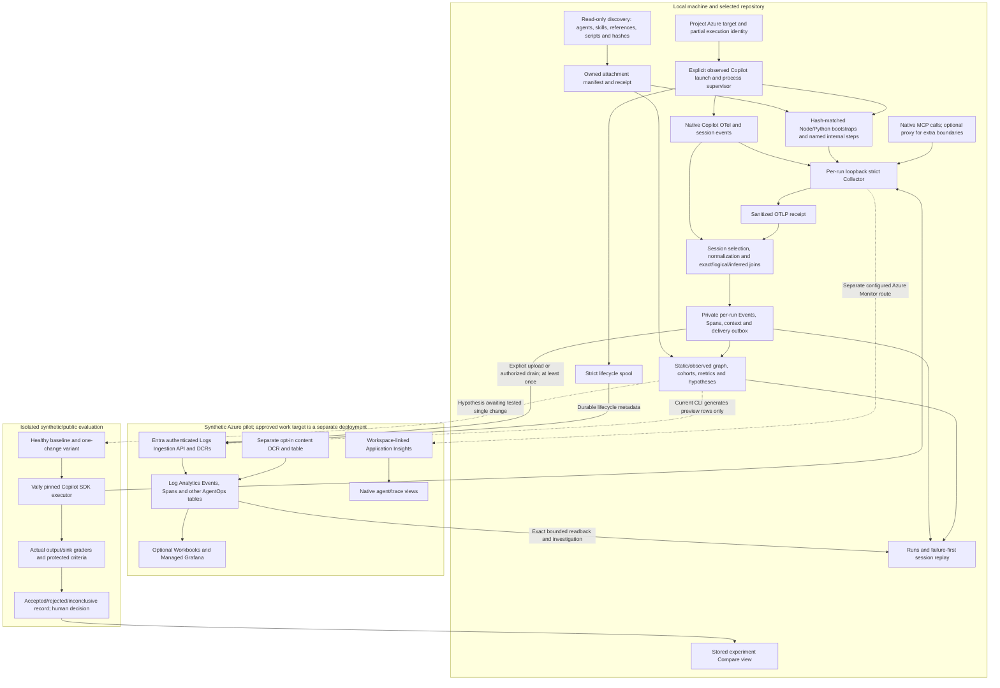

# Plans, architecture, and remaining delivery audit — 2 October 2026

TL;DR — The repository implements a useful, unusually careful Copilot CLI flight recorder. It does **not yet prove a generally useful architecture optimizer or an enterprise deployment**. Its strongest contribution is preserving ordered agent/skill/reference/tool/script evidence and uncertainty through a private local ledger and a tested synthetic Azure path. The most important remaining work is connecting real producer coverage to eligible analytics, clarifying baseline/candidate comparison identities, proving operator usefulness, and closing deployment-specific controls.

This is a read-only source/plan audit with one new report. No product code, cloud resource, model run, configuration, or existing dirty file was changed by this audit. Live deployment verification and fresh tests belong to the sibling audit reports. Historical results below are attributed to their dated evidence; they were not rerun here.

## Inspection boundary

Source inspected at branch `feat/enterprise-flight-recorder`, HEAD `0b91a3671376f9bc655aa955094d995ac711254c` (documentation head over the completed source). Existing modified master plan and pilot ledger, and existing untracked overnight plan/compatibility research, were preserved. The existing Graphify index was consulted with read-only `affected sessionWaterfall --depth 1`; freshness was not established, so exact source governed conclusions.

Reviewed the master plan, executable overnight plan, progress log, closing handoff, source-material README/context, the 113-section requirements register and its source-material copy, all four ADRs, and the architecture-intelligence design spec. The two requirements copies compare byte-identical. The requirements register is exhaustive ambition, not evidence that every section ships. Long requirements were inspected by section/topic, with deeper reads on capture, scripts, privacy, graphs, analytics, experiments, dashboards, compatibility, and success gates; this is not a claim to have checked every individual requirement against every code path.

Supporting reads: architecture/data model, CLI-first recorder, simplified Azure design, privacy modes/threat model, execution-configuration identity, durable spool, V2 ingestion, product-pattern roadmap, architecture/product audit, release checklist, requirements reconciliation, latest completion/live-completion records, StockPilot variants, Vally documentation, and experiment records. Exact current source was checked for attach, observed launch, scoped Collector, script activation, session delivery, event/span joins, outbox states, architecture loading/graphs/metrics/findings/reports/views, CLI command surface, and pilot/ingestion Bicep. SDK adapters, full alert/actioner internals, every dashboard query, and complete per-runtime implementation were not exhaustively reviewed here.

> 🧠 **From Hindsight memory (AgentOps waterfall reference reads)** — The reference-read contract preserves ordered lane-specific reads, exact/logical/inferred/ambiguous/missing/unsupported/unknown evidence, and nullable missing counts. Source verification confirms those evidence/coverage principles. The page's claim that this path belongs to `hermes-primary` is not used as repository identity.

## Which documents govern the product

| Artifact | Purpose | Current implication |
| --- | --- | --- |
| [Master plan](../plans/2026-09-29-copilot-agentops-observability.md) | Single roadmap and release gates | CLI-first sequencing; opt-in collection; synthetic/public development; separate enterprise gate |
| [113-section requirements](../requirements/full-agent-observability-requirements.md) | Long-term acceptance register | Multi-surface observation, deterministic analytics, protected improvement loop, fleet/operator workflows remain in scope eventually |
| [Requirements reconciliation](2026-09-29/requirements-reconciliation.md) | Resolves product shape | Runs → Architecture → Compare simplifies navigation without deleting deeper scope |
| [Overnight plan](../plans/2026-09-30-agentops-overnight-build.md) | Implementation/local acceptance contract | Local fixtures, live native execution, Azure delivery, enterprise controls are distinct proof tiers |
| [ADR 0003](../adr/0003-opt-in-observation-process.md) | Activation authority | Explicitly started process; no default persistent hooks/global exports; ADR 0001 activation is superseded |
| [ADR 0002](../adr/0002-approved-rich-detail-in-azure.md) | Rich-detail design | Allowed only for approved, restricted deployment; design acceptance is not work-data authorization |
| [ADR 0004](../adr/0004-azure-readiness-profiles.md) | Azure profiles | Personal skips absent optional views; team/internal require App Insights/Grafana; internal adds group RBAC |
| [Architecture spec](../superpowers/specs/2026-09-30-architecture-intelligence-design.md) | Analytics design | Still labelled draft/proposed despite landed implementation; reconcile status rather than treat proposals as new authority |
| [Latest live completion](2026-10-02-agentops-live-completion.md) | Dated proof | New bounded SDK/MCP/delegation live stimulus and earlier-run synthetic Azure field readback passed; optimization remains unproved |

## Logical architecture

The current main path is: **discover → attach → start one observed process → capture native/session/script evidence → sanitize → persist per-run metadata → replay → upload if requested → query exact IDs**. Architecture findings require a separate affirmative coverage and cohort contract. Fleet views and restricted rich-content export are extra paths, not evidence that the default run captures every surface.

## Component and dataflow ownership

| Plane | Current implementation | Input → output | Important boundary |
| --- | --- | --- | --- |
| Inventory/lifecycle | `attach-command.js` discovery, ownership receipt, detach | Repo definitions/code paths → hashes and safe relative component paths | Attach alone enables no telemetry; changed/unlisted scripts do not qualify |
| Process launch | `copilot/session-command.js` and `process-supervisor.js` | User arguments + selected target → scoped Copilot and Collector | Rejects incompatible inherited OTel settings; explicit session identity where possible; supervisor observes Collector/process failure |
| Script observation | `script-observation.js`, `instrumentation/node/`, `instrumentation/python/` | Owned hash-matched script invocations → roots and explicit internal steps | Arbitrary code internals cannot be automatically inferred; Python direct-script wait status has a narrower supported invocation contract |
| Native evidence | `session-parser.js`, `session-otel.js`, `session-enricher.js` | Native JSON/protobuf/session records → normalized source IDs | Requested model, actual model, provider and usage availability stay separate |
| Join/export | `session-event-export.js`, `session-span-export.js` | Exact session/run evidence → metadata-only Events/Spans | Native tool joins use exact tool-call IDs; script invocation uses uniquely supported temporal/path inference |
| Delivery | `session-run-delivery.js`, `session-delivery-outbox.js`, `azure/durable-evidence-spool.js` | Local evidence + bound target → per-stream acceptance checkpoint | API acceptance differs from query visibility; delivery is at least once |
| Azure | `pilot-subscription.bicep`, `v2-ingestion.bicep`, `eval-content.bicep` | Reviewed pilot deployment → workspace, App Insights, content/metadata DCE/DCRs, tables and sender assignments | Synthetic target; public endpoint defaults; ingestion cap is not spend control |
| Investigation | `session-waterfall.js`, local queries, ask-context/triage | Evidence ledger → timed failure-first HTML and bounded query/handoff context | Unknown or missing evidence remains visible; full content needs explicit local mode |
| Analytics | `architecture/{graph,metrics,findings,report,views}.js` | Static inventory + eligible run cohorts → metrics, cards, preview rows | Findings are hypotheses, not safe automatic edits; no live upload in this command |
| Evaluations | StockPilot tasks/graders, pinned Vally, `experiments/` | Baseline/one variant → repeated actual output results and stored decision | Hand-built golden ledgers prove rule logic, not behavioral efficacy |
| Other surfaces | SDK adapter, MCP proxy, GitHub enrichment, legacy/operator commands | Additional runtime/outcome receipts → same telemetry contracts | Their presence does not establish complete VS Code/hosted-agent observation |

## Evidence, identity, and join invariants

1. **Run is the investigation envelope, not necessarily one physical trace.** Copilot native trace IDs and owned script trace IDs can differ. Exact `RunId` linkage is logical, not a fabricated trace parent. The older “trace = one Agent Run” documentation oversimplifies the current multi-producer model.
2. **Exact session selection first.** Session event-file identity must match the selected directory. Unsafe run/session paths and symlinks are rejected. Ambiguous changed sessions are not safely attributed by guessing.
3. **Source IDs survive.** Event/tool/agent/parent/trace/span identities are preserved where producers expose them. Operation order can be exact within a source and a causal partial order across concurrent sources; timestamps alone cannot prove global causality.
4. **Script joins are independently labelled.** Exact run matches permit inclusion; a unique known script path within one supported tool interval permits an inferred script/tool association. Overlapping candidate parents remain unlinked/ambiguous.
5. **Reference observation needs an affirmative read receipt.** Starts, failures, pending/partial/unknown statuses and unrelated metadata do not count as successful reads. Same-lane ownership ties cannot be promoted to exact evidence.
6. **Unknown is different from zero.** Unavailable tokens/counts/coverage stay null or unknown; measured zero remains zero. Native chat-request usage is deduplicated before presentation rather than added to enclosing agent totals. Recorded launch arguments are requested settings; the parent audit observed `gpt-5.4-mini` requested versus `gpt-5.5` provider evidence in a reviewed run, so effective model identity must come from the actual run receipt, not invocation text.
7. **Architecture identity and execution identity are different.** Architecture hashes sorted path/content-hash pairs. Current session delivery reads the attachment after capture (`session-run-delivery.js:103`); this is not an independently retained immutable pre-run architecture snapshot. An inventory discovered after a live run is static context, not proof of attachment during that run. Preserve original run contexts/manifests separately from later discovered inventory and mark drift rather than rewriting history. Execution identity is a bounded non-secret launch-argument projection. Ambient defaults, file-backed configuration content, plugin content and many runtime settings are excluded; observed identity is partial.
8. **Absence needs producer completeness.** Expected fixture operations and an observed event do not prove exhaustive capture. The current native recorder deliberately does not assert global completeness.
9. **Delivery and correctness are distinct.** A successful task, captured local stream, accepted API request, and indexed query are separate facts. The outbox reports each stream separately.
10. **Stable IDs must support deduplication.** Crash after Azure acceptance and before local checkpoint can resend a physical row. Query/rollup consumers must deduplicate using the appropriate event/span lifecycle identity, not merely assume one request produced one unique row.

Exact source anchors: [run context and coverage](../../agentops-cli/src/lib/copilot/session-run-delivery.js#L101), [script join logic](../../agentops-cli/src/lib/copilot/session-span-export.js#L43), [architecture loader eligibility](../../agentops-cli/src/lib/architecture-command.js#L120), [metric eligibility](../../agentops-cli/src/lib/architecture/metrics.js#L47), [execution identity design](../execution-configuration-identity.md).

## Privacy and deployment boundaries

The per-run Collector binds loopback ports, validates a strict template, and creates owner-only files. It sanitizes before the local OTLP receipt. Native Copilot session history is a separate existing local source and may contain raw content; Collector sanitization does not make that history metadata-only. Exporters and HTML renderers therefore require their own explicit projections/redaction.

Metadata export drops prompts, reasoning, command arguments, tool payloads and content. Component-relative names/paths deliberately appear in the declared/reference contract; the older blanket claim that every path/name is hashed does not describe this allowlisted component identity. Restricted local HTML can contain payload content under explicit opt-in, uses owner-only permissions, and has **no automatic expiry**. Best-effort secret redaction cannot establish a universally safe work-data policy.

The pilot template provisions a workspace-linked App Insights component and separate content/metadata paths. Content and metadata can coexist in the same synthetic workspace; separate DCRs do not by themselves provide separate reader authorization. For real work, choose independently verified table/workspace access separation, retention/deletion, audit and policy.

Current Bicep evidence: pilot table retention defaults to seven days, workspace retention to thirty days, daily quota to 1 GB; metadata/content DCE defaults allow public network access. DCR-scoped sender assignment exists. Enterprise private access, actual reader-group role assignments, budget/alerts, work-content permissions and deletion proof require target readback. Existing configured values and templates are not deployment proof.

## Plan-to-implementation gap matrix

| Requirement group | Implemented or historically proven | Remaining acceptance work |
| --- | --- | --- |
| §§4–12, 25: Copilot run/tool order | Native/session model, parent/subagent lanes, exact tool joins, failure-first replay, tested CLI fixtures | Versioned runtime/plugin/source compatibility; unsupported retry signal; simultaneous producer/interrupt cases; no universal physical script parent |
| §§13–22: skills/references | Inventory, activation/read rows, repeated reads, lane attribution, deterministic reference/coactivation metrics | Fresh diverse workloads with independently supported eligible coverage; semantics of instruction delivery versus actual use remain limited |
| §§23–26: script depth | Hash-matched Node/Python roots, named steps, standard-library Python OTLP, tested direct TS/loader cases | Absolute/options/module/stdin Python outcome cases; broader TSX/runtime matrix; meaningful internal-step adoption; measured overhead and parity |
| §§27–36: privacy/Azure | Strict Collector, separate rich-content producer, outbox/spool, synthetic metadata/content proofs | Enterprise RBAC/private network/deletion/spend controls; comprehensive outage/disk/TTL/corruption matrix; all consumers deduped |
| §§37–46, 73: architecture analytics | Static inventory, observed graph, cohorts, Wilson intervals, metadata reports, five rules | **Real recorder emits unknown coverage and `evidenceComplete:false`; no eligible native analytics today.** Define producer-specific supported denominator evidence rather than stamp complete globally |
| §§47–54: structural hypotheses | Four planted golden-rule cases plus healthy controls; declared-not-observed rule; deferred subagent/indirection rules | Show rules find independently audited real inefficiencies and do not punish healthy reuse; validate candidate outcomes |
| §§55–66: evaluation/candidates | Twelve-task StockPilot corpus, pinned Vally, actual sink graders, single-flaw variants, inconclusive live records | Original 30–50-task ambition remains unmet; protected diverse holdout; predeclared adequate trials; accepted/rejected decisions; candidate isolation/retention/rejection suppression |
| §§67–70: architecture reviewer | Deterministic context and bounded exact queries for read-only investigation | `agentops experiment plan|record` is absent; architecture upload preview needs live delivery/readback wiring; SkillOpt follows stabilization |
| §§71–72: PR/nightly automation | Local manual workflows and templates | Safe CI scheduling and protected review gates after proven loop; no automatic merge |
| §§74–81: product views | Local Runs/replay/Architecture/Compare HTML; maintained dashboard packs | Coherent default journey, durable output location/discovery, source-definition graph drilldown, governed fleet views; actual user value validation |
| §§82–83: feedback/corrections | Adjacent annotations/outcomes exist | Structured task-quality/correction feedback capture and evidence-linked eval conversion need specific verification |
| §§84–90: benchmark/ecosystem | StockPilot/public provenance and compatibility research | More independent tasks/agents, capability matrix kept current, separate hosted and VS Code adapters with real readback |
| §§91–113: final goal | Strong evidence foundation and failure reconstruction | Reliable trace-to-eval/improvement chain with measured task benefit remains a later product stage |

The completed overnight local tasks and bounded later live tests are substantial progress; they do not automatically close every row in the original requirements register.

## Concrete contradictions and finish risks

| Priority | Finding | Source/effect | Required resolution |
| --- | --- | --- | --- |
| P0 | No eligible real architecture cohort | Recorder writes every kind `unknown` and `evidenceComplete:false`; loader requires all six kinds complete; metrics require complete evidence/version match | Design producer-specific observability/completeness proofs and per-metric denominators. Preserve truthful uncertainty; do not relax to event-presence heuristics |
| P1 | Compare compatibility label requires same architecture hash | `views.js:90–98` requires equal baseline/candidate architecture plus matching authoritative config to call them compatible. This renderer displays stored decisions; it does not execute trials or calculate/gate an efficiency decision | A true structural edit changes architecture hash. Clarify controlled-change comparison with expected baseline/candidate hashes, unchanged nuisance config and task/holdout/trial contract; distinguish intentional change from drift. This is a presentation/contract limitation, not proof trials cannot run |
| P1 | Cloud architecture cards are preview-only | `architecture-command.js:235–245` makes no network call even with `--upload` | Wire reviewed metadata producer to target-bound uploader only after schema/readback proof; display uploaded vs indexed states |
| P1 | Experiment command promised but absent | `architecture-command.js:192` recommends `agentops experiment`; core/experimental surfaces have no such command; experiments README calls it pending | Provide runnable pinned Vally command in current UX or implement reviewed plan/record workflow; avoid dead next actions |
| P1 | Readiness labels overstate use-case proof | “Local product complete” records coexist with unknown global coverage and inconclusive experiments | Publish completion per stage/profile/use case; do not imply useful optimization from unit/golden success |
| P1 | Default investigation story conflicts | `architecture.md`/simplified design prioritize native Agents view; later roadmap prioritizes local Runs; older simplified design says current group absent | Replace stale entrypoint/status text with one current target-aware quickstart; preserve historical evidence separately |
| P1 | “Offline” release checklist contains external actions | Includes GitHub enrichment, Azure validation/import and later real-model instructions; generic `azd provision` path conflicts with pilot hazard notes | Split pure local, external read, model-budget, and hosted-write checks by actual side effect; inspect targets before execution |
| P2 | Draft status and comments lag landed code | Architecture spec proposed sections; loader comment says real contexts have no architecture/config fields, but current producer writes them | Reconcile maintained design/source comments with current contracts without rewriting historical receipts |
| P2 | Single physical trace documentation is too strong | `agent-run-data-model.md` says trace = run; native/script paths preserve independent traces and logical run links | Document run envelope and typed evidence edges as primary; trace remains producer context |
| P2 | “Metadata-only” has multiple meanings | Raw native session files, strict exports, restricted HTML, content DCR/table, and synthetic workspace are different boundaries | Publish one data classification/storage/access/retention matrix; test each transition with canaries |

## Is this useful?

**Already credible:** investigating a complicated opted-in Copilot CLI failure that crosses a subagent, references, tools, MCP and owned scripts. Native token/latency summaries alone do not prove reference read order, ownership uncertainty, script-step links, or why a missing edge is unavailable. This repo's careful reconstruction and local evidence receipt are a plausible differentiated product.

**Not yet established:** whether engineers diagnose failures faster; whether reference/skill graphs change a useful decision; whether the generated hypothesis saves tokens/latency without regressions; whether enterprise teams accept its setup/governance burden. The three-trials-per-variant thrash record reports all graders passed but tool-call medians 9 versus 10, below its predeclared 20% threshold. It correctly retains an inconclusive decision. That proves executable evaluation discipline, not improvement.

Recommended usefulness experiment: give independent engineers the same five-to-ten independently audited multi-boundary failures. Randomize native tools alone versus the AgentOps replay. Measure time to correct diagnosis, correct causal explanation, unsupported claims, setup time and recovery confidence; use blinded ground truth and retain failed tasks. For optimizer value, first capture adequate covered cohorts across several task families, then predeclare one candidate's correctness/critical-regression criteria and target effect, and run protected baseline/candidate trials. Do not spend on fleet dashboards or add more rules before proving these two outcomes.

## Dependency-ordered finish map

1. **Reconcile current release claims and entrypoint.** One CLI-first quickstart, source/runtime capabilities, proof matrix, tested scripts and explicit target/profile. Acceptance: a fresh reader can reach a retained replay and identify current limits without comparing dated checkpoint prose.
2. **Close the analytics evidence contract.** Immutable inventory/attachment snapshot at launch, execution settings with provenance, task identity, per-producer/per-component supported coverage and lifecycle failure receipts. Acceptance: eligible metrics from a named real synthetic workflow; missing producer prevents only the metrics whose denominator depends on it.
3. **Clarify controlled comparison semantics.** Explicit experiment stores baseline and candidate architecture versions and permitted diff, while unchanged runtime/model/tool/MCP/task conditions are audited. Acceptance: a one-skill edit is labelled controlled; an unrelated model/config change is labelled incompatible or uncertain; partial config remains uncertain.
4. **Complete the manual hypothesis-to-result loop.** Runnable Vally handoff, exact trial/ledger/task joins, protected holdout, deterministic output grading, trial count/effect criteria fixed before launch, accepted/rejected/inconclusive retention and prior-rejection suppression. Acceptance: one independently supported optimization or a correctly rejected candidate with full replay evidence.
5. **Prove usefulness and operational behavior.** User diagnosis study plus bounded collection overhead, failure parity, queue/restart/429/schema/disk/expiry/readback-delay cases and consumer dedup. Acceptance: measured support benefit and explicit failure behavior rather than more generated dashboards.
6. **Choose and close a governed deployment profile.** Separate work target, least privilege, network/access/content/retention/deletion/audit controls, actual cost protection and alerts, reviewed preview/recovery. Acceptance: independent live readback of controls and data-plane canaries. Current synthetic target remains insufficient for work-data readiness.
7. **Expand surfaces only by compatibility proof.** VS Code/cloud agents and additional runtime loaders get native-vs-adapter capability records and smoke/readback. Acceptance: each promised field has versioned producer evidence or visible unsupported status.

This report is an evidence audit of the existing master roadmap, not a replacement roadmap or authorization to execute new deployment, optimization, or model spending.
