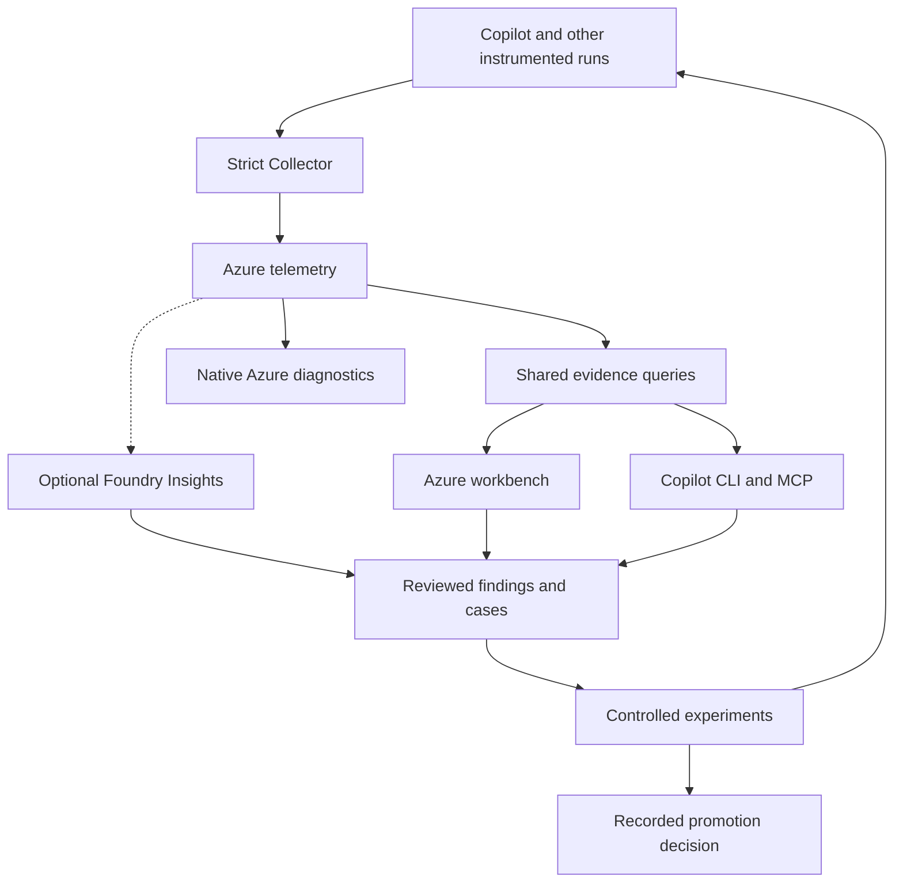

# Azure AgentOps: dashboard, conversational investigation and evaluation

Status: architecture direction accepted for publication; not implemented or cloud-qualified.

> **Dated snapshot (written the morning of 2026-10-07).** Later the same day,
> v0.2.0-preview to v0.3.1-preview shipped part of this direction: `agentops
> doctor`, the local web UI (`agentops ui`), OTel `gen_ai.*` span export for the
> Application Insights Agents view, a portable Grafana dashboard, a metadata-only
> Deploy to Azure template, and `agentops digest`. See [CHANGELOG.md](../../../CHANGELOG.md).
> The workbench, Copilot analyst and controlled-experiment milestones below are
> still unbuilt. Read the rest as the design rationale at that time.
Date: 2026-10-07.
Code inspected: main `4e1d3fbccd96a96e96aa027c89c02adcfd9f70c6` plus
local collector-label patch `0217469`. That code patch is separate from this
docs-only publication. Azure and Copilot live execution were unavailable during
the audit; the live acceptance gates below remain outstanding.

## Purpose and success

Conor wants a polished Azure UI and the ability to ask Copilot CLI questions
about the same Azure telemetry. Findings should produce testable improvements
to agents, skills and evaluations. Reuse existing code wherever its evidence
and contracts hold. Metadata-only collection remains the default.

The first success is a real public-repository run that can be found both in
the UI and through Copilot, investigated with the same identifiers and token
totals, and associated with independently verified test/evaluation outcomes.
The first improvement must compare a baseline and candidate on fixed cases
and unseen holdout cases, with traceable evidence and a rollback decision.

## Architecture choice

The target product is a thin Azure-hosted workbench over Azure-native telemetry,
with the same evidence available through Copilot CLI. This refines the earlier
portal-only recommendation: branch inspection found existing saved-view,
recommendation-review and actioner primitives worth turning into a coherent
workflow. A dedicated review/experiment experience is a concrete reason to
add a small application; recreating all of Azure's diagnostics is not.

| Approach | Benefit | Tradeoff | Decision |
| --- | --- | --- | --- |
| Portal Grafana + CLI only | Fastest route to verified telemetry; little hosting | Limited finding review, experiment decisions and unified navigation | First delivery slice and permanent diagnostic surface |
| Thin workbench + Azure diagnostics + shared query contracts | Cohesive daily workflow, reuses existing records, same evidence in UI and CLI | One small authenticated application and workflow API | Recommended end product |
| Fork/self-host Langfuse or SigNoz | Mature observability UI | Additional data stores, identity, operations and migration of current evidence contracts | Borrow focused code/patterns; no backend fork initially |

Proposed workbench: React/TypeScript frontend and a same-origin Node API on
Azure App Service. Keep existing JavaScript domain builders and extract only
what the new endpoints need from `actioner/index.js`. App Service supplies
Entra sign-in; the API implements workspace authorization. Its managed identity
gets scoped telemetry read access and separate workflow-storage permissions.
The browser receives neither Azure credentials nor function keys. This is a
hosting recommendation, not an already deployed or cost-qualified resource.

Native Copilot OTel enters the existing loopback strict Collector. Standard
traces reach Application Insights through one chosen exporter. Existing custom
tables retain receipts, outcomes and experiment evidence. Shared versioned KQL
projections normalize evidence for dashboards, the API and local CLI execution.
Blob storage holds versioned case manifests, saved investigations and decision
records. Telemetry tables are not a transactional approval database.

The review arrow from CLI represents a proposed case or explicit review action,
not a write capability in the read-only analyst tool set. Promotion remains a
separate authorized action. Native diagnostics are linked from the workbench.
No hosted LLM/chat backend is required: Copilot supplies the initial language UI.

The current extension's manual `AgentOpsEvents_CL` projection is receipt-only.
It omits parent/span IDs, model/tool names and agent label. It cannot substitute
for the standard trace exporter. The local collector-label patch still needs
pinned real-Collector qualification and does not retain agent ID/version yet.

Start with the existing Azure Monitor exporter lane if the selected current
Application Insights resource supports it. Qualify native Azure OTLP/DCR
ingestion as an alternative, not simultaneous duplicate export. Discover
actual table schemas and workspace bindings first. Trace/log storage and the
native metrics destination must be configured explicitly; native OTLP metrics
have delta/exponential-histogram requirements that need runtime verification.
Do not apply a main infrastructure template that would repoint existing targets.

## Branch integration boundary

Build from main `4e1d3fb`, carrying the local collector privacy patch. The native
publish branch is tree-identical to merged #168, and the Azure MCP pin is
patch-equivalent to merged #169. Windows qualification core files already
match main. The control-room branch has unrelated history, but main contains
and has extended its product features. Inspect its remaining fixture examples
selectively; do not merge its historical tree over newer main.

The wording-only PR170 follow-up is independent of this architecture.
[Branch and upstream audit](../../research/2026-10-07-branch-and-upstream-reuse.md)
records exact heads, source paths, license boundaries and comparison evidence.

## Reuse map

| Existing code | Reuse | Required adaptation |
| --- | --- | --- |
| `grafana/dashboards/v2/` | Panels, labels, filters, query logic | Four coherent screens; replace Managed Grafana links/datasource assumptions with portal-compatible deployment and links |
| `agentops-cli/src/lib/observability-queries.js` | Named KQL and token rollup logic | Include agent/server root spans from actual discovered tables; schema adapters and bounded parameters |
| `observability-query-command.js` | Named investigation intents | Existing Azure commands emit KQL only; add explicit query execution with receipts |
| `ask-context.js`, `v2-ask-context.js` | Evidence bundles, missing-data states, dashboard links | Return actual query results and provenance alongside prompts |
| `plugin/agents/telemetry-investigator.agent.md` | Evidence-first analyst | Narrow tools, enforce query receipts, remove assumption of one table mapping |
| `plugin/agents/agent-optimizer.agent.md` | Hypotheses, patch targets, validation and rollback | Use versioned experiment results; no silent promotion |
| `saved-views.js`, `recommendation-store.js`, `actioner/index.js` | Saved investigations, review records and context builders | Authenticated per-user authorization, versioned state, concurrency and idempotency |
| `benchmark-*`, `recommendation-benchmark-evidence.js` | Baseline/candidate execution and promotion gates | Versioned cases, holdout separation, repetition and outcome qualification |
| `evals/`, `insights/` | Operational checks and recurring patterns | Missing evidence becomes unknown; separate heuristics from task correctness |
| `mcp/trace-context.js` | MCP metadata propagation helpers | Preserve/extract active parent context; a newly generated trace is not proof of connection to Copilot |
| `infra/bicep/observability-views.bicep` | Existing workspace boundary | Add separate dashboard-only deployment referencing existing resources; no chargeable Managed Grafana by default |

Checked-in `.github/mcp.json` pins Azure MCP 2.0.5, but
`copilot/mcp.azure-monitor.sample.json` still uses `@latest`. Unify supported
installation examples as part of the analyst onboarding change. Do not assume
current online Azure MCP tool names exist unchanged in that pinned release.

## One shared evidence contract

Canonical projections: run summary, span tree, tool aggregates, model/token
rollup, pipeline health, outcome evidence and experiment comparison.
Every result carries: query ID/version, UTC time window, selected target,
source tables, run/trace identifiers, row count, retrieval time, completeness,
warnings and investigation links. Target identifiers stay in private runtime
configuration and operator receipts, not public fixtures or logs.

Readiness separates capture, exporter acceptance, query visibility and rendered
native trace. Outcome status is independently unknown/pass/fail with a source.
Missing observations are never zero-filled into correctness or success scores.
Root aggregate token counts and child model-call counts are not added together.
Agent runtime success and task correctness are different measures.

Support the actual chosen exporter schema; do not blindly union every possible
native/custom table or count duplicate exports as additional runs. Physical
parentage requires trace/span/parent IDs; logical run correlation is labelled
separately. Partial captures cannot establish complete critical paths.

## Everyday Azure UI

The workbench has five destinations with one persistent target/time/filter bar.
A run or finding URL preserves those filters. Every evidence panel shows its
window, last retrieval time and complete/partial/unavailable state. Empty data,
permission failures and an unhealthy capture pipeline get different messages.
Avoid an overall "agent health score" that hides unknown task outcomes.

1. **Overview:** recent runs, failures, latency, usage and independently verified
   outcomes. Pipeline freshness and outcome coverage sit beside the metrics.
   Costs are labelled estimates with rate version and coverage when calculable;
   token counts alone are not a Copilot subscription bill.
2. **Runs:** searchable repository/agent/model list with a detail drawer for
   tool activity, observed lineage, usage and outcome evidence. Open the exact
   native Azure transaction for a full waterfall. Do not synthesize parentage
   from receipt rows or timing alone.
3. **Findings:** ranked recurring problems with supporting and healthy comparison
   runs, source (rule, human or Foundry), owner and review status. Save an
   investigation, dismiss with a reason, or draft an evaluation case.
4. **Experiments:** baseline/candidate comparison, fixed cases and holdouts,
   evaluator/config versions, repeated trial results and a recorded decision.
   Incompatible and inconclusive results remain visible.
5. **System:** collector/export/query readiness, schema support, freshness,
   capture coverage and analyst usage. This answers "is it actually doing
   anything?" without treating a deployed resource as proof of value.

The UI offers "Open in Azure" and "Ask in Copilot" from the same evidence.
The latter copies a safe investigation reference/command resolved by configured
query tools, not a giant prompt containing raw telemetry. The existing Workbook
remains available for diagnostics. Portal Grafana uses Microsoft's built-in
Copilot template first, augmented with our outcome and experiment projections.
Use standalone dashboard deployment that references existing resources.

### Evidence and workflow records

| Record | Purpose | Required distinction |
| --- | --- | --- |
| Run / Span | Runtime operations and physical trace links | Logical run correlation is separate from actual parentage |
| Outcome | Independent assertions or reviewed labels | Runtime completion is separate from task correctness |
| Finding | Repeated behavior and evidence references | An automated hypothesis is separate from a confirmed problem |
| Experiment | Frozen comparison definition and trial evidence | File treatment v1 is separate from future model/repair treatments |
| Review | Attributed decisions and reasons | A favorable result is separate from authorization to promote |

Evidence bundles pin query version, window, result digest and retrieval time.
Persist a bounded, schema-validated metadata result snapshot when a decision
must remain reproducible;
links alone may expire with telemetry retention. Workflow heads are mutable,
while decision revisions are append-only by application contract. Blob versioning
alone is not tamper-proof audit storage. Store a decision as one conditionally
written record plus immutable revisions, avoiding assumed cross-blob atomicity.
Retries use idempotency keys; stale ETags return a conflict requiring review.

Authorize reader/reviewer/operator capabilities against configured workspaces.
Entra authentication alone is insufficient. Attribute reviews to the validated
subject, not a supplied `owner` field. Existing function-key/shared Blob handlers
are reusable plumbing, not completed per-user authorization. Hosted managed
identity access must not grant every signed-in user all of its workspaces.
The local CLI can use the operator's Azure identity; shared semantic contracts
keep its results equivalent to the hosted API without requiring a hosted login
for basic local investigation. Shared writes go through the authenticated API.

## Conversational interface

Reuse Copilot CLI as the language interface. Initially a local AgentOps query
executor runs named read-only queries using the operator's existing Azure
identity. Azure MCP provides resource/schema discovery and an advanced read-only
investigation route. Expose the same named operations through a local stdio MCP
adapter only after the CLI result contract passes the equivalence tests.

First operations: health, list runs, get run, get trace, summarize tools,
summarize models and compare experiments. Default lookback 24 hours; maximum
31 days. Maximum returned rows 500, serialized result 256 KiB, request timeout
15 seconds, and no automatic unbounded retry. Oversized results report partial
with a continuation/narrowing suggestion. These limits bound requests and
responses, not Azure query scan cost; queries need early time/target filters.

The named-query interface accepts validated filters, not arbitrary KQL or
resource IDs selected by a model. Configuration binds the approved workspace
and subscription. Advanced Azure MCP use is separately tool-allowlisted and
must still report target, time, query and result provenance. Read-only identity
and configured targets enforce boundaries beyond agent instructions.

Examples of intended questions (not claims of current execution):

- Which tool caused the most failures this week, and in which runs?
- Why was the last run slow? Show the supporting trace.
- Did this instruction change reduce tool calls while preserving correctness?
- Does the cheaper model retain correctness? (Future model-treatment contract.)
- Propose an evaluation case for this recurring failure.

Analyst replies cite query/trace evidence, separate observation from hypotheses,
and attach the matching dashboard link. They cannot enable content capture or
change Azure resources. Telemetry labels/results are data, never instructions.
Tag analyst activity with a safe purpose enum `observability`; exclude it from
workload comparisons by default, but expose its own usage and query health.
This prevents the platform's investigation sessions distorting workload totals.

## Improvement loop

Observed recurring failure -> reviewed hypothesis -> versioned regression case
-> baseline/candidate experiment -> holdout check -> proposed change -> explicit
promotion and rollback evidence. Freeze case/evaluator versions for each
comparison. Candidates cannot rewrite their own judge or expected outputs.
Report sample size and uncertainty; a single successful run is insufficient
to claim an improvement. Expensive model trials are explicit, budgeted actions.

Metadata establishes operational behavior, not semantic answer correctness.
Correctness needs independent assertions, tests, reviewed labels or bounded
public/synthetic evaluation inputs. Do not infer it from tokens or merged PRs.
The current `scoreCodeOutcome()` assigns 65 without evidence and 98 to merged
PRs; `scoreTestDiscipline()` assigns 75 without recorded tests. Keep these only
as explicitly labelled legacy heuristics. New correctness results require
evidence and coverage; absence is unknown and excluded from correctness rates.

No automatic modification of production agents, eval truth, access policy or
resources in the initial release. Case suggestions and candidate patches can
be generated, but execution/promotion is a separate recorded action.

### What existing experiments can establish

V1 in `architecture/experiment-contract.js` requires identical task, dataset,
grader, requested/actual model, provider, runtime, tools, MCP and settings,
with exactly one changed file. It requires repeated trials and reports only
descriptive conclusions conditional on caller-asserted runtime identities.
Local snapshot verification does not independently establish runtime identity.
First qualify one instruction/skill-file efficiency treatment on passing tasks.

A cheaper-model comparison needs an explicit new treatment type and contract
version with all other factors held fixed. A failing-to-passing repair also
needs a separate regression contract: v1 rejects efficiency conclusions when
the baseline fails. Preserve those rules rather than weakening them to make
a comparison appear successful. Add independent producer receipts and holdout
execution before claiming a verified improvement.

Modern full-run activation coverage is not currently producer-qualified
(`qualifiedProducer` returns false). Show observed positive events and their
scope; do not infer unused skills, complete coactivation or absence from silence.

## Delivery milestones and acceptance

| Milestone | Observable acceptance |
| --- | --- |
| Native data + evidence projections | Real public run has parent-linked spans in selected cloud destination; poison absent; unknown outcomes retained; token rollup deduplicated |
| Read-only query execution | Named CLI query returns actual rows and a bounded receipt; schema mismatch/auth/empty/partial results are distinguishable |
| Azure diagnostics | Deployed portal dashboard renders real rows; exact run/trace drilldowns and CLI totals match |
| Thin workbench | One run investigation can be saved, reviewed and reopened; authorization, stale-update conflict and attributed decision checks pass |
| Copilot analyst | A real Copilot session answers one run question using query tools and cites the same rows/links; denied writes stay denied |
| Controlled experiments | Passing baseline tasks support a single-file efficiency comparison; holdouts and independent receipts support a recorded decision without judge leakage |

The platform decomposes into evidence/query execution, workbench/review, and
experiment subsystems. The first implementation scope is a narrow end-to-end
run investigation: one qualified capture, one bounded Azure query, one portal
view and one Copilot answer. Subsequent scopes add shared review and controlled
experiments using the same contracts. This is delivery sequencing, not an
approved detailed implementation plan for all subsystems.

Required tests include both exporter table mappings when supported, absent
tables, duplicate spans, missing root spans, missing outcomes, malicious filter
strings, oversized responses, token duplication, stale data and mixed targets.
Live gates must qualify the pinned Azure MCP operations, Copilot tool use,
Collector execution, Azure query readback and rendered dashboard drilldowns.
Offline fixtures cannot satisfy live acceptance. Existing CI and relevant
security/privacy contracts remain required.

## Focused upstream reuse

Reuse Langfuse's compact observation/experiment tool patterns and consider its
pure graph-selection helper if a custom graph proves useful. Preserve exact
parentage and label timing inference. Reuse SigNoz MCP's bounded query tools,
wire-schema budget tests, structured errors and golden protocol fixtures as
design patterns. Both implementations depend on their own backend/auth models;
they are not drop-in Azure adapters. No upstream source was copied in this audit.

The source audit pins commits and licenses. Retain notices for copied code,
exclude enterprise directories and inspect each dependency's terms. Avoid
raw request logging, identity attributes or write tools that conflict with our
metadata-only analyst contract. No second telemetry store is part of v1.

## Research references and applicability

### Current-capability research amendment

See [the Oct 7 capability assessment](../../research/2026-10-07-current-capabilities.md)
for current status, prerequisites, evidence and proposed integration trials.
Start UI qualification with Microsoft's built-in Copilot Grafana template,
then add our outcome and experiment panels. Native Collector OTLP ingestion is
GA; AMA/AKS preview status must not be applied to the Collector path.

Add an optional Foundry Insights adapter after external-agent identity and
trace compatibility are demonstrated. Retrieve existing findings read-only;
record their source, cohort and review state alongside deterministic findings.
Retain the local named-query investigation path whether this preview is
available or not. Foundry registration must match privacy-safe emitted identity
and version; the current allowlist does not yet retain the required ID/version.

Cloud quality evaluation is a separately qualified public/synthetic data path:
ordinary strict collection drops the message attributes those evaluators need.
It must not silently enable production content capture. Trace-generated cases
need reviewed assertions and fixed holdouts. Foundry's optimizer supports its
prompt/hosted agent types; direct optimization of arbitrary Copilot CLI agents
is not established. The existing local benchmark/promotion design remains.

Use portal Observability Agent chat as an optional investigation surface. Defer
durable autonomous incident triage until useful alerts and its operating costs
have been qualified. No new paid or recurring cloud services are enabled by
this amendment.

- [Microsoft portal Grafana](https://learn.microsoft.com/en-us/azure/azure-monitor/app/grafana-dashboards): deployable dashboards without a separate Grafana service.
- [Microsoft Agents view](https://learn.microsoft.com/en-us/azure/azure-monitor/app/agents-view): native run and transaction investigation.
- [Azure MCP Monitor tools](https://learn.microsoft.com/en-us/azure/developer/azure-mcp-server/tools/azure-monitor): workspace/table discovery and read-only Log Analytics queries; qualify installed version.
- [GitHub Copilot CLI OTel](https://docs.github.com/en/copilot/reference/copilot-cli-reference/cli-command-reference): native traces/metrics and configuration.
- [Langfuse Copilot integration](https://langfuse.com/integrations/developer-tools/github-copilot): native OTel mapped to agent/model/tool observations and sessions; its OTLP endpoint is trace-only.
- [Langfuse MCP](https://langfuse.com/docs/api-and-data-platform/features/mcp-server): authenticated data access; read/write tools require explicit allowlisting for read-only use.
- [Langfuse datasets](https://langfuse.com/docs/evaluation/experiments/datasets): reusable experiment cases as a design reference.
- [Langfuse MCP trace propagation](https://langfuse.com/docs/observability/features/mcp-tracing): connected client/server traces via context in MCP metadata.
- [SigNoz MCP](https://signoz.io/docs/ai/signoz-mcp-server/): agent-accessible telemetry plus schema/query resources; do not import its mutation tools into our analyst.

These are documentation-based integration comparisons, not benchmarks of those
products or claims that every feature is present in their self-hosted editions.
The reference patterns inform the Azure implementation; no external backend
has been connected and no telemetry has been sent to one.

- [App Service authentication](https://learn.microsoft.com/en-us/azure/app-service/overview-authentication-authorization): Entra sign-in; application authorization remains necessary.
- [App Service managed identity](https://learn.microsoft.com/en-us/azure/app-service/overview-managed-identity): scoped backend Azure access without browser-held credentials.
